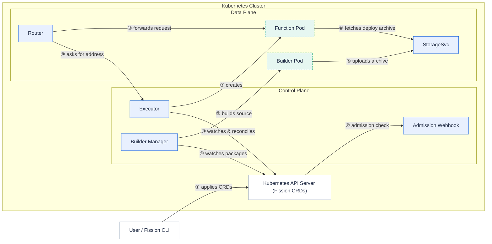

Fission is built from a set of small components that run inside your Kubernetes cluster.
Together they turn a function's source code into a running pod and route requests to it on demand.

This page gives you the big picture so you know what each component does and how a request flows through the system.
From there you can dive into the per-component pages for the details.

It helps to split the components into two groups.
**Core components** are the ones you should understand to use Fission effectively.
**Optional components** add specific capabilities — extra trigger types, log collection, traffic shifting — and you can learn them as you need them.

## Architecture overview

The diagram below splits Fission into a **control plane** (the components that watch your Fission resources and reconcile the cluster toward them) and a **data plane** (the components that carry an actual request to your function).

The control plane never sits in the request path.
Once the Executor has placed a function pod, the Router talks to that pod directly.

## Core components

These components handle the build-and-serve path for every function.

### [Router]({})
The entry point for traffic — maps triggers to functions and forwards each request to a live function pod.

### [Executor]({})
Creates and manages the pods that run your functions, using one of three executor types (poolmgr, newdeploy, container).

### [Function Pod]({})
The pod where your function code is loaded and executed.

### [Builder Manager]({})
Watches packages and environments and drives the compilation of source code into a deployable archive.

### [Builder Pod]({})
The pod that compiles your source into a runnable function package.

### [StorageSvc]({})
Stores source and deployment archives, backed by S3 or a local volume via minio-go.

### [Admission Webhook]({})
Validates Fission custom resources at the Kubernetes API server before they are persisted.

## Optional components

These components add trigger types and supporting features.
Enable them when your workload needs them.

### [Logger]({})
Records and persists function logs from every node.

### [KubeWatcher]({})
Watches Kubernetes resource changes and invokes functions in response.

### [Message Queue Trigger]({})
Subscribes to message-queue topics and invokes functions on new messages, with optional KEDA-based autoscaling.

### [Timer]({})
Invokes functions on a cron schedule.

### Canary Config
Shifts traffic gradually between two function versions and rolls back automatically on failures.

## Deprecated components

### [Controller]({})
The old REST API server.
It was deprecated in Fission 1.18.0 and is no longer part of the default architecture — clients now talk directly to the Kubernetes API server and Fission CRDs.
See the [Controller page]({}) for migration guidance.

## Related

- [Concepts]({}) — the Fission resource model (functions, environments, packages, triggers).
- [Reconcilers]({}) — how Fission components self-heal toward your declared state.
- [Installation]({}) — install Fission and the components above.
