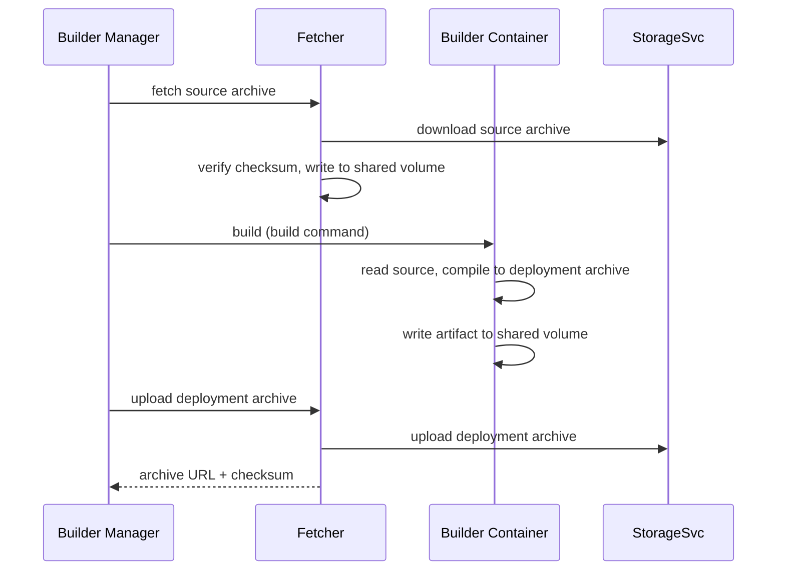

The builder pod is the per-environment workload that compiles a source archive into a deployment archive used by the [function pod]({}).

{}
A builder pod exists only for environments that declare a builder image.
The [builder manager]({}) creates one builder Deployment per such environment; deploy-only packages never touch a builder pod.
{}

Each builder pod runs two containers that share a volume:

- **Builder container** — compiles the function source into an executable artifact; this container is language-specific and comes from the environment's builder image.
- **Fetcher** — a sidecar that downloads the source archive from [StorageSvc]({}), verifies its checksum, and uploads the resulting deployment archive back to StorageSvc after the build.

## Build pipeline

The build command is taken from the package's `spec.buildcmd` when set, otherwise from the environment's `builder.command`.
The shared volume is how the fetcher hands the source to the builder and the builder hands the artifact back to the fetcher.
The fetcher exposes its API on port `8000` and the builder container on port `8001`.

## Security: no service-account token in the builder container

As of Fission  the builder pod no longer auto-mounts the `fission-builder` ServiceAccount token into every container.
The pod sets `automountServiceAccountToken: false`, and the token is re-mounted only on the fetcher sidecar via a projected volume — the user-supplied builder container does not receive it (GHSA-8wcj-mfrc-jx5q).
This prevents untrusted build code from reading the builder ServiceAccount credentials.

## Related

- [Builder Manager]({}) — orchestrates the build and updates package status.
- [StorageSvc]({}) — stores the source and deployment archives.
- [Function Pod]({}) — consumes the deployment archive at runtime.
