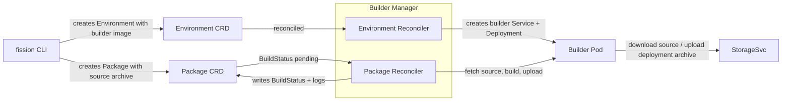

The builder manager turns a package's **source archive** into a runnable **deployment archive** by driving the environment's builder.

{}
The builder manager is a core Fission component.
It runs inside the `buildermgr` deployment as part of `fission-bundle` and is only active for environments that declare a builder image.
{}

As of Fission  the builder manager is built on [controller-runtime](https://github.com/kubernetes-sigs/controller-runtime) reconcilers rather than the older informer-driven watchers.
It hosts two reconcilers: an Environment reconciler that keeps each builder Service and Deployment in sync with its Environment, and a Package reconciler that builds source packages into deployment archives.
Reconciliation is level-based, so the builder objects self-heal if the live cluster drifts from the desired state.

## How a build flows

## Environment reconciler

The Environment reconciler watches `Environment` resources and manages the builder workload for each one.

1. When an environment that declares a `builder.image` is created, the reconciler creates a builder `Service` and `Deployment` in the environment's builder namespace.
2. The builder Service and Deployment are named `<env-name>-<env-resourceVersion>`, so a spec change yields a new name.
Each reconcile first deletes builder objects orphaned by a previous generation, then ensures the current-generation pair exists.
3. When an environment is deleted, the reconciler tears down every builder Service and Deployment it owns.
4. Environments using the v1 interface, or environments without a builder image, are skipped — they have nothing to build.

## Package reconciler

The Package reconciler watches `Package` resources and runs builds.
A build is requested by setting the package's `Status.BuildStatus` to `pending` through the status subresource, so the reconciler triggers on that status transition rather than on a spec change.

1. A freshly applied package with no status gets an initial build status: `none` for a deploy-only package, `pending` when it carries a source archive, or `failed` when both archives are empty.
2. For a `pending` (or interrupted `running`) package, the reconciler waits for the environment's builder pod to report ready, requeueing rather than blocking a worker while it waits.
3. It marks the package `running`, then drives the build: fetch the source archive, run the build command, and upload the resulting deployment archive (see [Builder Pod]({})).
4. On success it writes the deployment archive URL and checksum onto the package spec, sets `BuildStatus` to `succeeded`, and stores the build logs in `Status.BuildLog`.
5. On failure it sets `BuildStatus` to `failed` and records the build logs; the failure is terminal until the package is re-triggered.
6. Either way it propagates the outcome onto the `Ready` and `PackageReady` conditions of every `Function` that references the package, so you can `kubectl wait --for=condition=Ready function/<name>`.

A cross-namespace environment reference is rejected during the build as defense in depth, matching the admission webhook's reject at submit time (GHSA-vjhc-cf4p-72q4).

## Configuration knobs

The builder manager reads a few environment variables, set on the `buildermgr` deployment by the Helm chart:

- `BUILDERMGR_PACKAGE_CONCURRENCY` — how many package builds run concurrently (default `5`).
Each build holds a reconcile worker for the duration of the fetch, build, and upload.
- `BUILDER_IMAGE_PULL_POLICY` — image pull policy for the builder container.
- `LEADER_ELECTION_ENABLED` — enables leader election so only one `buildermgr` replica reconciles at a time.
- `ENABLE_ISTIO` — adjusts builder pod annotations when running under Istio.

## Related

- [Builder Pod]({}) — the per-environment pod that runs the build.
- [StorageSvc]({}) — where source and deployment archives live.
- [Environments]({}) — the language runtime and builder image definition.
