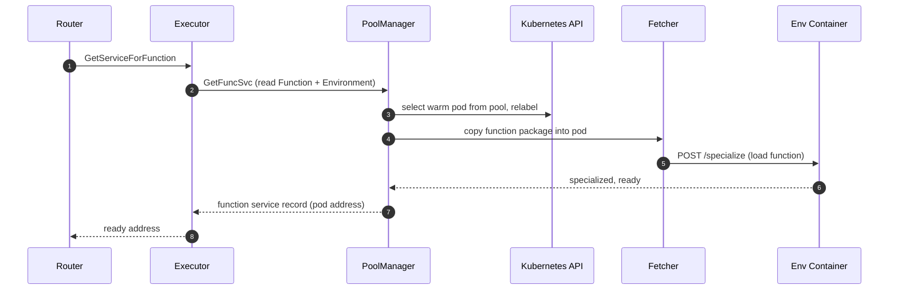

**The executor turns a function reference into a running, network-addressable pod.**

When the [router]({}) needs to serve a function and has no cached address, it calls the executor's `GetServiceForFunction` endpoint.
The executor reads the `Function` and `Environment` resources from the Kubernetes API, picks the executor type configured on the function, and drives one of three strategies to deliver a ready address.
It returns a function service record holding the pod or Service address, which the router then uses to forward the request.

{}
The executor is a core component installed by default and served by the `fission-bundle` binary as the `executor` service.
{}

## Executor types

Fission ships exactly three executor types, each with its own strategy for launching, specializing, and managing pods.
You choose one per function based on your latency and cost requirements.

| Executor type | Strategy | Best for |
|:--------------|:---------|:---------|
| `poolmgr` | Specializes a pod from a pre-warmed generic pool | Short-lived functions needing fast cold starts |
| `newdeploy` | Creates a Deployment, Service, and HPA per function | Functions serving sustained or spiky traffic |
| `container` | Runs your own prebuilt container image as the function | Custom runtimes packaged as a container image |

### PoolManager

PoolManager (`poolmgr`) maintains pools of generic, "warm" pods per environment.
It watches `Environment` resources and eagerly creates a pool of generic pods for each one; the pool size is configurable per environment.
Resource requirements are specified at the environment level and are inherited by specialized function pods.

On a request, PoolManager picks a generic pod from the pool, relabels it out of the pool, copies the function package in via the in-pod fetcher, and calls the environment container's specialize endpoint to load the function.
The pod is now specific to that function and serves subsequent requests for it.
If the function stays idle past its threshold, the pod is reaped and a fresh pod is specialized from the pool on the next request.

PoolManager gives fast cold starts because pods are pre-created; for tiny code snippets a cold start is typically well under 100ms (it grows with package size).
A `concurrency` field (default 500) caps how many pods may serve a single function in parallel, so a function is no longer limited to one pod.

### New-Deployment

The New-Deployment executor (`newdeploy`) creates a Kubernetes Deployment, a Service, and a HorizontalPodAutoscaler for each function.
The Service load-balances requests across the function's pods, and the HPA scales replicas based on CPU utilization, making this type suitable for functions that handle sustained or spiky traffic.
Resource requirements can be specified at the function level and override those from the environment.

The fetcher in a `newdeploy` pod self-specializes at pod startup: it downloads the package and loads the function as the pod comes up, rather than waiting for a separate specialize call.

This raises cold-start latency relative to `poolmgr`, but you can trade that away by setting a minimum scale greater than zero.
A non-zero `minscale` keeps that many pods ready at all times, so invocations incur no specialization delay and idle pods are not reaped.

### Container

The container executor (`container`) runs a prebuilt container image you supply as the function, instead of specializing a generic environment pod.
It creates a Deployment, Service, and HPA like `newdeploy`, but the pod runs your image directly with no fetcher or environment specialization step.
A function using this type must provide a pod spec; the API server enforces that with a CEL validation rule.

## Cold-start flow

This is the path the first request to an unwarmed function takes through a `poolmgr` environment.

## Reconcilers, self-healing, and cleanup

In  the executor's controllers were consolidated onto controller-runtime reconcilers (RFC-0004), collapsing the previous nine reconcilers down to three.

- **Single Function reconciler.**
One Function-centric reconciler resolves each function's executor type and dispatches create, update, and delete to the owning type.
It uses `.For(Function)` plus `.Watches(...)` to react to a function's real dependencies (Environment, ConfigMap, Secret, and the Deployment, Service, and HPA it manages) instead of running separate per-type reconcilers.
- **Self-healing workloads.**
Owner-reference garbage collection cannot cross namespaces, and a function's workloads often live in a namespace distinct from the `Function` resource.
The reconciler therefore watches its managed objects via function-identifying labels and recreates any backing object that is deleted out of band.
- **Cleanup finalizers.**
A `fission.io/function-cleanup` finalizer ensures the executor tears down a function's workloads through the owning type's delete path **before** the `Function` resource is collected, closing a long-standing leak where a missed delete event could orphan cross-namespace workloads.
The finalizer is gated by the chart-wide `finalizerEnabled` toggle (default on); turning it off drains any existing finalizer safely.

## The latency vs. idle-cost tradeoff

The executors let you trade request latency against the cost of keeping pods warm.
Pick the combination that fits your workload.

| Executor type | Min scale | Latency | Idle cost |
|:--------------|:---------:|:-------:|:----------|
| `newdeploy` | 0 | High | Very low; pods are reaped after the idle threshold |
| `newdeploy` | > 0 | Low | Medium; min-scale pods stay up |
| `poolmgr` | 0 | Low | Low; a pool of generic pods stays warm |

## Autoscaling

The `newdeploy` and `container` executors autoscale function pods via a HorizontalPodAutoscaler driven by CPU usage.
You set the minimum and maximum scale and the target CPU percentage at which scaling triggers.
This is useful for workloads with intermittent spikes: a baseline of `minscale` pods absorbs steady load while the HPA bursts up to `maxscale` on demand, then scales back down.

## Configuration knobs

You set executor deployment options through the Helm chart's `executor` values (`charts/fission-all/values.yaml`):

| Value | Default | Purpose |
|:------|:--------|:--------|
| `executor.replicas` | `1` | Number of executor pods. |
| `executor.podDisruptionBudget.enabled` | `false` | Protect executor availability during voluntary disruptions; only meaningful with `replicas > 1`. |
| `finalizerEnabled` | `true` | Chart-wide toggle for the function-cleanup finalizer. |

{}
Run more than one executor replica only with leader election enabled.
See [Controlling Function Execution]({}) to learn how to choose and tune an executor type per function.
{}

## Related

- [Router]({}) - asks the executor for function service addresses.
- [Function Pod]({}) - the pod anatomy and specialization flow the executor drives.
- [Environments]({}) - define the runtimes that PoolManager pre-warms.
