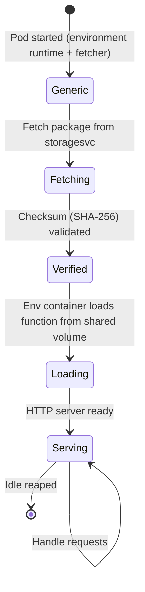

**A function pod is where a Fission function is loaded and serves HTTP requests.**

It pairs a language-specific runtime with a helper container that pulls your code into the pod.
Understanding its anatomy explains how a generic, reusable pod becomes specialized to run your function, and why `poolmgr` and `newdeploy` pods behave differently.

## Anatomy

A function pod (for the `poolmgr` and `newdeploy` executors) runs two containers that share an `emptyDir` volume:

- **Environment container** - the language-specific runtime (NodeJS, Python, Ruby, Go, PHP, Bash, or a custom image).
It runs an HTTP server plus a loader that can specialize the pod to a specific function and then serve its requests.
- **Fetcher** - a small helper container that downloads your function package from [storagesvc]({}), verifies its SHA-256 checksum, and writes it onto the shared volume where the environment container loads it from.

{}
Pods created by the `container` executor are different: they run your prebuilt image directly with no fetcher and no specialization step.
The fetcher and environment-container model below applies to the `poolmgr` and `newdeploy` executors.
{}

## Specialization flow

Specialization is the step that turns a generic pod into one bound to a specific function.
The fetcher copies the package onto the shared volume, then the environment container loads it and begins serving.

1. The pod starts with the environment runtime and the fetcher sharing an `emptyDir` volume.
2. The fetcher downloads the function's deployment package from storagesvc.
3. The fetcher validates the package's SHA-256 checksum to ensure integrity, then writes it to the shared volume.
4. The environment container is told to specialize: it loads the user function from the shared volume.
5. The pod begins serving HTTP requests for that function.

## PoolManager vs New-Deployment pods

The fetcher is the same binary in both executor types, but it is invoked differently, which is the key behavioral difference:

| Aspect | `poolmgr` pod | `newdeploy` pod |
|:-------|:--------------|:----------------|
| When the pod is created | Eagerly, as a warm generic pod in the environment pool | When the function is created or first invoked (or kept warm if `minscale > 0`) |
| How specialization is triggered | PoolManager calls the fetcher's `/specialize` endpoint on demand | The fetcher self-specializes at pod startup (`-specialize-on-startup`) |
| Resource requirements | Inherited from the environment | Set at the function level, overriding the environment |
| Fronting Kubernetes object | The specialized pod (router targets the pod directly) | A Deployment with a Service and HPA |

In a `poolmgr` pod the fetcher container stays running as a sidecar and waits for a specialize call, so a warm generic pod can be specialized the moment a request arrives.
In a `newdeploy` pod the fetcher is given the specialize request as a startup argument, so the pod loads its function as it comes up and the package fetch is part of the cold start.

## Idle reaping

When a function is idle past its threshold, the executor's idle reaper cleans up its pods to free resources.

- For `poolmgr`, a specialized pod is removed; the next request specializes a fresh pod from the warm pool.
- For `newdeploy`, the Deployment is scaled toward its `minscale` (so a `minscale` of zero scales to zero, while a non-zero `minscale` keeps that many pods ready and is never reaped below it).

## Related

- [Executor]({}) - creates and specializes function pods.
- [Router]({}) - forwards requests to function pods.
- [StorageSvc]({}) - serves the function packages the fetcher downloads.
