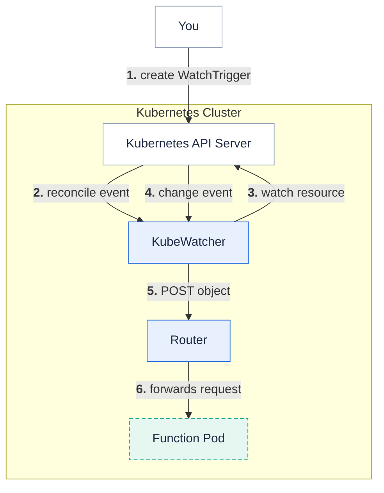
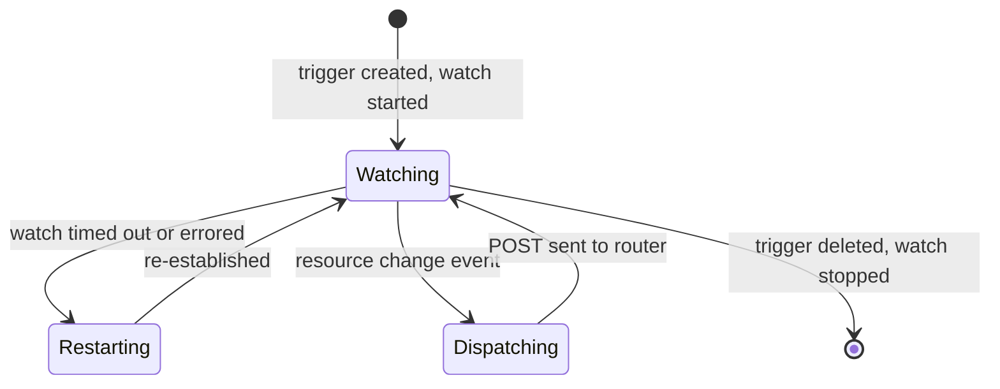

KubeWatcher is the Fission component that watches Kubernetes API resources and invokes a function whenever a watched object changes.

It lets you treat the cluster itself as an event source: create a `KubernetesWatchTrigger` that names a resource type and a target function, and KubeWatcher streams add, update, and delete events from the Kubernetes API to that function.
This is useful for cluster automation tasks such as reacting to new Pods, Services, or completed Jobs without polling.

{}
KubeWatcher is an optional component.
It runs as the `kubewatcher` service inside `fission-bundle` and is only active when you create `KubernetesWatchTrigger` resources.
{}

## How it works

1. You create a `KubernetesWatchTrigger` CRD that specifies the resource type to watch, the namespace, and the function to invoke.
2. A controller-runtime reconciler in KubeWatcher observes the trigger and starts a watch subscription against the Kubernetes API for that resource type.
3. When the watched resource changes, KubeWatcher receives a watch event, records the resource version, and serializes the object to JSON.
4. KubeWatcher publishes the serialized object as the body of an HTTP `POST` to the [Router]({}), which routes it to the target function.
5. The Router forwards the request to a function pod and the function processes the event.

The serialized object is sent as the request body.
KubeWatcher also sets these headers so your function can tell what happened without re-parsing the payload:

| Header | Value |
| --- | --- |
| `Content-Type` | `application/json` |
| `X-Kubernetes-Event-Type` | the watch event type (`ADDED`, `MODIFIED`, or `DELETED`) |
| `X-Kubernetes-Object-Type` | the Go type name of the watched object (for example `Pod`) |

## Watchable resource types

A `KubernetesWatchTrigger` can watch one of the following resource types, set in `spec.type`:

- `Pod`
- `Service`
- `ReplicationController`
- `Job`

An unrecognized type is rejected when the watch starts.

## Namespace scope and security

A `KubernetesWatchTrigger` watches resources in its own namespace.
If `spec.namespace` is empty it is coerced to the trigger's namespace, so an unset field can never resolve to a cluster-wide watch.
A trigger whose `spec.namespace` differs from the trigger's own namespace is rejected as a cross-namespace watch.

The admission webhook validates `KubernetesWatchTrigger` objects at creation time, and the watch start path rejects cross-namespace targets again so stale objects on upgraded clusters cannot leak across namespaces.

{}
KubeWatcher does retry a failed or timed-out watch, but there is not yet a durable message bus between KubeWatcher and the function, so delivery is best-effort.
Design your function to be idempotent and do not rely on KubeWatcher for guaranteed, exactly-once event delivery.
{}

## Lifecycle of a watch subscription

Each watch runs for a bounded window (a 120-second server-side timeout) and is automatically restarted when it ends.
On a watch error, KubeWatcher restarts from an empty resource version to recover from "too old resource version" responses.
When you delete the trigger, the reconciler stops and drops the watch subscription.

## Related

- [Router]({}) - the component KubeWatcher posts events to.
- [Reconcilers]({}) - the control-loop pattern KubeWatcher uses to drive watches from `KubernetesWatchTrigger` CRDs.
- [Create a Kubernetes watch trigger]({}) - task-oriented usage guide.
