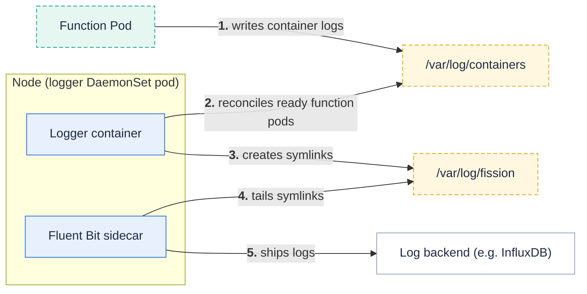

The logger makes each function pod's container logs discoverable on the node so a log shipper can collect them.

{}
The logger runs as a <a href="https://kubernetes.io/docs/concepts/workloads/controllers/daemonset/" target="_blank">DaemonSet</a> — one replica per node — so every node manages the logs of the function pods scheduled on it.
{}

As of Fission  the logger is a [controller-runtime](https://github.com/kubernetes-sigs/controller-runtime) reconciler rather than a raw pod informer.
Because it is a per-node DaemonSet, the Manager runs **without leader election** — each node's logger must process its own pods, so every replica reconciles unconditionally.

The logger itself does not ship logs to a database.
It maintains stable symlinks to function pod log files; a Fluent Bit sidecar container (using the `fission-fluentbit` ServiceAccount and config) runs alongside the logger in the same DaemonSet, tails those symlinks, and forwards the logs to a backend such as InfluxDB.

## How it works



1. Containers in the function pod write logs to the node's container log files under `/var/log/containers`.
2. The logger's pod reconciler reacts to pod status changes for function pods scheduled on its node.
It triggers on status updates (not spec changes), because container IDs only appear in pod status once containers start.
3. For each ready, valid function pod on the node, the logger creates a symlink under `/var/log/fission` pointing at the container's log file.
4. A background reaper runs every 5 minutes and removes any symlink whose target log file no longer exists, cleaning up after deleted pods.
5. The Fluent Bit sidecar in the same DaemonSet pod tails the `/var/log/fission` symlinks and forwards the logs to the configured backend.

A function pod is considered valid only when it carries the full set of Fission environment and function labels, ensuring the logger ignores non-function pods.

## Retrieving function logs

With log shipping configured, you can read function logs with the CLI:

```bash
fission function log --name <function-name>
```

## Configuration knobs

- `NODE_NAME` — set on each logger pod so its pod watch is scoped to that node's pods.
- The Fluent Bit sidecar's input path and output backend are configured through the Helm chart's Fluent Bit configuration (for example the InfluxDB host, port, and database).

## Related

- [Function Pod]({}) — the source of the logs the logger exposes.
- [`fission function log`]({}) — reading function logs with the Fission CLI.
