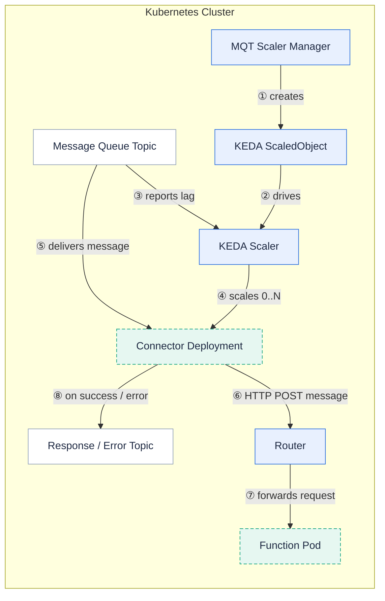

A Message Queue Trigger binds a message queue topic to a function so that each message on that topic invokes the function with the message as the request body.

The current architecture is built on [KEDA](https://keda.sh) (Kubernetes Event-Driven Autoscaling).
For each `MessageQueueTrigger` of kind `keda`, Fission provisions a KEDA `ScaledObject` and a connector Deployment that consumes the queue, calls your function through the [Router]({}), and scales with the depth of the queue, including scaling to zero when the topic is idle.

{}
Message Queue Trigger is an optional component.
It runs as the `mqtrigger` service inside `fission-bundle`, and the KEDA scaler manager runs alongside it to reconcile `ScaledObject` resources.
Using a KEDA-based trigger requires KEDA (v2.20) installed in the cluster.
{}

## How it works

1. You create a `MessageQueueTrigger` CRD with `mqtkind: keda`, naming the queue type, topic, target function, and scaling settings.
2. The MQT scaler manager reconciles the trigger and creates a KEDA `ScaledObject` (and, when a secret is referenced, a `TriggerAuthentication`) plus a connector Deployment for that queue type.
3. KEDA polls the queue, and based on its depth scales the connector Deployment between the configured minimum and maximum replica counts, scaling to zero during idle periods.
4. A connector replica consumes messages from the topic and sends each message as an HTTP `POST` to the Router, which routes it to the function.
5. If a response topic is configured, the function's successful output is published to it; if an error topic is configured, failed invocations are published there.

The connector Deployment is pointed at the Router's internal URL through the `HTTP_ENDPOINT` environment variable, so messages reach functions over the cluster-internal listener.

## Supported queue connectors

The KEDA-based trigger validates the following queue types (`spec.messageQueueType`):

| Queue type | `messageQueueType` value |
| --- | --- |
| Apache Kafka | `kafka` |
| AWS SQS | `aws-sqs-queue` |
| AWS Kinesis | `aws-kinesis-stream` |
| GCP Pub/Sub | `gcp-pubsub` |
| RabbitMQ | `rabbitmq` |
| NATS JetStream | `nats-jetstream` |
| NATS Streaming (STAN) | `stan` |
| Redis | `redis` |

See the [Message Queue Trigger (KEDA) usage guides]({}) for connector-specific setup.

## Scaling and behavior knobs

These fields on the `MessageQueueTrigger` spec map to KEDA `ScaledObject` settings:

- `pollingInterval` - how often KEDA checks the queue and adjusts the connector Deployment.
- `cooldownPeriod` - how long to wait after the last active reading before scaling back to zero.
- `minReplicaCount` / `maxReplicaCount` - the bounds KEDA scales the connector Deployment between.
- `metadata` - scaler-specific trigger metadata passed through to KEDA.
- `secret` - the name of a secret used to build a KEDA `TriggerAuthentication`.
- `respTopic` / `errorTopic` - topics for function output and error responses.
- `maxRetries` - how many times the connector retries a failed invocation.

## Legacy built-in trigger

{}
The original built-in (non-KEDA) message queue trigger is legacy.
New triggers should use `mqtkind: keda`.
{}

Before KEDA integration, Fission ran message queue consumers directly inside the `mqtrigger` component.
That built-in path now retains Kafka in-tree only, and it does not provide event-driven autoscaling or scale-to-zero.
The error topic in the legacy path is supported by a limited set of queues (NATS, Kafka, and Redis lists).
Prefer the KEDA-based trigger for all supported queues, broader connector coverage, and queue-depth autoscaling.

## Related

- [Router]({}) - the component connectors post messages to.
- [Executor]({}) - how the invoked function's pods are managed.
- [Message Queue Trigger (KEDA) usage guides]({}) - per-connector setup.
