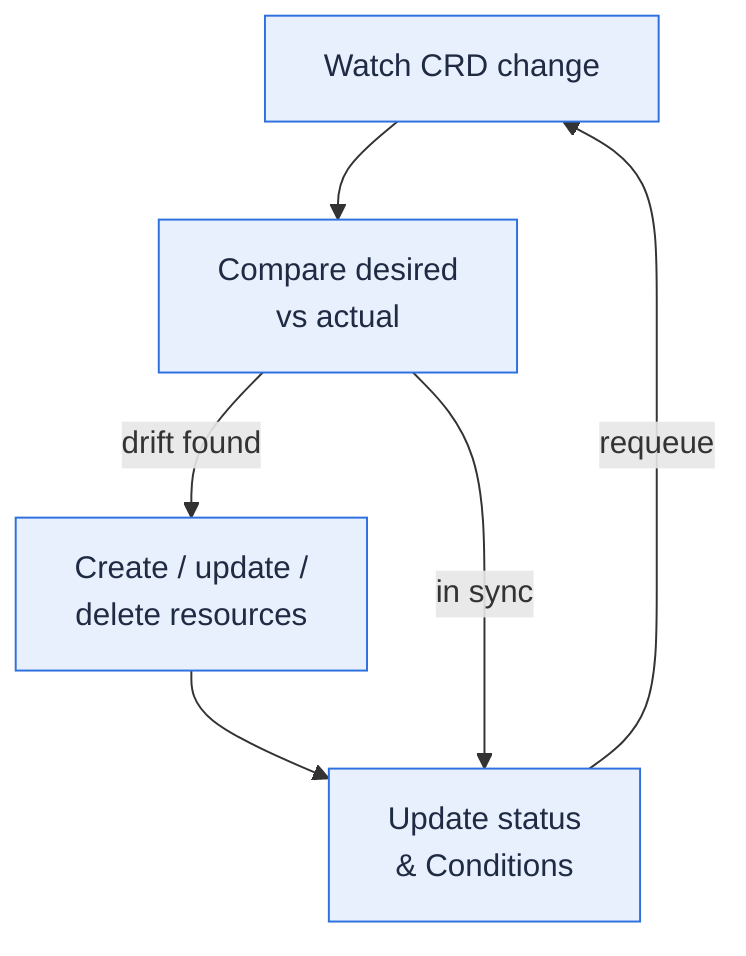

A **reconciler** is a control loop that watches a Fission resource and keeps the cluster matching what that resource asks for.

This is the standard Kubernetes operator pattern, built on [controller-runtime](https://github.com/kubernetes-sigs/controller-runtime).
You declare *what* you want as a CRD; the reconciler figures out *how* to make the cluster match, and keeps doing so over time.

Fission adopted this model across its components in the  control-plane rework (RFC-0005).
This page explains what a reconcile loop is, which components use one, and what you get from it.

## What a reconcile loop is

A reconcile loop runs the same three steps every time the resource it watches changes — and periodically even when nothing changed.

1. **Watch.** The reconciler subscribes to changes on its CRD (for example, a Function or an Environment).
2. **Compare.** On each event it reads the *desired* state from the CRD spec and the *actual* state of the backing Kubernetes objects (deployments, pods, services).
3. **Act.** If the two differ, it creates, updates, or deletes the backing objects to close the gap.
4. **Update status.** It records the outcome on the CRD's `status` subresource as Conditions, then requeues so the loop runs again.

Because the loop is level-triggered — it always works from current state, not from a one-off event — it converges even if an earlier action failed or an event was missed.

## Which components use reconcilers

In  these Fission components run controller-runtime reconcilers:

- **Executor** — separate environment and function reconcilers, plus per-executor-type reconcilers for the poolmgr, newdeploy, and container executors, and one for the executor's config maps.
- **Builder Manager** — environment and package reconcilers that drive source builds.
- **KubeWatcher** — reconciles KubernetesWatchTrigger resources.
- **Message Queue Trigger** — reconciles MessageQueueTrigger resources and their KEDA scalers.
- **Canary Config** — reconciles CanaryConfig resources for gradual traffic shifting.

The Logger is **not** a reconciler — it is a per-node log forwarder (a DaemonSet) and does not watch a CRD.

## What you gain

- **Self-healing on drift.**
  If a function's deployment is deleted or edited out of band, the reconciler notices the gap on its next pass and rebuilds it to match the spec.
- **Reliable teardown with finalizers.**
  Reconcilers add a cleanup finalizer to the resources they own, so on delete they tear down the backing objects — including across namespaces, where owner-reference garbage collection cannot reach — before releasing the resource.
  This is controlled chart-wide by the `finalizerEnabled` Helm value (enabled by default).
- **Status you can query.**
  Each reconciler reports progress and errors as Conditions on the CRD's `status` subresource, so `kubectl get` and `kubectl describe` show you whether a resource is healthy and why.

## Related

- [Admission Webhook]({}) — validation that runs before a resource reaches a reconciler.
- [Executor]({}) — the component with the most reconcilers.
- [Architecture overview]({}) — how reconcilers fit into the control plane.
