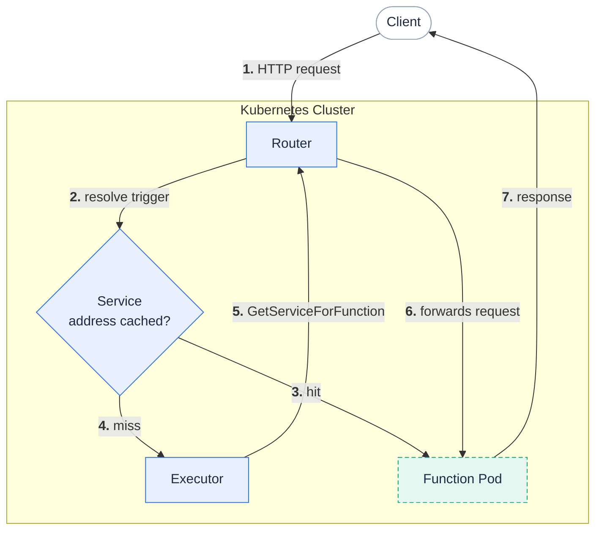

**The router is the HTTP entry point that maps an incoming request to a function and forwards it to a running function pod.**

It is the only stateless Fission component, so you can run multiple replicas behind a single Service and scale them horizontally with load.
The router keeps a short-lived cache of function service addresses.
On a cache hit it forwards straight to the pod; on a miss it asks the [executor]({}) for an address, holding the request until the function pod is ready.

{}
The router is a core component installed by default with every Fission deployment.
It is served by the `fission-bundle` binary as the `router` service.
{}

## Request flow

## Responsibilities and flow

1. The router watches `HTTPTrigger` resources through the Kubernetes API and builds a URL-to-function routing table, rebuilding it atomically whenever triggers change.
2. A client sends an HTTP request to a trigger URL.
If no trigger matches the path and method, the router returns `404`.
3. The router resolves the matched trigger to its target function (or to a weighted split across two functions for a canary release) using its function reference resolver.
4. The router checks its in-memory cache for a service address for that function.
On a hit it forwards the request directly to the function pod.
5. On a miss the router calls the executor's `GetServiceForFunction` endpoint to obtain an address, then caches the result and forwards the request.
6. The router's retrying transport re-attempts transient failures, and if a cached address is stale it drops the entry and asks the executor for a fresh one.
When the executor cannot return a usable address, the router responds with `502`.

{}
For the `poolmgr` executor the router does not cache the address; each request goes to the executor, which returns the address of a warm, specialized pod.
Caching applies to the `newdeploy` and `container` executors, where a stable Service fronts the function's pods.
{}

## Configuration knobs

You set these through the Helm chart's `router` values (`charts/fission-all/values.yaml`):

| Value | Default | Purpose |
|:------|:--------|:--------|
| `router.replicas` | `1` | Number of router pods (Deployment mode). |
| `router.deployAsDaemonSet` | `false` | Run one router per node as a DaemonSet instead of a Deployment. |
| `router.autoscaling.enabled` | `false` | Deploy a HorizontalPodAutoscaler for the router; ignored when `deployAsDaemonSet` is true. |
| `router.svcAddressMaxRetries` | `5` | Maximum retries against a specific service address before the cache entry is dropped. |
| `router.podDisruptionBudget.enabled` | `false` | Protect router availability during voluntary disruptions; only meaningful with `replicas > 1`. |

Because the router is stateless and replica-independent, it scales out cleanly: enable `router.autoscaling` for a CPU-driven HPA, or set `router.deployAsDaemonSet: true` to place a router on every node.

## Related

- [Executor]({}) - supplies function service addresses to the router.
- [Function Pod]({}) - the destination the router forwards requests to.
- [HTTP Triggers]({}) - define the URL-to-function routes the router serves.
