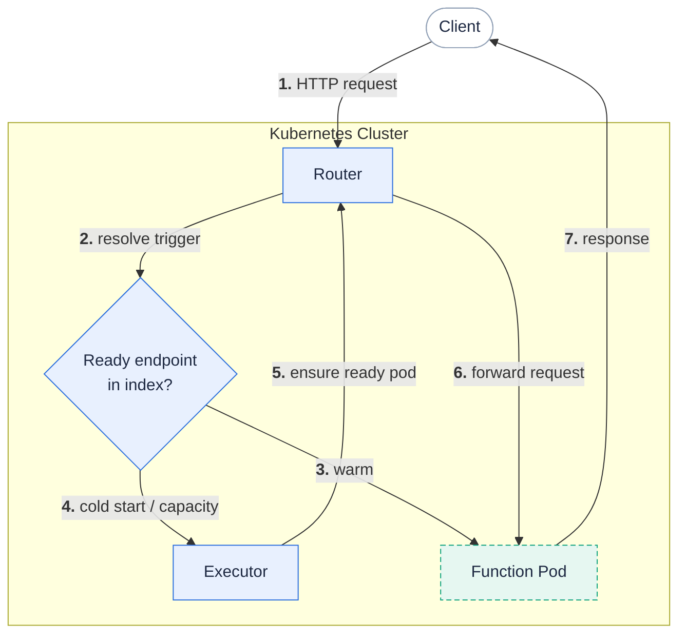

**The router is the HTTP entry point that maps an incoming request to a function and forwards it to a running function pod.**

It is the only stateless Fission component, so you can run multiple replicas behind a single Service and scale them horizontally with load.
The router keeps a replica-local endpoint index fed by Kubernetes EndpointSlices, so it forwards warm traffic straight to a ready function pod without consulting the executor.
It calls the [executor]({}) only when a function has no ready endpoints (a cold start), when every endpoint is saturated (to add capacity), or for functions that require strict global concurrency — holding the request until a pod is ready.

{}
The router is a core component installed by default with every Fission deployment.
It is served by the `fission-bundle` binary as the `router` service.
{}

## Request flow

```mermaid
flowchart TB
  client(["Client"]):::user
  subgraph k8s["Kubernetes Cluster"]
    router["Router"]:::fission
    index{"Ready endpoint<br/>in index?"}:::fission
    executor["Executor"]:::fission
    fnPod["Function Pod"]:::pod
  end
  client -->|"<b>1.</b> HTTP request"| router
  router -->|"<b>2.</b> resolve trigger"| index
  index -->|"<b>3.</b> warm"| fnPod
  index -->|"<b>4.</b> cold start / capacity"| executor
  executor -->|"<b>5.</b> ensure ready pod"| router
  router -->|"<b>6.</b> forward request"| fnPod
  fnPod -->|"<b>7.</b> response"| client
  classDef user fill:#ffffff,stroke:#94a3b8,color:#1f2a43
  classDef fission fill:#e8f0fe,stroke:#2d70de,color:#1f2a43
  classDef pod fill:#e6f7f1,stroke:#11a37f,color:#1f2a43,stroke-dasharray:5 3
```

## Responsibilities and flow

1. The router watches `HTTPTrigger` resources through the Kubernetes API and builds a URL-to-function routing table, rebuilding it atomically whenever triggers change.
2. A client sends an HTTP request to a trigger URL.
If no trigger matches the path and method, the router returns `404`.
3. The router resolves the matched trigger to its target function (or to a weighted split across two functions for a canary release) using its function reference resolver.
4. The router resolves the function's address from its EndpointSlice-fed endpoint index.
When a ready endpoint exists (the warm path) it forwards there directly — for a `poolmgr` function it balances across the ready specialized pods, choosing the least-loaded one below the function's `requestsPerPod`.
5. When the index has no ready endpoint (a cold start), every endpoint is saturated (more capacity is needed), or the function requires strict global concurrency, the router calls the executor, which specializes or scales a pod and ensures capacity, then forwards the request once a pod is ready.
6. The router's retrying transport re-attempts transient failures and quarantines an endpoint that fails to dial, re-resolving a fresh one.
When no usable address can be obtained, the router responds with `502`.

{}
The EndpointSlice-fed data plane is the default (`router.endpointSliceCache.mode: "on"`).
For `poolmgr` functions it additionally requires `executor.functionServices.enabled` (default `true`), which gives each invoked function a headless Service so Kubernetes publishes its specialized pods into the router's index.
Set `router.endpointSliceCache.mode: "off"` to fall back to the legacy data plane, where the router instead caches the address returned by the executor's `GetServiceForFunction` on each cold lookup.
{}

## Configuration knobs

You set these through the Helm chart's `router` values (`charts/fission-all/values.yaml`):

| Value | Default | Purpose |
|:------|:--------|:--------|
| `router.replicas` | `1` | Number of router pods (Deployment mode). |
| `router.deployAsDaemonSet` | `false` | Run one router per node as a DaemonSet instead of a Deployment. |
| `router.endpointSliceCache.mode` | `"on"` | EndpointSlice-fed endpoint index (RFC-0002). `"on"` serves the warm path from the index; `"off"` uses the legacy executor-RPC data plane. Always quote the value. |
| `router.autoscaling.enabled` | `false` | Deploy a HorizontalPodAutoscaler for the router; ignored when `deployAsDaemonSet` is true. |
| `router.svcAddressMaxRetries` | `5` | Maximum retries against a specific service address before the cache entry is dropped. |
| `router.podDisruptionBudget.enabled` | `false` | Protect router availability during voluntary disruptions; only meaningful with `replicas > 1`. |

Because the router is stateless and replica-independent, it scales out cleanly: enable `router.autoscaling` for a CPU-driven HPA, or set `router.deployAsDaemonSet: true` to place a router on every node.

## Related

- [Executor]({}) - supplies function service addresses to the router.
- [Function Pod]({}) - the destination the router forwards requests to.
- [HTTP Triggers]({}) - define the URL-to-function routes the router serves.
