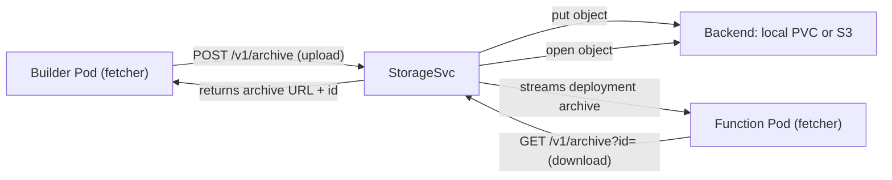

The storage service is where Fission keeps the **source** and **deployment archives** of packages that are too large to embed inline.

{}
StorageSvc is a core Fission component, running as the `storagesvc` deployment inside `fission-bundle`.
It is reached only over the cluster network by the builder pods, function-pod fetchers, and the router — it is never exposed publicly.
{}

Packages whose archive is **larger than 256 KB** are stored in StorageSvc rather than inline in the `Package` resource; smaller archives are stored as literals in the CRD itself.
A builder pod uploads the deployment archive it produces to StorageSvc, and the fetcher inside a function pod downloads that archive when specializing the function.

## Storage backends

StorageSvc abstracts over two object-store backends, selected by the `persistence.storageType` Helm value:

- **`local`** — an os-based local filesystem store backed by a Kubernetes `PersistentVolumeClaim`.
- **`s3`** — any S3-compatible object store (AWS S3, MinIO, and other S3-compatible systems), accessed through the [minio-go](https://github.com/minio/minio-go) client.

{}
The `s3` backend talks plain S3, so any S3-compatible endpoint works.
Configure it under `persistence.s3` in the Helm chart, setting `endPoint` for non-AWS providers such as MinIO.
{}

## Archive upload and download

1. After a build, the builder pod's fetcher uploads the deployment archive with a multipart `POST /v1/archive` and an `X-File-Size` header; StorageSvc writes it to the backend and returns an opaque `id`.
2. The builder manager records the archive's download URL and checksum on the package.
3. When a function specializes, the fetcher in the function pod downloads the deployment archive with `GET /v1/archive?id=<id>` and verifies its checksum before handing it to the environment container.

When an internal-auth secret is configured (`FISSION_INTERNAL_AUTH_SECRET`), the `/v1/archive` endpoints require an HMAC signature, so only Fission's internal clients can read or write archives.

## Garbage collection of orphaned archives

Deleting a package with `kubectl` or the Fission CLI removes only the `Package` resource, not the archive it referenced, which would leave the archive orphaned in storage.
The **archive pruner** inside StorageSvc reaps these orphans.

1. On a fixed interval (default 60 minutes, set by `storagesvc.archivePruner.interval`) the pruner lists every `Package` across Fission's namespaces and collects the archive IDs they reference.
2. It lists every archive in the backend, skipping archives created in the last minute so freshly uploaded, not-yet-referenced archives are not deleted.
3. The difference — archives present in storage but referenced by no package — is the orphan set, and each orphan is deleted.

The pruner is enabled by default and can be turned off with `storagesvc.archivePruner.enabled: false` (the `PRUNE_ENABLED` env var on the deployment).

## Configuration knobs

Set under `persistence` and `storagesvc` in the Helm chart:

- `persistence.storageType` — `local` or `s3`.
- `persistence.s3` — bucket, region, and `endPoint` for the S3-compatible backend.
- `persistence.enabled` / `persistence.storageClass` — PersistentVolumeClaim settings for the `local` backend.
- `storagesvc.archivePruner.enabled` / `storagesvc.archivePruner.interval` — orphaned-archive garbage collection.

## Related

- [Builder Pod]({}) — uploads deployment archives here.
- [Function Pod]({}) — downloads deployment archives from here.
- [Builder Manager]({}) — records archive URLs on packages.
