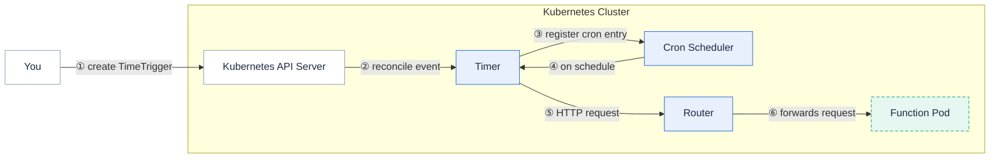

Timer is the Fission component that invokes a function on a recurring schedule defined by a cron expression.

It behaves like a Kubernetes CronJob, but instead of creating a Pod for each run it sends an HTTP request to the [Router]({}) to invoke your function.
This makes it well suited to lightweight, periodic background work such as cleanup jobs, polling, and scheduled reports.

{}
Timer is an optional component.
It runs as the `timer` service inside `fission-bundle` and is only active when you create `TimeTrigger` resources.
{}

## How it works

1. You create a `TimeTrigger` CRD that specifies a cron expression, a target function, and the HTTP method to use.
2. A controller-runtime reconciler in Timer observes the trigger and registers a cron entry for the trigger's schedule.
3. When the schedule fires, Timer issues an HTTP request to the Router at the function's URL.
4. The Router forwards the request to a function pod and the function runs.

Each request carries an `X-Fission-Timer-Name` header set to the trigger name, so a function shared by several timers can tell which schedule invoked it.
The request body is empty; the HTTP method comes from `spec.method` and an optional `spec.subpath` is appended to the function URL.

When you update a trigger's schedule the cron entry is stopped and re-registered so the new schedule takes effect, and deleting the trigger stops and drops its cron entry.

## Cron expression format

Timer uses the [robfig/cron](https://github.com/robfig/cron) v3 parser.
A schedule may be a standard five-field cron expression (minute, hour, day-of-month, month, day-of-week), with an optional leading seconds field, or a descriptor such as `@every 1m` or `@hourly`.

A function namespace equals its trigger namespace: a `TimeTrigger` can only invoke a function in the same namespace as the trigger.

## Related

- [Router]({}) - the component Timer sends requests to.
- [Reconcilers]({}) - the control-loop pattern Timer uses to drive cron entries from `TimeTrigger` CRDs.
- [Create a time trigger]({}) - task-oriented usage guide.
