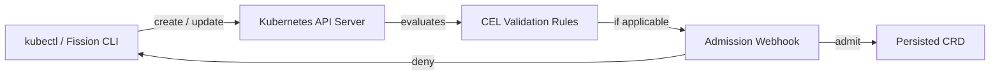

The **admission webhook** is the component that checks a Fission resource for validity at admission time and rejects it before it is written to the cluster.

{}
The webhook is a **core** component.
It runs as part of `fission-bundle` and is installed by the default Helm chart.
{}

When you create or update a Fission resource, the Kubernetes API server runs two layers of validation before storing it: built-in [CEL](https://kubernetes.io/docs/reference/using-api/cel/) rules declared on the CRDs, and a validating admission webhook for the checks CEL cannot express.
This catches mistakes early — at `kubectl apply` or `fission ... create` time — instead of when a function later fails to build or run.

## Validation flow

The API server evaluates the CRD's CEL rules first, then calls the webhook for the resources it is registered on.
If either layer rejects the resource, the API server returns the error to the client and nothing is stored.

## What the webhook validates

In  the validating webhook is registered for exactly five resource types:

- Function
- Package
- Environment
- KubernetesWatchTrigger
- MessageQueueTrigger

These keep a webhook because they need checks that CEL cannot express — cross-namespace reference rejection, pod-spec and container security validation, the environment runtime-image and name invariants, and message-queue type and topic validity.

HTTPTrigger, TimeTrigger, and CanaryConfig no longer have an admission webhook.
Their field rules moved to CEL validation on the CRDs at the API server.
The few parser-based checks that CEL cannot express — the cron schedule, CORS origin and max-age, and the ingress path regex — are surfaced as status Conditions on the resource by the timer and router reconcilers rather than blocking admission.

## PodSpec security validation

A function's Environment or Package can carry a pod spec, so the webhook enforces a security baseline on it.

1. Linux capabilities are constrained to a strict allowlist.
   A tenant may add only `NET_BIND_SERVICE` via `securityContext.capabilities.add`; any other capability is rejected.
2. The executor merge layer then forces `drop: ["ALL"]` on the container so the function starts with no ambient capabilities beyond the allowlisted set.
3. Dangerous pod-level fields are rejected: `hostNetwork`, `hostPID`, `hostIPC`, and overrides of `serviceAccount` / `serviceAccountName` are not allowed.
4. HTTPTrigger paths are validated for path safety, rejecting `..` directory-traversal segments and collisions with router-owned paths.
5. Cross-namespace Environment and Package references are rejected.

The capability allowlist replaced an earlier fixed denylist, closing a privilege-escalation gap (GHSA-qf5v-m7p4-95rp).

## Configuration

The webhook runs inside `fission-bundle` and listens on the port passed via `--webhookPort`.
It is deployed by the Helm chart as part of the standard install — there is no separate enable flag.

## Related

- [Controller]({}) — the deprecated REST server whose validation moved here and to CEL.
- [Reconcilers]({}) — how status Conditions get reported after admission.
- [Architecture overview]({}) — where the webhook sits in the control plane.
