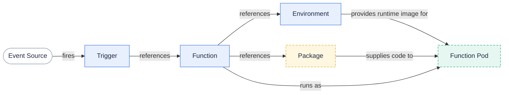

Fission lets you run short-lived functions on Kubernetes without managing pods, deployments, or services yourself.
You write a function, point it at a language environment, and bind it to an event with a trigger.
Fission turns that into running, autoscaled pods on demand.

This page gives you the mental model.
Each object below has its own page that goes deeper.

## The four objects you work with

Everything in Fission is built from four core objects, each backed by a Kubernetes Custom Resource:

- A **Function** is your code plus the configuration that says how to run it.
- An **Environment** is the language-specific container that builds and runs your function.
- A **Trigger** binds an event source (an HTTP request, a timer, a message-queue message, a Kubernetes event) to a function invocation.
- A **Package** holds your code as archives and ties it to an environment, optionally building source into a runnable artifact.

The relationship is simple: a Trigger fires, the request reaches your Function, and your Function runs inside a pod created from its Environment, using the code stored in its Package.

## How the objects relate

A Trigger names a Function.
A Function names exactly one Environment and (optionally) one Package.
At invocation time Fission combines the Environment's runtime image with the Package's code to produce a running Function Pod that serves your request over HTTP.

## Explore the concepts

{}
New to Fission?
Read the pages in order — they build on each other.
{}

- **[Functions]({})** — what a function is, its entry point and interface, and how invocation works.
- **[Environments]({})** — language runtimes, optional builders, and the versioned environment interface.
- **[Executors]({})** — how Fission provisions and scales function pods (poolmgr vs newdeploy vs container).
- **[Triggers]({})** — the event sources that invoke your functions.
- **[Packages and builds]({})** — source and deployment archives, and the build pipeline.

## Specs: declarative configuration

The objects above are normally created with `fission` CLI commands, but you can also declare them in YAML **specs**.
Specs live on the client side and let the CLI create or update objects idempotently, including bundling your source into archives.
See [Spec reference]({}) for the declarative workflow.

## Related

- [Architecture]({}) — the components that implement these concepts.
- [Language environments]({}) — the runtimes you can use.
