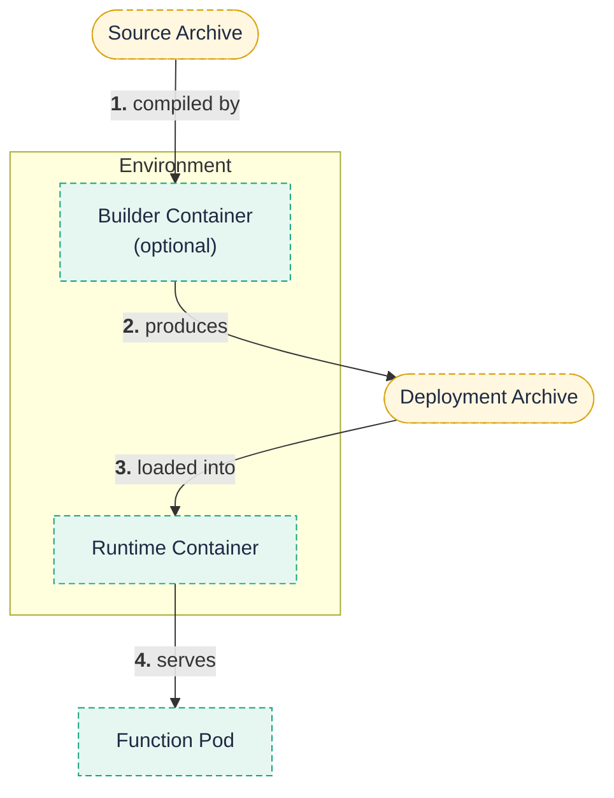

**An environment is the language-specific container that builds and runs your function.**

An `Environment` packages just enough software to compile (if needed) and execute functions written in a particular language.
Because Fission invokes every function over HTTP, an environment's runtime is fundamentally a container running an HTTP server with a loader that can specialize the generic server into your specific function.

This page covers the two containers that make up an environment, how specialization loads your code, the available runtimes, and the versioned environment interface.

## Why it matters

Choosing the right environment and interface version determines whether you can ship a single source file, compile dependencies, or control a pre-warm pool.
It also dictates how your function's entry point is loaded at runtime.

## Runtime container and optional builder container

An environment has up to two parts:

- The **runtime container** is required.
  It runs an HTTP server that, on receiving a specialize request, loads your function code and then serves invocations.
- The **builder container** is optional.
  It compiles source code and gathers dependencies, turning a source archive into a runnable deployment archive.

You only need the builder container for languages that compile or fetch dependencies.
For interpreted single-file functions, the runtime container alone is enough.

## How specialization loads your code

Fission keeps function pods generic until they are needed.
A pod created from an environment starts as an empty HTTP server.
When the executor assigns a function to it, the server receives a **specialize** request that loads your code, after which the pod serves invocations for that one function.
This two-phase model — generic pod first, specialize on demand — is what makes warm-pool cold starts fast.

## Available runtimes

Fission ships environments for these languages, and you can build a custom environment for anything else:



- NodeJS
- Python
- Ruby
- PHP
- Bash


- Go
- Java (JVM)


- Any container image that implements the Fission environment HTTP interface.



See [Language environments]({}) for per-language setup and entry-point signatures.
To build a runtime for a language Fission does not ship, see [Building a Custom Environment]({}).

## The versioned environment interface

The `Environment` spec has an immutable `version` field that selects which interface contract the environment implements.
The version determines what your environment can do:

| Version | Capability |
| --- | --- |
| **1** | Run a code snippet from a single file. Supported by most environments. |
| **2** | Download and compile user functions when a source archive is present (adds builder support). |
| **3** | Same as v2, plus control over the size of the environment's pre-warm pool. |

{}
The `version` field is immutable.
A CEL validation rule on the resource (`self == oldSelf`) rejects any attempt to change it after creation, so pick the right version up front.
{}

### allowedFunctionsPerContainer

By default an environment loads exactly one function per runtime container (`allowedFunctionsPerContainer: single`).
Setting it to `infinite` lets a single function pod load multiple functions, which Fission Workflows uses to chain functions in one pod.
The field accepts only `single` or `infinite`.

### Other spec fields worth knowing

- **`poolsize`** — initial size of the pre-warm pool (relevant to v3 and the poolmgr executor).
- **`resources`** — CPU/memory requests and limits for pre-warm pool pods.
- **`terminationGracePeriod`** — seconds a pod may drain connections before termination; defaults to 360.
- **`keeparchive`** — keep the extracted archive instead of a single unarchived file (used by the JVM environment because a `.jar` is itself a zip archive).
- **`allowAccessToExternalNetwork`** — set to `true` to allow egress when Istio blocks external traffic by default.
- **`imagepullsecret`** — secret used to pull the environment image from a private registry.

## Related

- [Language environments]({}) — set up a runtime for your language.
- [Building a Custom Environment]({}) — implement the runtime/builder contract for a new language.
- [Packages and builds]({}) — how the builder turns source into a deployment archive.
- [Executors]({}) — how the runtime container becomes a serving pod.
