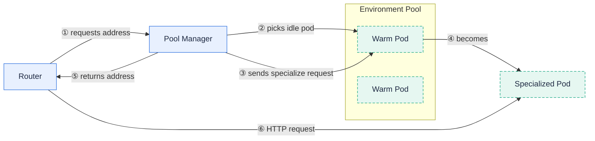
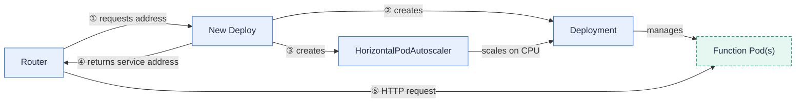
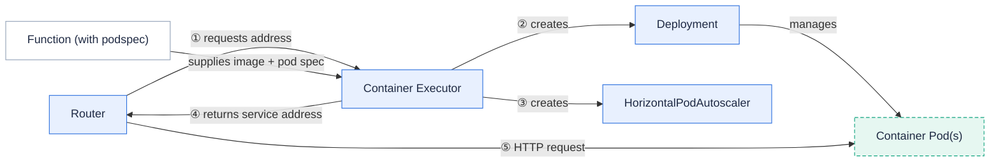
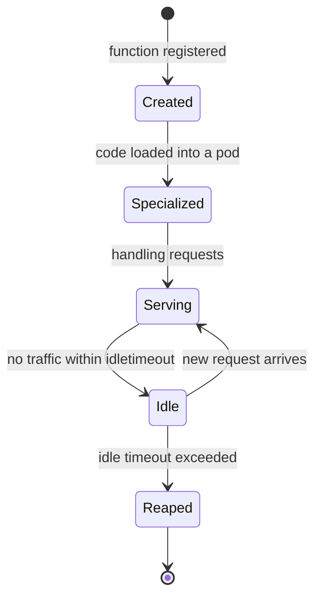

**An executor decides how a function's pods are created, kept warm, scaled, and reaped.**

Every function names an executor through its `InvokeStrategy.ExecutionStrategy.ExecutorType`.
The executor is the part of Fission that turns "this function needs to run" into a concrete Kubernetes pod serving HTTP.
Fission ships exactly three executor types — `poolmgr`, `newdeploy`, and `container` — and your choice trades cold-start latency against resource isolation and scaling control.

This page is the definitive comparison of the three executors, with a provisioning diagram for each and a function-lifecycle state diagram.

## Why it matters

The executor is the single biggest lever over your function's latency and cost.
Pool Manager gives near-zero cold starts by keeping warm pods ready; New Deploy gives strong isolation and CPU-based autoscaling at the cost of a cold start; Container lets you run any image with a full pod spec.

## At a glance

| | **poolmgr** (Pool Manager) | **newdeploy** (New Deploy) | **container** |
| --- | --- | --- | --- |
| Cold start | Very low — served from a pre-warmed pool | Higher — a Deployment must be created and scheduled | Higher — a Deployment must be created and scheduled |
| Scaling | Pool of generic pods specialized on demand | Kubernetes Deployment with a HorizontalPodAutoscaler | Kubernetes Deployment with a HorizontalPodAutoscaler |
| Min scale to zero | Idle pods reaped back to the warm pool | `minScale: 0` scales the function to zero when idle | `minScale: 0` scales the function to zero when idle |
| Resource isolation | Shared pool; per-function resources are limited | Per-function Deployment with its own resources | Per-function Deployment from your own pod spec |
| Custom image | Uses the environment runtime image | Uses the environment runtime image | Runs any container image you supply |
| Best for | Latency-sensitive, bursty, short functions | Steady traffic needing isolation and autoscaling | Bring-your-own-image workloads |

All three executor names are enforced by a CEL validation rule on the `Function` resource — `ExecutionStrategy.ExecutorType` must be one of `poolmgr`, `newdeploy`, or `container`.

## Pool Manager (poolmgr)

Pool Manager keeps a pool of generic, already-running pods for each environment.
When a request arrives for a function that has no warm pod, the executor takes an idle pod from the pool and **specializes** it — loading your function code — then routes the request to it.
Because the pod is already scheduled and running, the cold start is just the specialize step.

Idle specialized pods are reaped back so the pool can be reused.
For newdeploy and container, scaling down to zero is configured with `minScale: 0`; for poolmgr, releasing idle pods is governed by the function's `idletimeout`.

## New Deploy (newdeploy)

New Deploy gives each function its own Kubernetes Deployment, Service, and HorizontalPodAutoscaler.
There is no shared pool, so the first request pays the cost of creating and scheduling the Deployment — but you get full per-function resource isolation and CPU-based autoscaling.

The HPA scales between `minScale` and `maxScale` based on `targetCPUPercent`.
Setting `minScale: 0` lets the function scale to zero when idle; the executor scales it back up on the next request.
CEL rules on the `Function` resource enforce that `maxScale > 0`, `maxScale >= minScale`, and `0 <= targetCPUPercent <= 100` for newdeploy and container.

## Container (container)

The Container executor runs functions from an arbitrary container image that you define with a full Kubernetes pod spec.
Like New Deploy, it creates a per-function Deployment, Service, and HPA, but it does not use an environment runtime image — your image is responsible for serving HTTP.

A CEL rule requires that any function with `executorType: container` provides a `podspec`.
For pod-spec safety, fields such as `hostNetwork`, `hostPID`, `hostIPC`, and service-account overrides are rejected at the API server, and the executor sanitizes the merged pod spec at submit time — forcing `privileged: false` and `allowPrivilegeEscalation: false` and filtering added Linux capabilities down to a strict allowlist.

## Function lifecycle

Regardless of executor, a function moves through the same logical states from creation to pod reaping:

- **Created** — the `Function` resource exists but no pod is serving it yet.
- **Specialized** — a pod has loaded your code (a warm pod for poolmgr, a Deployment pod for newdeploy/container).
- **Serving** — the pod is handling HTTP requests routed by the router.
- **Idle** — no traffic has arrived within `idletimeout`.
- **Reaped** — the executor releases the pod (poolmgr returns it to the pool; newdeploy/container can scale to zero).

{}
As of , the executor's environment and function controllers run as controller-runtime reconcilers (RFC-0005), with self-healing on drift and cleanup finalizers for reliable teardown.
{}

## Choosing an executor

- Use **poolmgr** for latency-sensitive, short-lived, bursty functions where cold starts must stay low.
- Use **newdeploy** when you need per-function resource isolation, CPU-based autoscaling, or scale-to-zero with a dedicated Deployment.
- Use **container** when you must run your own image with a custom pod spec rather than a Fission environment.

## Related

- [Configure a function's executor]({}) — the task-oriented guide.
- [Container functions]({}) — run your own image with the container executor.
- [Executor architecture]({}) — the component internals.
- [Functions]({}) — where executor type and scaling are configured.
