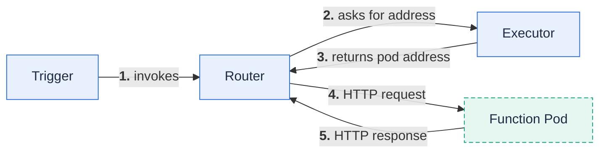

**A function is your code plus the configuration that tells Fission how to build, run, and scale it.**

A function is the unit of work in Fission.
You write a small piece of code with a single entry point, register it as a `Function` object, and Fission runs it on demand inside a Kubernetes pod.
You never write a Dockerfile, a Deployment, or a Service — Fission derives all of that from the function's environment and package.

This page covers what a function looks like, how it is invoked, and the essential fields of the `Function` resource.

## Why it matters

Functions are the reason to use Fission at all.
Understanding the entry-point contract and the always-HTTP invocation model explains both how to write functions and how they behave at runtime — including cold starts, concurrency, and scaling.

## A function is just an entry point

Most environments expect a module that exposes one entry-point function with a language-specific interface.
Here is a minimal NodeJS function:

```js
module.exports = async function (context) {
  return {
    status: 200,
    body: "hello, world!\n",
  };
};
```

The `context` argument carries the incoming HTTP request (headers, query parameters, body), and the return value becomes the HTTP response.
Each language environment defines its own interface; see [Language environments]({}) for the exact signature per runtime.

## Invocation is always HTTP into the function pod

No matter what triggers a function — an HTTP request, a timer, a message-queue message, or a Kubernetes event — Fission invokes it the same way: as an HTTP request sent to the function's pod through the router.



1. A trigger decides a function should run and forwards the event to the **router**.
2. The router asks the **executor** for an address where the function is currently served.
3. The executor returns the address of a ready pod, creating or specializing one if needed.
4. The router proxies an HTTP request to the function pod and streams the response back.

This uniform HTTP model is why every Fission environment runtime is, at its core, an HTTP server.

## The Function resource

A `Function` is a Kubernetes Custom Resource in the `fission.io/v1` group.
Its spec ties your code to an environment and controls how it executes.
The fields you most often set are:

- **`environment`** — the name of the [Environment]({}) used to build and run the function.
- **`package`** — a reference to the [Package]({}) holding your code, plus an optional `functionName` entry point within that package.
- **`InvokeStrategy`** — selects the [executor]({}) (`poolmgr`, `newdeploy`, or `container`) and scaling parameters such as `minScale` and `maxScale`.
- **`functionTimeout`** — maximum request duration; defaults to 60 seconds.
- **`idletimeout`** — how long a function may sit idle before its pods are reaped.
- **`concurrency`** and **`requestsPerPod`** — how many pods may be specialized and how many concurrent requests each pod serves.
- **`secrets`** and **`configmaps`** — Kubernetes Secrets and ConfigMaps made available to the function.

{}
The `Function` resource has a status subresource with Conditions, so you can inspect reconciliation state with `kubectl get function <name> -o yaml`.
{}

A function references exactly one environment.
Several functions can share a single package by using different `functionName` entry points within it.

## Defaults worth knowing

- **Function timeout** defaults to 60 seconds when `functionTimeout` is unset.
- **Concurrency** (maximum pods specialized for a function) defaults to 500.
- **Requests per pod** defaults to 1, meaning each specialized pod serves one request at a time unless you raise it.

These defaults come straight from the `Function` resource definition, so they apply whether you create functions with the CLI or with YAML specs.

## Related

- [Create and run functions]({}) — the task-oriented guide.
- [Environments]({}) — the runtime your function executes in.
- [Executors]({}) — how function pods are provisioned and scaled.
- [Packages and builds]({}) — how your code reaches the pod.
