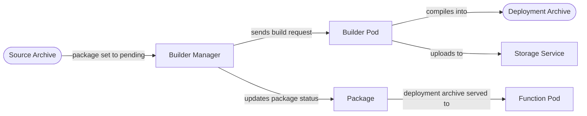

**A package holds your function's code as archives and ties it to an environment, building source into a runnable artifact when needed.**

A `Package` is the bridge between your source code and a running function pod.
It carries up to two archives — the source you wrote and the deployment artifact that actually runs — together with a reference to the environment that builds and runs them.
When you supply only source, Fission compiles it into a deployment archive for you.

This page covers the two archive kinds, the `Package` resource, and the build pipeline that turns source into something runnable.

## Why it matters

Packages are how your code reaches the function pod.
Understanding source vs deployment archives — and the automatic build between them — explains why some functions build before they run, where build logs come from, and how large code is stored.

## Source archive vs deployment archive

A package can hold two archives:

- A **source archive** contains the code and dependency manifest you wrote, before compilation.
- A **deployment archive** contains the runnable artifact — compiled binaries or ready-to-load source — that the environment runtime loads into a function pod.

If you provide a deployment archive directly, the function runs as-is.
If you provide a source archive, Fission's builder compiles it into a deployment archive first.

## The Package resource

A `Package` is a Custom Resource in the `fission.io/v1` group.
Its spec contains:

- **`environment`** — the [Environment]({}) reference used to build and run the package.
- **`source`** — the source archive (optional).
- **`deployment`** — the deployment archive (optional).
- **`buildcmd`** — a custom build command for the builder to run.

The package's status tracks the build:

- **`buildstatus`** is one of `pending`, `running`, `succeeded`, `failed`, or `none`.
- **`buildlog`** captures the build output, including any compiler errors.
- **`conditions`** record the latest observations of the package's state on the status subresource.

{}
A package created with a source archive starts in `buildstatus: pending`.
The builder manager picks it up, runs the build, and on success sets `succeeded` and attaches the deployment archive.
A failed build is terminal and recorded with `failed` plus the build log — inspect it with `fission package info` or `kubectl get package <name> -o yaml`.
{}

## The build pipeline

When a package has a source archive, the build runs through these components:

1. A package with a source archive enters `buildstatus: pending`.
2. The **builder manager** reconciles it, marks it `running`, and sends a build request to the environment's **builder pod**.
3. The builder pod runs the build command, producing a deployment archive.
4. The deployment archive is uploaded to the **storage service**, which stores it (S3 or local backend, via the minio-go client).
5. The builder manager records the upload result, sets `buildstatus: succeeded`, and updates dependent functions so they pick up the new archive.

{}
As of , builder pods no longer inherit the builder service-account token, and cross-namespace Environment or Package references are rejected.
Keep a function's environment and package in the same namespace.
{}

## Literal vs URL archives, and checksums

An archive is stored in one of two ways, set by its `type`:

- **`literal`** — the archive bytes are embedded directly in the resource, suitable for small packages.
- **`url`** — the archive is referenced by URL and fetched on demand, suitable for larger artifacts stored externally (for example, in the storage service).

URL archives carry a **checksum** so Fission can verify integrity when fetching.
The only supported checksum type is `sha256`, enforced by a CEL rule on the resource; the sum is hex-encoded.
Checksums are ignored for literal archives, where the bytes are already present.

You can point a function at an externally hosted archive over a URL; see [URL as archive source]({}).

## Related

- [Create and manage packages]({}) — the task-oriented guide.
- [Builder manager architecture]({})
- [Builder pod architecture]({})
- [Storage service architecture]({})
- [Environments]({}) — the builder that compiles your source.
