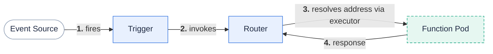

**A trigger binds an event source to a function invocation.**

A function does nothing until something invokes it.
A trigger is the binding that says "when this event happens, run that function."
Each trigger type listens to a different event source, but they all converge on the same path: the event reaches the router, and the router sends an HTTP request to the function pod.

This page covers the four trigger types and how an event becomes a function invocation.

## Why it matters

Triggers are how you wire functions into the real world — an HTTP endpoint, a schedule, a message queue, or changes in your cluster.
Knowing which trigger fits an event source lets you build event-driven systems without writing any glue code.

## How an event reaches your function

Whatever the event source, the trigger turns it into a function invocation routed through the **router**, which resolves the function's current pod address (asking the executor to create or specialize a pod if needed) and proxies an HTTP request.
This is why all triggers ultimately produce an HTTP call into the function pod.

## Trigger types

Fission provides four trigger types, each a Custom Resource in the `fission.io/v1` group.

### HTTP triggers

An **HTTP trigger** exposes a function at a URL path and HTTP method.
For example, you can bind `GET /hello` to a function so that any matching request invokes it.
HTTP triggers support exact relative URLs as well as prefix-based routing, and can create a Kubernetes Ingress.

{}
As of , HTTP trigger paths are validated for safety at the API server: a path must start with `/`, must not be `/`, must not contain `..` segments, and must not collide with router-owned paths such as `/router-healthz`, `/readyz`, `/_version`, and `/auth/login`.
{}

See [HTTP triggers]({}).

### Timer triggers

A **timer trigger** invokes a function on a schedule, expressed as a cron specification.
Use it for periodic jobs such as cleanup tasks, report generation, or polling.

See [Timer triggers]({}).

### Message queue triggers (KEDA)

A **message queue trigger** invokes a function for each message on a queue or topic, and scales the function with the backlog using [KEDA](https://keda.sh).
Fission supports a range of KEDA-backed connectors, including Kafka, NATS JetStream, RabbitMQ, Redis, AWS SQS, AWS Kinesis, and GCP Pub/Sub.

{}
Fission  builds against KEDA v2.20.
KEDA scales the consumer based on queue depth, so the function can scale to zero when the queue is empty and scale out under load.
{}

See [Message queue triggers (KEDA)]({}).

### Kubernetes watch triggers

A **Kubernetes watch trigger** invokes a function when objects in your cluster change.
It watches a resource type (for example, pods in a namespace) and calls the function on add, update, or delete events, letting you react to cluster state.

See [Kubernetes watch triggers]({}).

## Validation

As of , admission webhooks validate `messagequeuetrigger` and `kuberneteswatchtrigger`, while `HTTPTrigger`, `TimeTrigger`, and `CanaryConfig` are validated by CEL rules in the CRD/API server rather than a webhook.
The practical effect is the same: invalid triggers are rejected at creation time.

## Related

- [HTTP triggers]({})
- [Timer triggers]({})
- [Message queue triggers (KEDA)]({})
- [Kubernetes watch triggers]({})
- [Functions]({}) — what triggers invoke.
