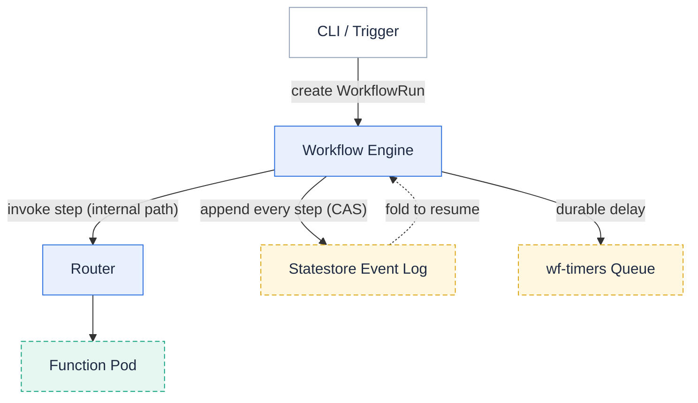

**A workflow is a durable state machine that orchestrates several functions as one reliable unit of work.**

A single function is the right tool for one step.
Real processes are usually several steps with logic between them — validate an order, screen it for fraud, charge the card, fulfill or reject — where some steps run in parallel, some are conditional, and some can fail transiently and must be retried.
You *can* wire that together by having functions call each other, but then the orchestration lives in your code, nothing records how far a given execution got, and a crash midway leaves you guessing.
A workflow makes the orchestration a first-class, durable object instead.

## Definition and execution

Workflows use two custom resources, mirroring the split between a program and a running process:

- A **`Workflow`** is the *definition* — a named state machine that says which functions run, in what order, with what branching, retries, and error handling.
- A **`WorkflowRun`** is one *execution* of that definition against a specific input. You create a run each time you want the workflow to happen; each run has its own state and history.

The definition is authored once and reused; every invocation is a new run.

## What makes it durable

Every step a run takes — scheduled, succeeded, failed, retried, a timer fired, branches joined — is appended to an event log in the [statestore]({}) using compare-and-swap, so the log is the single source of truth for where a run is.
The engine's own state is derived: it rebuilds a run's position by folding its event log, then decides the next step.

That design buys four things:

- **Restart survival.** If the controller restarts mid-run, it reads the log back and continues — nothing is re-run that already succeeded, and nothing is lost.
- **Resume exactly where it stopped.** A run picks up from its last recorded step, not from the beginning.
- **Retries with backoff.** A transient function failure (a 5xx) is retried automatically; a permanent one (a 4xx typed error) is not.
- **Typed-error routing.** A step can catch a named business error (`PaymentDeclined`) and route to a different state, separately from infrastructure retries.

## The state types

A workflow is built from a small set of state types:

- **Task** — invoke a function.
- **Choice** — branch on the data, with no function call.
- **Parallel** — run several branches concurrently and join their results.
- **Map** — run one branch per element of an array, with a concurrency limit.
- **Wait** — pause the run durably for a set duration.
- **Succeed** / **Fail** — terminate the run.

See [Authoring workflows]({}) for the full field reference.

## When to use a workflow

Reach for a workflow when an operation is **multiple steps that must complete reliably as a whole** — especially with parallelism, conditional routing, retries, durable waits, or a need to know afterward exactly what happened.

Prefer the simpler tools when they fit:

- A single function, possibly async, is enough for one unit of work — see [Asynchronous invocation]({}).
- Independent event-driven reactions are better modeled as separate [triggers]({}).

## Related

- [Workflows usage guide]({}) — enable, author, run, and inspect workflows.
- [Statestore]({}) — the durable event log a run is recorded in.
- [Functions]({}) — the steps a workflow orchestrates.
