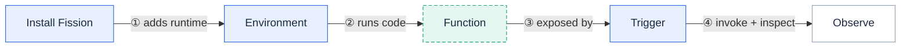

This guide takes you from an empty Kubernetes cluster to a running serverless function in about five minutes.
You will install Fission, create a Python environment, write a one-line function, and call it two ways.

This is the single happy path.
For production installs, alternative service types, and air-gapped options, see the [Installation deep dive]({}).

## Prerequisites

You need three things on your machine and one cluster to deploy into.

- A **Kubernetes cluster** running **1.32 or higher**.
  A local cluster from [kind](https://kind.sigs.k8s.io/), [minikube](https://minikube.sigs.k8s.io/), or Docker Desktop works fine for this walkthrough.
- [**kubectl**](https://kubernetes.io/docs/tasks/tools/#kubectl), configured to talk to that cluster.
- [**Helm v3**](https://helm.sh/docs/intro/install/), used to install the Fission chart.

{}
Fission  requires Kubernetes **1.32 or higher**.
The Helm chart enforces this through its `kubeVersion` constraint, and `fission check` enforces the same floor at runtime.
{}

Confirm your cluster is reachable and on a supported version before continuing.

```sh
kubectl version
```

## Step 1: Install Fission

Install the CRDs first, then the `fission-all` Helm chart into a dedicated `fission` namespace.
These are the canonical commands for a local cluster; they match the [Installation page]({}#install-fission).

```sh
export FISSION_NAMESPACE="fission"
kubectl create namespace $FISSION_NAMESPACE
kubectl create -k "github.com/fission/fission/crds/v1?ref={}"
helm repo add fission-charts https://fission.github.io/fission-charts/
helm repo update
helm install --version {} --namespace $FISSION_NAMESPACE fission \
  --set serviceType=NodePort,routerServiceType=NodePort \
  fission-charts/fission-all
```

{}
The `--set serviceType=NodePort,routerServiceType=NodePort` flags expose Fission on a local cluster that has no cloud load balancer.
On a managed cluster (GKE, AKS, EKS) you can drop those flags to use the default `LoadBalancer`.
See [Installation]({}#install-fission) for every variant.
{}

Pods take a minute or two to become ready.
Wait until every pod in the namespace is `Running`.

```sh
kubectl get pods -n fission
```

## Step 2: Install the Fission CLI

The `fission` CLI is how you create environments, functions, and triggers.
Pick the asset that matches your CPU architecture: `arm64` on Apple Silicon and ARM Linux, `amd64` on Intel/AMD.




```sh
# Apple Silicon (M1/M2/M3)
curl -Lo fission https://github.com/fission/fission/releases/download/{}/fission-{}-darwin-arm64 \
    && chmod +x fission && sudo mv fission /usr/local/bin/

# Intel
curl -Lo fission https://github.com/fission/fission/releases/download/{}/fission-{}-darwin-amd64 \
    && chmod +x fission && sudo mv fission /usr/local/bin/
```




```sh
# amd64
curl -Lo fission https://github.com/fission/fission/releases/download/{}/fission-{}-linux-amd64 \
    && chmod +x fission && sudo mv fission /usr/local/bin/

# arm64
curl -Lo fission https://github.com/fission/fission/releases/download/{}/fission-{}-linux-arm64 \
    && chmod +x fission && sudo mv fission /usr/local/bin/
```




Verify the install.
The client and server versions should both report .

```sh
fission version
```

```sh
fission check
```

A healthy cluster reports the core services as running.

```
fission-services
--------------------
√ executor is running fine
√ router is running fine
√ storagesvc is running fine
√ webhook is running fine
```

## Step 3: Create a Python environment

An **environment** is the language runtime your function executes in.
Create one from the stock Python image.

```sh
fission environment create --name python --image ghcr.io/fission/python-env
```

## Step 4: Write your function

Save the following one line as `hello.py`.

```python
def main():
    return "Hello, world!\n"
```

## Step 5: Create the function

Register `hello.py` with the `python` environment.
This uploads your code as a package and creates the `Function` resource.

```sh
fission function create --name hello --env python --code hello.py
```

## Step 6: Test it

The fastest way to invoke a function is `fission function test`.
The first call cold-starts a pod and takes roughly 100msec; later calls reuse the warm pod.

```sh
fission function test --name hello
```

```
Hello, world!
```

To call the function over HTTP the way a real client would, give it an HTTP route and reach it through the router.

```sh
fission httptrigger create --name hello --method GET --url /hello --function hello
```

On a local cluster, port-forward the router service and curl the route.

```sh
kubectl port-forward svc/router -n fission 8080:80 &
curl http://localhost:8080/hello
```

```
Hello, world!
```

{}
The router service is named `router` and listens on port `80` inside the `fission` namespace.
The port-forward maps it to `localhost:8080` so you can reach it without a load balancer.
{}

## The getting-started journey

Every Fission workflow follows the same shape: install once, then iterate on environments, functions, and triggers.



You just completed every stage of this loop: you installed Fission, created the `python` environment, deployed the `hello` function, attached an HTTP trigger, and observed its output through `fission function test` and `curl`.

## Where to go next

- [Concepts]({}) — understand environments, functions, packages, and triggers before you build more.
- [Usage]({}) — task guides for building functions in each language, wiring triggers, and shipping with specs.
- [Installation deep dive]({}) — managed-cluster installs, alternative service types, authentication, and installing without Helm.
