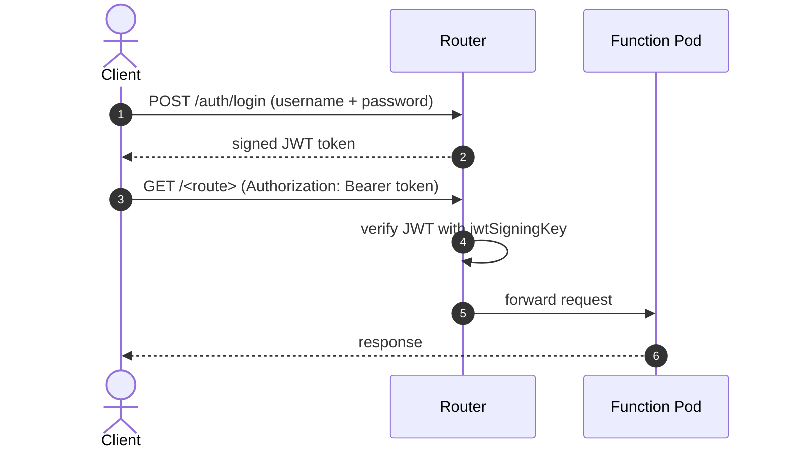

## Authentication for Fission Functions

When using Fission, if you are using an ingress, you might already have some form of authentication in place for external calls.
But if you aren't, Fission didn't provide a way to configure authentication for your API calls.

Starting with [v1.16.0]({}), Fission allows you to have an **authentication mechanism in place for Fission function invocations**.

## Understanding Authentication for Fission Functions

Fission does so by enabling authentication for Fission Router.
This is an optional feature that can be enabled/disable depending on your requirement.

When enabled, a new endpoint for authentication will be registered in the router.
All the API calls to Fission functions will now be routed through function endpoints using authentication token.

Fission also creates a Secret named `router` in the `fission` namespace with a default `username`, a randomly generated `password`, and a `jwtSigningKey`.
This Secret is mounted as a volume on the router pod.
You first create an auth token by providing the `username` and `password`.
The generated token must then be passed in the `Authorization` header of every subsequent function call.



## Enabling Authentication

To enable authentication, you need to set the key `authentication.enabled` to `true`.
This can be found in `charts/fission-all/values.yaml`.

```bash
--set authentication.enabled=true
```

You can also tune the related parameters in the `authentication` section of `values.yaml`:

```yaml
authentication:
  enabled: true

  ## authUriPath defines the authentication endpoint path on the router.
  ## default '/auth/login'
  authUriPath:

  ## authUsername is the username used for authentication.
  ## default 'admin'
  authUsername: admin

  ## jwtSigningKey is the key used to sign the JWT token.
  ## If left empty, the chart generates a random key on install.
  jwtSigningKey:

  ## jwtExpiryTime is the JWT expiry time in seconds.
  ## default '120'
  jwtExpiryTime:

  ## jwtIssuer is the issuer claim of the JWT.
  ## default 'fission'
  jwtIssuer: fission
```

Refer to the [installation guide]({}) if you are installing Fission for the first time, or to the [Upgrade Guide]({}) if you are upgrading from an older version.

## Generating Auth Token

Once the installation is successful, you need to generate the `auth token`.
To do that, you will export the values and set up `$FISSION_USERNAME`, `$FISSION_PASSWORD` and `$FISSION_AUTH_TOKEN` env variables.

```bash
export FISSION_USERNAME=$(kubectl get secrets/router --template={{.data.username}} -n fission | base64 -d)
export FISSION_PASSWORD=$(kubectl get secrets/router --template={{.data.password}} -n fission | base64 -d)
export FISSION_AUTH_TOKEN=$(fission token create --username $FISSION_USERNAME --password $FISSION_PASSWORD)
```

To understand more about generating tokens, refer to the [`fission token create`]({}) reference.

With this, all your API calls to Fission functions are now authenticated using the generated token.
If a malformed token is used, the API call fails and returns an error.

{}
The auth token is valid for 120 seconds by default.
Adjust this with `authentication.jwtExpiryTime`.
{}

## Using Authentication in Fission

Once authentication is enabled, you can use it in two ways:

* Fission Function `test` command
* Fission Function API call

### Fission Function `test` command

Make sure that the environment variables are set before you test your function.

```bash
fission function test --name hello
hello, world!
```

If the environment variable is not set, you need to pass it using the `--header` flag

```bash
fission function test --name hello --header "Authorization: Bearer <token>"
hello, world!
```

If the `auth token` is not configured correctly or malformed, the function will not be invoked and instead will return an error.

```bash
fission fn test --name hello
Error: Error calling function hello: 401; Please try again or fix the error: {"message":"Unauthorized: malformed Token","statusCode":401}
```

### Fission Function API call

In order to execute Fission functions over API calls, you need to first ensure that your fission function has an associate `route` created.

Creating a route for your Fission function

```bash
fission route create --name sample --method GET --url /hello --function hello
```

The next step is to forward the port

```bash
kubectl port-forward svc/router 8888:80 -nfission
```

Using `curl` you can invoke the function by passing the `auth token` in the header

```bash
curl http://localhost:8888/hello -H "Authorization: Bearer ${FISSION_AUTH_TOKEN}"
hello, world!
```

You can also test your Fission function using Postman.
Generate the auth token and pass it as a bearer token in the header of the request.


## Related

- [Internal Service Authentication]({}) — HMAC auth for Fission's internal control-plane RPCs (a separate, on-by-default feature).
- [`fission token create`]({}) — CLI reference.
- [Installing Fission]({})
