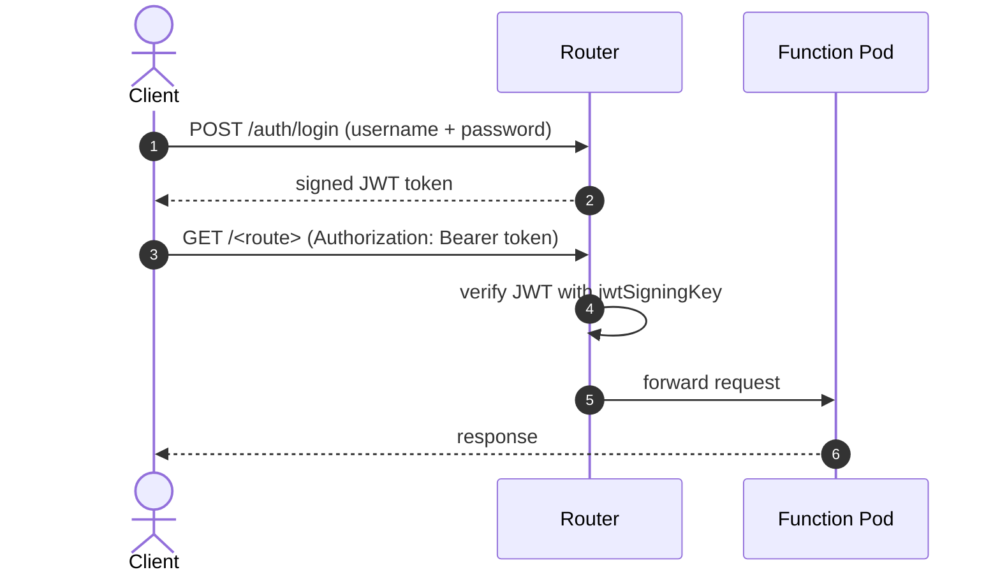

## Authentication for Fission Functions

Starting with [v1.16.0]({}), Fission lets you enable an **authentication mechanism for Fission function invocations**.
If you're using an ingress, you might already have some authentication in place for external calls.
This feature instead protects direct calls to Fission's own function endpoints, which previously had no authentication option.

## How Authentication Works

Fission enables authentication on the Fission Router.
When enabled, the router registers a login endpoint, and every function call must include an authentication token.

Fission also creates a Secret named `router` in the `fission` namespace with a default `username`, a randomly generated `password`, and a `jwtSigningKey`.
The router reads these values through `secretKeyRef` environment variables.
You first create an auth token by providing the `username` and `password`.
Pass the generated token in the `Authorization` header of every subsequent function call.

The sequence below traces this end to end, from login to an authenticated function call:


```mermaid
sequenceDiagram
    autonumber
    actor client as Client
    participant router as Router
    participant fnPod as Function Pod
    client->>router: POST /auth/login (username + password)
    router-->>client: signed JWT token
    client->>router: GET /<route> (Authorization: Bearer token)
    router->>router: verify JWT with jwtSigningKey
    router->>fnPod: forward request
    fnPod-->>client: response
```

## Enabling Authentication

To enable authentication, set `authentication.enabled` to `true` in `charts/fission-all/values.yaml`:

```bash
--set authentication.enabled=true
```

You can also tune the related parameters in the `authentication` section of `values.yaml`:

```yaml
authentication:
  enabled: true

  ## authUriPath defines the authentication endpoint path on the router.
  ## default '/auth/login'
  authUriPath:

  ## authUsername is the username used for authentication.
  ## default 'admin'
  authUsername: admin

  ## jwtSigningKey is the key used to sign the JWT token.
  ## If left empty, the chart generates a random key on install.
  jwtSigningKey:

  ## existingSecret names a pre-created Secret in the release namespace
  ## with the keys username, password, and jwtSigningKey.
  ## When set, the chart does not generate the "router" Secret.
  existingSecret:

  ## jwtExpiryTime is the JWT expiry time in seconds.
  ## default '120'
  jwtExpiryTime:

  ## jwtIssuer is the issuer claim of the JWT.
  ## default 'fission'
  jwtIssuer: fission
```

On GitOps renderers (Argo CD, Flux), set `authentication.existingSecret` to a Secret you create yourself.
Those run `helm template`, where the chart cannot preserve the generated `password` and `jwtSigningKey` across syncs.
Each sync would mint fresh values and invalidate issued tokens.

See the [installation guide]({}) if you install Fission for the first time.
See the [Upgrade Guide]({}) if you upgrade from an older version.

## Generating Auth Token

After installing Fission, generate an auth token by exporting `$FISSION_USERNAME`, `$FISSION_PASSWORD`, and `$FISSION_AUTH_TOKEN`:

```bash
export FISSION_USERNAME=$(kubectl get secrets/router --template={{.data.username}} -n fission | base64 -d)
export FISSION_PASSWORD=$(kubectl get secrets/router --template={{.data.password}} -n fission | base64 -d)
export FISSION_AUTH_TOKEN=$(fission token create --username $FISSION_USERNAME --password $FISSION_PASSWORD)
```

See the [`fission token create`]({}) reference for more on generating tokens.

All API calls to Fission functions now use the generated token for authentication.
A malformed token causes the API call to fail with an error.

{}
The auth token is valid for 120 seconds by default.
Adjust this with `authentication.jwtExpiryTime`.
{}

## Using Authentication in Fission

Once authentication is enabled, you can use it in two ways:

* Fission Function `test` command
* Fission Function API call

### Fission Function `test` command

Set the environment variables before you test your function.

```bash
fission function test --name hello
hello, world!
```

If the environment variable is not set, pass the token with the `--header` flag:

```bash
fission function test --name hello --header "Authorization: Bearer <token>"
hello, world!
```

If the auth token is missing or malformed, the function call fails and returns an error.

```bash
fission fn test --name hello
Error: Error calling function hello: 401; Please try again or fix the error: {"message":"Unauthorized: malformed Token","statusCode":401}
```

### Fission Function API call

To call a Fission function over the API, first create a route for it:

```bash
fission route create --name sample --method GET --url /hello --function hello
```

Forward the port:

```bash
kubectl port-forward svc/router 8888:80 -nfission
```

Invoke the function with `curl`, passing the auth token in the header:

```bash
curl http://localhost:8888/hello -H "Authorization: Bearer ${FISSION_AUTH_TOKEN}"
hello, world!
```

You can also test your Fission function using Postman.
Generate the auth token and pass it as a bearer token in the header of the request.


## Related

- [Internal Service Authentication]({}) — HMAC auth for Fission's internal control-plane RPCs (a separate, on-by-default feature).
- [`fission token create`]({}) — CLI reference.
- [Installing Fission]({})
