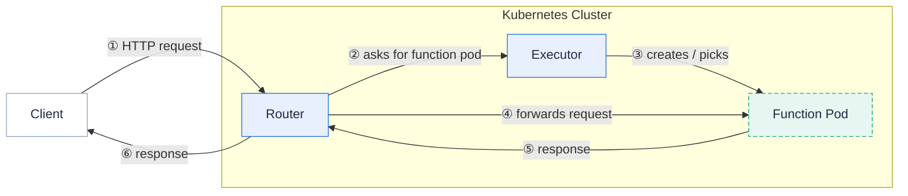

This section helps you diagnose and fix problems with a running Fission installation.
Start here when a function returns errors, a build fails, a trigger does not fire, or a component pod is unhealthy.

The fastest path to a root cause is almost always the same: confirm the control plane is healthy, then read the logs of the one component that owns the failing step.
The sections below give you the commands to do that, followed by a symptom-to-first-place-to-look table you can scan quickly.

Knowing which component owns each step tells you whose log to read.
A function request flows through the router and executor before reaching your code:



## Self-diagnose in three steps

1. Run `fission check` to confirm the Fission services are up and the CLI can reach the cluster.
2. Inspect the relevant pods and their logs with `kubectl`.
3. If you need help, capture a `fission support dump` and attach it to a GitHub issue.

### Step 1: Run fission check

`fission check` verifies that the core Fission services are running and that your CLI version matches the installed server.

```bash
$ fission check
```

A healthy cluster reports each service as running fine:

```
fission-services
--------------------
√ executor is running fine
√ router is running fine
√ storagesvc is running fine
√ webhook is running fine

fission-version
--------------------
√ fission is up-to-date
```

When a service is down, the failing check is marked and names the deployment:

```
fission-services
--------------------
√ executor is running fine
√ router is running fine
× storagesvc deployment is not running
√ webhook is running fine
```

To validate a cluster *before* installing Fission, run the pre-install checks, which confirm the Kubernetes version is compatible:

```bash
$ fission check --pre

kubernetes
--------------------
√ kubernetes version is compatible
```

{}
The `webhook` service is part of the health check.
Fission's admission webhook validates Function, Package, Environment, KubernetesWatchTrigger, and MessageQueueTrigger resources, and its `failurePolicy` is `Fail` — so if the webhook pod is unhealthy, creating or updating those resources will be rejected.
Always confirm `webhook is running fine` before debugging "my function won't create" problems.
{}

### Step 2: Inspect pods and logs

Fission runs entirely as Kubernetes workloads, so `kubectl` is your primary diagnostic tool.
By default the control-plane components live in the `fission` namespace.

#### Core components

Every core component should stay in the `Running` state with a stable restart count.
If a pod is not `Running`, or its `RESTARTS` count keeps climbing, start with `describe` — the `Events` section surfaces the most common problems (bad image name, failed scheduling, failing readiness probe):

```bash
$ kubectl -n fission get pods
$ kubectl -n fission describe pod <pod>
```

If `Events` is not informative, read the component log:

```bash
$ kubectl -n fission logs -f <pod>
```

Each component owns a distinct part of the request lifecycle, so the component whose log matters depends on the symptom:

| Component | Owns | Read its log when |
|-----------|------|-------------------|
| `router` | Maps incoming HTTP requests to functions; asks executor for a function pod. | Requests return 404, 502, or 503; latency spikes. |
| `executor` | Creates and manages function pods (pool manager, new-deploy, container executors). | Functions are slow to start (cold starts), never become ready, or scale incorrectly. |
| `buildermgr` | Drives builds of source packages into deployable archives. | A package build is stuck or failed. |
| `storagesvc` | Stores and serves built packages and large function bodies. | Builds upload but deploys fail to fetch; package downloads error. |
| `webhook` | Admission validation of Fission CRDs. | `create`/`update` of a function, package, environment, or trigger is rejected. |
| `kubewatcher` | Backs KubernetesWatchTriggers. | A `kubernetes watch` trigger does not fire. |
| `timer` | Backs TimeTriggers (cron). | A scheduled function does not run on time. |
| `mqtrigger` | Backs MessageQueueTriggers (and KEDA-managed connectors). | A message-queue trigger does not consume messages. |

#### Function pods

A function pod runs two containers: `fetcher` and the runtime container.
The `fetcher` container pulls your function code into the pod during specialization, and the runtime container is the language environment that executes your function.

Filter for the pods backing a specific function:

```bash
$ kubectl -n fission get pod -l functionName=<fn-name>
```

You can narrow the selection further with these labels:

| Label | Possible value | Example |
|-------|----------------|---------|
| `environmentName` | environment name | `environmentName=go` |
| `functionName` | function name | `functionName=hello` |
| `executorType` | `poolmgr`, `newdeploy`, or `container` | `executorType=newdeploy` |

To list only running pods, add a field selector:

```bash
$ kubectl -n fission get pod -l functionName=<fn-name> \
    --field-selector status.phase=Running
```

Then describe the pod and read each container's log:

```bash
$ kubectl -n fission describe pod <pod>
$ kubectl -n fission logs <pod> -c fetcher
$ kubectl -n fission logs <pod> -c <runtime-container>
```

#### Builder pods

A builder pod compiles your source package into a deployable archive.
Your function will not serve until the package it uses reaches the `succeeded` build status.
Package build status is one of `pending`, `running`, `succeeded`, `failed`, or `none`.

Create a source package and watch its status:

```bash
$ fission pkg create --env go --src go.zip
Package 'go-zip-5obh' created

$ fission pkg list
NAME          BUILD_STATUS ENV
go-zip-5obh   running      go
```

If the build fails, the build logs are stored on the package and surfaced by `fission pkg info`:

```bash
$ fission pkg info --name <pkg-name>
```

To go straight to the builder pod logs, select by the environment name:

```bash
$ kubectl -n fission get pod -l envName=<env-name>
$ kubectl -n fission describe pod <pod>
$ kubectl -n fission logs <pod> -c builder
```

### Step 3: Capture a support dump

If the steps above do not resolve the problem, capture a support dump and share it.
The dump collects the Kubernetes specs and logs for the Fission components, builder, and function pods, plus the Fission CRDs (functions, packages, environments, and all trigger types), into a single archive:

```bash
$ fission support dump
```

By default the archive is written to a `fission-dump` directory.
Use `--output` to choose a different directory and `--nozip` to write individual files instead of a single zip:

```bash
$ fission support dump --output ./my-dump --nozip
```

Open an issue on [GitHub](https://github.com/fission/fission/issues) and attach the dump so others can help.

## Symptom-to-first-place-to-look

Use this table to jump straight to the component or command most likely to reveal the cause.

| Symptom | First place to look |
|---------|---------------------|
| Function returns HTTP 500 or 502 | Function pod runtime-container log (`kubectl logs <pod> -c <runtime>`); your handler is erroring or crashing. |
| Function request times out | Executor log and the function pod; check the function's `functionTimeout` and whether the pod is `Running` and ready. |
| First request is slow (cold start) | Executor log; for `poolmgr`, check that the environment pool has warm pods (`kubectl -n fission get pods -l environmentName=<env>`). For `newdeploy`/`container`, the first request waits for a fresh deployment. |
| Package build is stuck or `failed` | `fission pkg info --name <pkg>` for build logs, then the builder pod (`kubectl -n fission logs <builder-pod> -c builder`) and `buildermgr` log. |
| Trigger does not fire | The trigger-owning component: `timer` (TimeTrigger), `mqtrigger` (MessageQueueTrigger), `kubewatcher` (KubernetesWatchTrigger). Confirm the trigger resource exists with `fission <trigger> list`. |
| Router returns 404 | `router` log; verify the HTTP trigger URL and method with `fission httptrigger list`. A request that matches no trigger is intentionally answered with 404. |
| Environment pods crash-looping | The crashing pod's logs and `Events` (`kubectl -n fission describe pod <pod>`); usually a bad runtime image, a failing readiness probe, or insufficient resources. |
| `create`/`update` of a resource is rejected | `webhook` log; the admission webhook (failurePolicy `Fail`) rejected the resource, or the webhook pod is unhealthy. |

## Related

- [Troubleshoot your Fission setup]({})
- [Troubleshoot your Kubernetes cluster]({})
- [fission check reference]({})
- [fission support dump reference]({})
