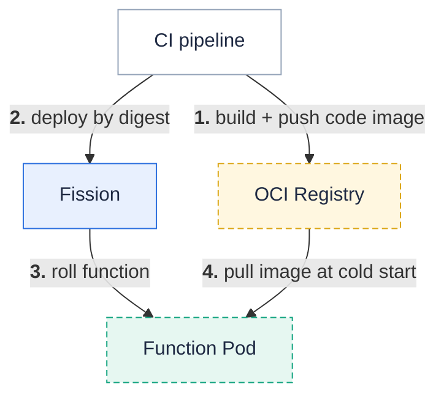

This guide shows how to deploy Fission functions from a CI/CD pipeline instead of by hand.
It builds on two pieces that work together:

- **Declarative [YAML specs]({})** — your functions, environments, and triggers as version-controlled YAML, reconciled onto the cluster with one idempotent command. This is the CI/CD *control plane*.
- **[OCI image packages]({})** — ship function code as a digest-pinned container image your pipeline already knows how to build, push, sign, and scan. This makes the deployed *artifact* registry-native.

Use specs alone to deploy from source, or add OCI delivery for an immutable, promote-by-digest GitOps flow.

## The foundation: `fission spec apply`

A CI/CD pipeline for Fission is, at its core, a job that runs `fission spec apply` against your cluster.
Because apply is **idempotent** — it reconciles the cluster to match the committed specs (creating, updating, and pruning) — the same job is safe to run on every push.

```bash
fission spec apply --wait   # block until builds finish; exits non-zero on failure
```

Keep the `specs/` directory in version control next to your code, and generate resources with `--spec` (for example `fission function create --spec ...`) so every change is reviewable in a pull request.
See [YAML Specs]({}) for the full spec workflow.

## Deploy from GitHub Actions

A minimal pipeline installs the Fission CLI, points it at your cluster with a `KUBECONFIG` secret, and applies the specs on every push to `main`:

```yaml
name: Deploy to Fission
on:
  push:
    branches: [main]

jobs:
  deploy:
    runs-on: ubuntu-latest
    steps:
      - uses: actions/checkout@v4

      - name: Install the Fission CLI
        run: |
          curl -Lo fission https://github.com/fission/fission/releases/download/{}/fission-{}-linux-amd64
          chmod +x fission && sudo mv fission /usr/local/bin/

      - name: Configure cluster access
        run: |
          mkdir -p ~/.kube
          echo "${{ secrets.KUBECONFIG }}" | base64 -d > ~/.kube/config

      - name: Apply specs
        run: fission spec apply --wait
```

Store a base64-encoded kubeconfig — ideally for a dedicated, least-privilege ServiceAccount — as the `KUBECONFIG` repository secret.
The same shape works on any CI system: install the CLI, provide cluster credentials, run `fission spec apply`.

{}
This supersedes the older `.github/main.workflow` approach from the [2019 Fission GitHub Action post](/blog/new-fission-github-action-easily-automate-your-ci/cd-workflows/) — GitHub has since replaced that syntax with the YAML workflows shown here.
{}

## Registry-native CI/CD with OCI packages

The pipeline above uploads your **source** to the cluster and builds it there.
With [OCI image packages]({}), your pipeline instead builds a small **code image**, pushes it to a registry it already uses, and the package references that image **by digest** — no separate upload step, and a deploy that is immutable and verifiable.



A code image is just your function files on top of `scratch`:

```dockerfile
# Dockerfile
FROM scratch
COPY hello.js /
```

The workflow builds and pushes that image, then deploys the package **pinned to the pushed digest**:

```yaml
name: Build and deploy (OCI)
on:
  push:
    branches: [main]

jobs:
  deploy:
    runs-on: ubuntu-latest
    permissions:
      contents: read
      packages: write
    steps:
      - uses: actions/checkout@v4

      - uses: docker/login-action@v3
        with:
          registry: ghcr.io
          username: ${{ github.actor }}
          password: ${{ secrets.GITHUB_TOKEN }}

      - name: Build and push the code image
        id: push
        uses: docker/build-push-action@v6
        with:
          context: .
          push: true
          tags: ghcr.io/${{ github.repository }}/hello-code:${{ github.sha }}

      - name: Install the Fission CLI
        run: |
          curl -Lo fission https://github.com/fission/fission/releases/download/{}/fission-{}-linux-amd64
          chmod +x fission && sudo mv fission /usr/local/bin/

      - name: Configure cluster access
        run: |
          mkdir -p ~/.kube
          echo "${{ secrets.KUBECONFIG }}" | base64 -d > ~/.kube/config

      - name: Deploy the pinned image
        run: |
          fission package update --name hello \
            --oci "ghcr.io/${{ github.repository }}/hello-code@${{ steps.push.outputs.digest }}"
          fission fn update --name hello --pkg hello
```

`docker/build-push-action` exposes the pushed image's digest as `steps.push.outputs.digest`, so the function rolls to the exact bytes the pipeline built.
For a fully declarative flow, write that digest into the package spec's `deployment.oci.digest` field and `fission spec apply` instead — the spec stays the single source of truth.

Delivering code as an image gives the pipeline:

- **No upload-and-build round trip** — the registry your CI already pushes to is the delivery mechanism; cold starts pull cached layers.
- **Supply-chain tooling for free** — sign the code image with `cosign`, scan it, and apply the same registry policies you use for runtime images.
- **Reproducible deploys** — a digest reference is immutable, so what you tested is exactly what runs.

{}
Prefer the cluster to publish images for you?
Set `packageRegistry.enabled` (see [OCI image packages]({}#automatic-oci-delivery-for-built-packages)) and every on-cluster build publishes a digest-pinned image automatically — your pipeline keeps running `fission spec apply` and gets registry-native delivery without building images itself.
{}

## Promote across environments by digest

Because an OCI package is pinned to a digest, promotion is just moving that digest between environments — no rebuild, so staging and production run byte-for-byte what you tested.
Build and verify once in a lower environment, then apply the **same digest** to the next:

```bash
fission package update --name hello --oci "ghcr.io/myorg/hello-code@sha256:<digest>"   # in staging
fission package update --name hello --oci "ghcr.io/myorg/hello-code@sha256:<digest>"   # then prod
```

In a GitOps setup, this is a pull request that bumps the `deployment.oci.digest` in the next environment's spec directory, applied by that environment's pipeline.

## Continuous deployment

For environments where you want the cluster to track a spec directory continuously rather than on each pipeline run, `fission spec apply --watch` re-applies on local changes.
In CI/CD, prefer the explicit per-push `fission spec apply --wait` shown above so each deploy is gated on a green build.

## Related

- [YAML Specs]({}) — the declarative spec workflow `fission spec apply` reconciles.
- [OCI image packages]({}) — build code images, pin digests, and configure a package registry.
- [Package source code]({}) — source vs deployment archives.
- [Installing Fission]({}) — set up the cluster your pipeline targets.
