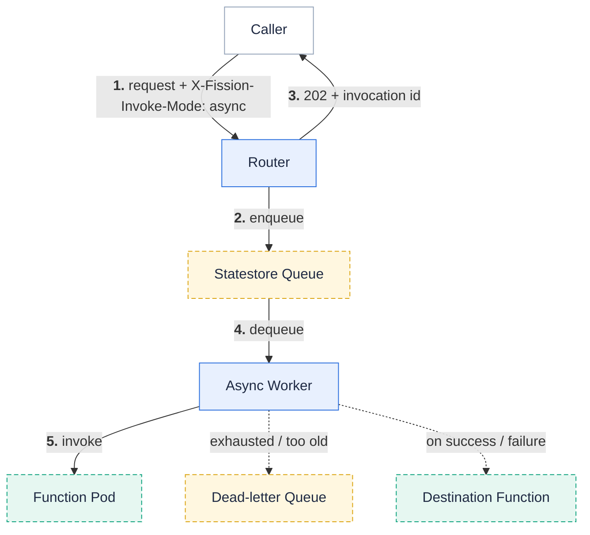

**Invoke a function fire-and-forget: the router accepts the call, returns a durable invocation id immediately, and delivers it in the background with retries — so the caller never waits for the work to finish.**

A normal invocation is synchronous: the caller holds the connection open until the function returns a response.
That is wrong for work that is slow, spiky, or must not be lost if a caller disconnects.
Examples: sending email, processing an upload, calling a rate-limited third party.
Starting with Fission , an asynchronous invocation hands that work to Fission and returns right away.

The caller sends `X-Fission-Invoke-Mode: async` (or uses `fission fn test --async`).
The router **enqueues** the call on the [statestore]({}) queue and returns **`202 Accepted`** with a durable invocation id.
A background worker then delivers it — retrying transient failures, dead-lettering what it cannot deliver, and optionally invoking a destination function with the result.



## Prerequisites

Asynchronous invocation is **off by default** and needs the [statestore]({}) for its durable queue:

```bash
helm upgrade --install fission fission-charts/fission-all \
  --namespace fission \
  --set statestore.enabled=true \
  --set statestore.mode=embedded \
  --set asyncInvocation.enabled=true
```

The chart requires an explicit `statestore.mode` (`embedded` or `external`) when the statestore is enabled.
Embedded mode is enough to try async invocation.
[Autoscaling](#autoscaling) additionally requires `statestore.mode=external`.

## Invoke asynchronously

The CLI sends the async header and prints the durable invocation id instead of waiting for a response:

```bash
$ fission fn test --name resize-image --method POST --body '{"path": "photos/cat.jpg"}' --async
Accepted (202)
invocationId: asyncinv/8f2c1a9e4b7d3c2a9f1e6b5d4c3a2b1f
```

Any HTTP caller can do the same by setting the header on a request to the function's [HTTP trigger]({}):

```bash
curl -XPOST -H "X-Fission-Invoke-Mode: async" \
  --data @photo.json \
  http://$FISSION_ROUTER/resize-image
# HTTP/1.1 202 Accepted
# X-Fission-Invocation-Id: asyncinv/8f2c1a9e4b7d3c2a9f1e6b5d4c3a2b1f
# {"invocationId":"asyncinv/8f2c1a9e4b7d3c2a9f1e6b5d4c3a2b1f"}
```

{}
When [authentication]({}) is enabled, set `FISSION_INTERNAL_AUTH_SECRET` so the CLI signs the internal invocation.
{}

## Delivery guarantees and retries

The worker retries a failed delivery with exponential backoff until it either succeeds, exhausts the attempt budget, or the invocation gets too old.
When either bound is crossed the invocation is moved to the [dead-letter queue](#dead-letter-queue) rather than dropped.
Configure the bounds per function on `fn create` / `fn update`:

```bash
fission fn update --name resize-image \
  --async-retry-max-attempts 3 \
  --async-max-age 1h
```

| Flag | Meaning |
| --- | --- |
| `--async-retry-max-attempts` | Maximum delivery attempts before dead-lettering (1 to 3). |
| `--async-max-age` | Maximum age of an invocation before dead-lettering, regardless of attempts. |

{}
When the function is invoked through a [function alias]({}), the invocation is pinned to the version resolved at enqueue time.
Retries re-run that same version even if the alias moves or is rolled back in between, so retries stay deterministic.
{}

## Result destinations

An async invocation has no caller waiting for its result, so you can route the result to another function in the same namespace:

```bash
fission fn update --name resize-image \
  --async-on-success notify-done \
  --async-on-failure alert-oncall
```

| Flag | Meaning |
| --- | --- |
| `--async-on-success` | Same-namespace function invoked with the result when delivery succeeds. |
| `--async-on-failure` | Same-namespace function invoked when the invocation is dead-lettered. |

To fan the result out to an event topic instead of a single function, use the `--async-on-success-topic` / `--async-on-failure-topic` variants.
These publish the result to a Fission eventing topic that any number of functions can subscribe to.

## Dead-letter queue

Invocations that exhaust their retries or age out land in the dead-letter queue, where you can inspect and act on them:

```bash
# List dead-lettered invocations
fission function dlq list

# Inspect one
fission function dlq show --id asyncinv/8f2c1a9e4b7d3c2a9f1e6b5d4c3a2b1f

# Re-drive one back onto the queue, or all of them
fission function dlq redrive --id asyncinv/8f2c1a9e4b7d3c2a9f1e6b5d4c3a2b1f
fission function dlq redrive --all

# Discard every dead-lettered async invocation
fission function dlq purge
```

A re-driven invocation starts with a fresh attempt budget.

| Flag | Meaning |
| --- | --- |
| `--id` | Operate on a single durable invocation id (`show`, `redrive`). |
| `--all` | Re-drive every dead-lettered invocation (`redrive`). |
| `--queue` | Target queue: empty for async invocations, or an eventing broker egress queue (`mq-egress-<type>`). |
| `--limit` | Cap the number of entries `dlq list` returns. |

## Autoscaling

An opt-in KEDA `ScaledObject` scales the async workers on the queue backlog.
A burst of enqueued work spins up more delivery capacity, then idles back down when the queue drains.

{}
Autoscaling requires `statestore.mode=external` (Postgres).
The KEDA PostgreSQL scaler reads the backlog from the database directly and cannot see the embedded SQLite file.
See [Statestore]({}).
{}

## Related

- [Statestore]({}) — the durable queue behind async delivery.
- [Function versions and aliases]({}) — async retries pin the version resolved at enqueue time.
- [Durable Workflows]({}) — orchestrate multiple functions with the same durable substrate.
- [Create and run functions]({}) — the everyday function workflow.
- [Custom Resource Definition Specification]({}) — the async delivery fields on the `Function` resource.
