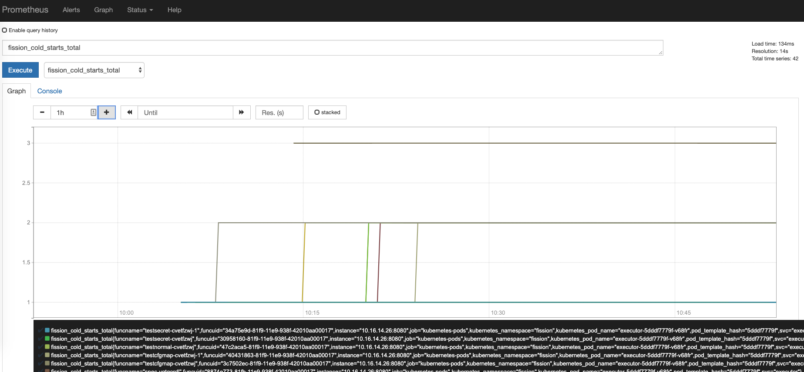
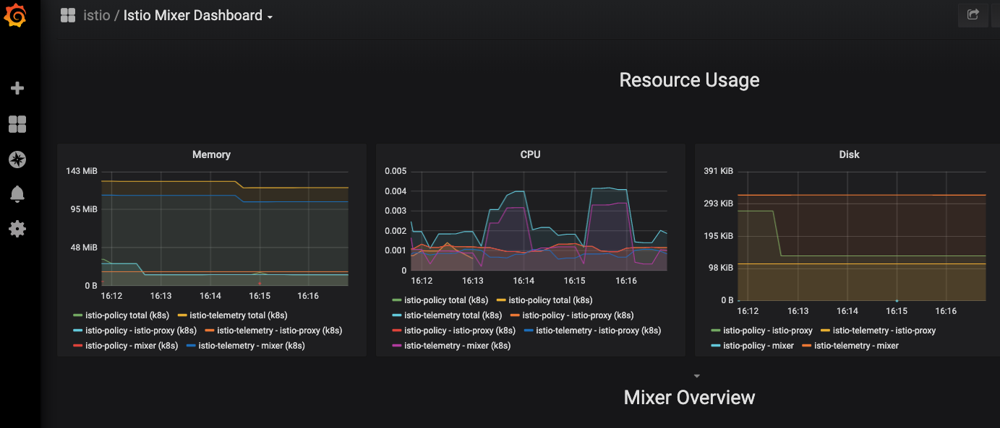
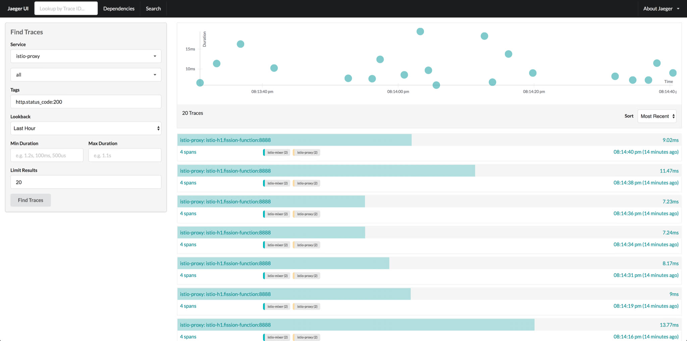

**Install Fission with [Istio](https://istio.io/) so the router, executor, and function pods each get an automatically injected sidecar proxy.**
This was originally tried on GKE but should work on any equivalent setup.
It assumes you already have a working Kubernetes cluster.

{}
The command output below was captured on an older Fission and Istio release, so version strings and the exact set of pods will differ on a current install.
For example, recent Fission releases no longer run a standalone `controller` pod.
Treat the listings as illustrative of the sidecar-injection behavior rather than exact expected output.
{}

#### Set up Istio

Follow the Istio setup guides [here](https://istio.io/docs/setup/kubernetes/install/); any installation method works.
This tutorial uses the Helm install for Istio, [detailed here](https://istio.io/latest/docs/setup/install/helm/).

#### Install fission

Set default namespace for helm installation, here we use `fission` as example namespace:

```bash
$ export FISSION_NAMESPACE=fission
```

Create the namespace and label it for Istio sidecar injection, so the Istio sidecar is automatically injected into Fission pods.

```bash
$ kubectl create namespace $FISSION_NAMESPACE
$ kubectl label namespace $FISSION_NAMESPACE istio-injection=enabled
$ kubectl config set-context $(kubectl config current-context) --namespace=$FISSION_NAMESPACE
```

Follow the [installation guide]({}) to install fission with flag `enableIstio` true.

```bash
$ helm install --namespace $FISSION_NAMESPACE --set enableIstio=true --name istio-demo <chart-fission-all-url>
```

#### Create & test a function

Create the Node.js environment for the function:

```bash
$ fission env create --name nodejs --image ghcr.io/fission/node-env
```

Write a simple hello-world function:

```js
# hello.js
module.exports = async function(context) {
    console.log(context.request.headers);
    return {
        status: 200,
        body: "Hello, World!\n"
    };
}
```

Create the function from that file:

```bash
$ fission fn create --name h1 --env nodejs --code hello.js --method GET
```

Create a route for the function:

```bash
$ fission route create --method GET --url /h1 --function h1
```

Access the function:

```bash
$ curl http://$FISSION_ROUTER/h1
Hello, World!
```

#### Under the hood

Now that a Fission function works with Istio, here's what changed under the hood.
After installation, Fission's core components (executor, router, and others) each gain an additional istio-proxy sidecar container and an istio-init init container.
The pod listing shows the extra `2/2` ready count from that added sidecar:

```bash
$ kubectl get pods -n fission
NAME                                                     READY     STATUS             RESTARTS   AGE
buildermgr-86858f4f6c-drhlv                              2/2       Running            0          7m
controller-78cbdfc4fb-vdjsj                              2/2       Running            0          7m
executor-97c7fc96d-9tclp                                 2/2       Running            1          7m
```

Inspecting the pod spec confirms the injected container is the Istio proxy:

```yaml
  containers:
    name: executor
...
...
    image: docker.io/istio/proxyv2:1.0.6
    imagePullPolicy: IfNotPresent
    name: istio-proxy
```

Function pods gain the same sidecar on top of their existing function and fetcher containers, bringing them to 3 containers total, and the istio-proxy logs are visible like any other container's:

```bash
$ kubectl get pods
NAME                                                READY     STATUS    RESTARTS   AGE
newdeploy-hello-default-mmrlkoog-557678fdcd-gw7tz   3/3       Running   2          9m
poolmgr-node-default-esibbicv-65488fbc4d-2hdzc      3/3       Running   0          9m

$ kubectl $ff logs -f newdeploy-hello-default-mmrlkoog-557678fdcd-gw7tz -c istio-proxy
2019-04-02T17:02:42.944608Z info    Version root@464fc845-2bf8-11e9-b805-0a580a2c0506-docker.io/istio-1.0.6-98598f88f6ee9c1e6b3f03b652d8e0e3cd114fa2-Clean
2019-04-02T17:02:42.944647Z info    Proxy role: model.Proxy{ClusterID:"", Type:"sidecar", IPAddress:"10.16.62.23", ID:"newdeploy-hello-default-mmrlkoog-557678fdcd-gw7tz.fission-function", Domain:"fission-function.svc.cluster.local", Metadata:map[string]string(nil)}
2019-04-02T17:02:42.944966Z info    Effective config: binaryPath: /usr/local/bin/envoy
configPath: /etc/istio/proxy
connectTimeout: 10s
discoveryAddress: istio-pilot.istio-system:15007
discoveryRefreshDelay: 1s

```

#### Install Istio Add-ons

Istio comes with add-ons for features such as monitoring and distributed tracing.
If you installed Istio with Helm, you can choose which add-ons to enable in `values.yaml`:

```yaml
#
# addon prometheus configuration
#
prometheus:
  enabled: true

#
# addon jaeger tracing configuration
#
tracing:
  enabled: true

#
# addon kiali tracing configuration
#
kiali:
  enabled: true
```

The sections below walk through three add-ons: Prometheus, Grafana, and Jaeger.
For each, port-forward its service and open the UI console.
For example, port-forward the Jaeger service:

```bash
$ kubectl port-forward service/jaeger-query -nistio-system 3000:16686
```

#### Prometheus

Prometheus scrapes metrics from both Fission and Istio components.
Once Fission's components are being scraped correctly, its metrics show up as graphs in the Prometheus console:



#### Grafana

Grafana visualizes metrics, and the Grafana instance Istio installs comes with a few dashboards built in.
The screenshot below shows mixer stats visualized:



#### Jaeger

Jaeger provides distributed tracing of requests for function calls, down to the details of each individual call.
Enable Jaeger in the Fission installation and point it to the Jaeger collector's URL.
See [how to configure Jaeger to work with Fission here](/blog/monitor-fission-serverless-functions-with-opentracing/) for details.


