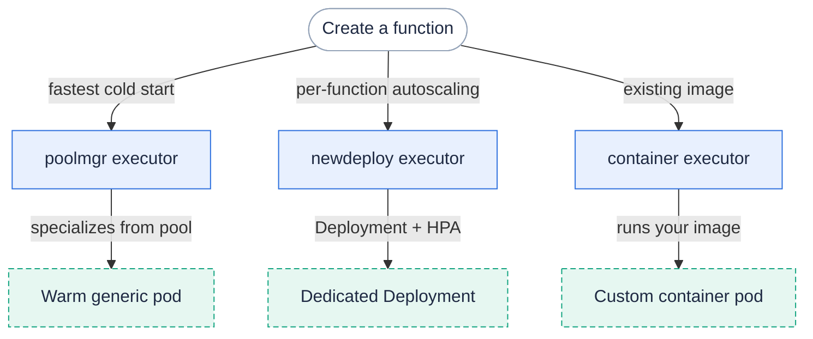

This guide shows how to choose and configure an executor when you create a function.
For the concepts and trade-offs behind each executor type, read [Executors]({}).

Fission has three executor types:

* **poolmgr** — the default; serves requests from a warm pool of generic pods for fast cold starts.
* **newdeploy** — gives each function its own Kubernetes Deployment with autoscaling (HPA).
* **container** — runs an arbitrary container image as a function (see [Running container as functions]({})).

The `--executortype` flag on `fission fn create` accepts `poolmgr` or `newdeploy`; the `container` type is created with [`fission fn run-container`]({}) instead.



#### Poolmgr (Pool-based executor)

Poolmgr is the default executor, so the two commands below are equivalent:

```bash
# The default executor type for a function is poolmgr
$ fission fn create --name foobar --env nodejs --code hello.js

# Or, set the executor type to poolmgr explicitly
$ fission fn create --name foobar --env nodejs --code hello.js --executortype poolmgr
```

When an environment is created, poolmgr creates a pool of generic pods with **default pool size 3**.
We may want to adjust the size of pools based on our need (e.g. resource efficiency), for some [historic reason](https://github.com/fission/fission/issues/506) fission now only supports to adjust pool size by giving `--version 3` flag when creating an environment.

```bash
$ fission env create --name python --version 3 --poolsize 1 --image ghcr.io/fission/python-env

$ kubectl get pod -l environmentName=test
```

Now, you shall see only one pod for the environment we just created.

{}
With `--poolsize 0`, the executor will not be able to specialize any function due to no generic pod in pool.
{}

If you want to set resource requests/limits for all functions use the same environment, you can provide extra min/max cpu & memory flags to set them at **environment-level**.
For example, we want to limit an environment's min/max cpu to 100m/200m and min/max memory to 128Mi/256Mi.

```bash
$ fission env create --name python --version 3 --poolsize 1 --image ghcr.io/fission/python-env \
    --mincpu 100 --maxcpu 200 --minmemory 128 --maxmemory 256

$ fission env list
NAME     UID               IMAGE              POOLSIZE MINCPU MAXCPU MINMEMORY MAXMEMORY EXTNET GRACETIME
python   73e4e8a3-db49-... ghcr.io/fission/python-env 1        100m   200m   128Mi     256Mi     false  360
```

Poolmgr functions support three tuning flags.
All three are valid **only** for the `poolmgr` executor type.

* **Requests per pod** (`--requestsperpod`, alias `--rpp`, default `1`):

The maximum number of concurrent requests a single specialized pod will serve.
Increase it to pack more concurrent requests onto each pod.
For example, to let each pod handle up to 5 concurrent requests:

```bash
$ fission fn create --name foobar --env nodejs --code hello.js --rpp 5
```

* **Once only** (`--onceonly`, alias `--yolo`, default off):

When enabled, a specialized pod serves exactly one request in its lifetime, then is recycled.
This is useful for long-running tasks where each request should get a fresh pod.

```bash
$ fission fn create --name foobar --env nodejs --code hello.js --rpp 1 --yolo
```

* **Concurrency** (`--concurrency`, alias `--con`, default `500`):

The maximum number of pods that may be specialized concurrently to serve incoming requests.
Lower it to cap how many pods the function can take from the pool at once.

```bash
$ fission fn create --name foobar --env nodejs --code hello.js --con 100
```

### Newdeploy (New-deployment executor)

Newdeploy gives each function its own Kubernetes Deployment with a HorizontalPodAutoscaler, so the function can scale out to handle spikes in load.
To use it, set the executor type to `newdeploy` explicitly.

```bash
$ fission fn create --name foobar --env nodejs --code hello.js --executortype newdeploy
```

Unlike poolmgr, which sets resources at the environment level, newdeploy provides more **fine-grained** configuration at the **function level**.
The relevant flags are:

```text
--mincpu value         Minimum CPU to be assigned to pod (In millicore, minimum 1)
--maxcpu value         Maximum CPU to be assigned to pod (In millicore, minimum 1)
--minmemory value      Minimum memory to be assigned to pod (In megabyte)
--maxmemory value      Maximum memory to be assigned to pod (In megabyte)
--minscale value       Minimum number of pods (Uses resource inputs to configure HPA)
--maxscale value       Maximum number of pods (Uses resource inputs to configure HPA)
--targetcpu value      Target average CPU usage percentage across pods for scaling (default: 80)
```

{}
For the `newdeploy` and `container` executors the API server validates these values: `maxscale` must be greater than `0`, `minscale` must be `0` or higher and not exceed `maxscale`, and `targetcpu` must be between `0` and `100`.
A request that violates these rules is rejected at create or update time.
{}

So if we want to limit a function's min/max cpu to 100m/200m and min/max memory to 128Mi/256Mi.

```bash
$ fission fn create --name foobar --env nodejs --code hello.js --executortype newdeploy \
    --minscale 1 --maxscale 3 --mincpu 100 --maxcpu 200 --minmemory 128 --maxmemory 256

$ fission fn list
NAME       UID                   ENV    EXECUTORTYPE MINSCALE MAXSCALE MINCPU MAXCPU MINMEMORY MAXMEMORY TARGETCPU
foobar     afe7666a-db51-11e8... nodejs newdeploy    1        3        100m   200m   128Mi     256Mi     80

$ kubectl -n fission-function get deploy -l functionName=foobar
NAME              DESIRED   CURRENT   UP-TO-DATE   AVAILABLE   AGE
foobar-hhytbcx4   1         1         1            1           51s
```

{}
With `--minscale 0`, a function will experience **long** cold-start time since it takes time for executor to create/scale deployment to 1 replica.
{}

#### Eliminating cold start

If you want to eliminate the cold start for a function, you can run the function with executortype as "newdeploy" and minscale set to 1.
This will ensure that at least one replica of function is always running and there is no cold start in request path.

```bash
$ fission fn create --name hello --env node --code hello.js --minscale 1 --executortype newdeploy
```

#### Autoscaling

Let's create a function to demonstrate the autoscaling behavior in Fission.
We create a simple function which outputs "Hello World" in using NodeJS.
We have kept the CPU request and limit purposefully low to simulate the load and also kept the target CPU percent to 50%.

```bash
$ fission fn create --name hello --env node --code hello.js --executortype newdeploy \
    --minmemory 64 --maxmemory 128 --minscale 1 --maxscale 6  --targetcpu 50
function 'hello' created
```

Now let's use [hey](https://github.com/rakyll/hey) to generate the load with 250 concurrent and a total of 10000 requests:

```bash
$ hey -c 250 -n 10000 http://${FISSION_ROUTER}/hello

Summary:
  Total:        67.3535 secs
  Slowest:      4.6192 secs
  Fastest:      0.0177 secs
  Average:      1.6464 secs
  Requests/sec: 148.4704
  Total data:   160000 bytes
  Size/request: 16 bytes

Response time histogram:
  0.018 [1]    |
  0.478 [486]  |∎∎∎∎∎∎∎
  0.938 [971]  |∎∎∎∎∎∎∎∎∎∎∎∎∎∎
  1.398 [2686] |∎∎∎∎∎∎∎∎∎∎∎∎∎∎∎∎∎∎∎∎∎∎∎∎∎∎∎∎∎∎∎∎∎∎∎∎∎∎∎∎
  1.858 [2326] |∎∎∎∎∎∎∎∎∎∎∎∎∎∎∎∎∎∎∎∎∎∎∎∎∎∎∎∎∎∎∎∎∎∎∎
  2.318 [1641] |∎∎∎∎∎∎∎∎∎∎∎∎∎∎∎∎∎∎∎∎∎∎∎∎
  2.779 [1157] |∎∎∎∎∎∎∎∎∎∎∎∎∎∎∎∎∎
  3.239 [574]  |∎∎∎∎∎∎∎∎∎
  3.699 [120]  |∎∎
  4.159 [0]    |
  4.619 [38]   |∎

Latency distribution:
  10% in 0.7037 secs
  25% in 1.1979 secs
  50% in 1.5038 secs
  75% in 2.1959 secs
  90% in 2.6670 secs
  95% in 2.8855 secs
  99% in 3.4102 secs

Details (average, fastest, slowest):
  DNS+dialup:  0.0058 secs, 0.0000 secs, 1.0853 secs
  DNS-lookup:  0.0000 secs, 0.0000 secs, 0.0000 secs
  req write:   0.0000 secs, 0.0000 secs, 0.0026 secs
  resp wait:   1.6405 secs, 0.0176 secs, 3.6144 secs
  resp read:   0.0001 secs, 0.0000 secs, 0.0056 secs

Status code distribution:
  [200] 10000 responses
```

While the load is being generated, we will watch the HorizontalPodAutoscaler and how it scales over a period of time.
As you can notice, the number of pods is scaled from 1 to 3 after the load rises from 8 - 103%.
After the load generator stops, it takes a few iterations to scale down from 3 to 1 pod.

When testing the scaling behavior, do keep in mind that the scaling event has an initial delay of up to a minute and waits for the average CPU to reach 110% above the threshold before scaling up.
It is best to maintain a minimum number of pods which can handle initial load and scale as needed.

You will notice that the scaling up and down has different behavior in terms of response time.
This behavior is governed by the frequency at which the controller watches (which defaults to 30s) and parameters set on controller-manager for upscale/downscale delay.
More details can be found [here](https://kubernetes.io/docs/tasks/run-application/horizontal-pod-autoscale/#support-for-cooldowndelay)

```bash
$ kubectl get hpa -w

NAME             REFERENCE                   TARGETS      MINPODS   MAXPODS   REPLICAS   AGE
hello-qoxmothj   Deployment/hello-qoxmothj   5% / 50%     1         6         1          3m
hello-qoxmothj   Deployment/hello-qoxmothj   8% / 50%     1         6         1         3m
hello-qoxmothj   Deployment/hello-qoxmothj   103% / 50%   1         6         1         4m
hello-qoxmothj   Deployment/hello-qoxmothj   103% / 50%   1         6         3         5m
hello-qoxmothj   Deployment/hello-qoxmothj   25% / 50%    1         6         3         5m
hello-qoxmothj   Deployment/hello-qoxmothj   25% / 50%    1         6         3         6m
hello-qoxmothj   Deployment/hello-qoxmothj   5% / 50%     1         6         3         6m
hello-qoxmothj   Deployment/hello-qoxmothj   5% / 50%     1         6         3         7m
hello-qoxmothj   Deployment/hello-qoxmothj   5% / 50%     1         6         3         7m
hello-qoxmothj   Deployment/hello-qoxmothj   5% / 50%     1         6         3         8m
hello-qoxmothj   Deployment/hello-qoxmothj   5% / 50%     1         6         3         8m
hello-qoxmothj   Deployment/hello-qoxmothj   5% / 50%     1         6         3         9m
hello-qoxmothj   Deployment/hello-qoxmothj   5% / 50%     1         6         3         9m
hello-qoxmothj   Deployment/hello-qoxmothj   5% / 50%     1         6         3         10m
hello-qoxmothj   Deployment/hello-qoxmothj   5% / 50%     1         6         3         10m
hello-qoxmothj   Deployment/hello-qoxmothj   7% / 50%     1         6         1         11m
hello-qoxmothj   Deployment/hello-qoxmothj   6% / 50%     1         6         1         11m
hello-qoxmothj   Deployment/hello-qoxmothj   6% / 50%     1         6         1         12m
hello-qoxmothj   Deployment/hello-qoxmothj   6% / 50%     1         6         1         12m
```

#### Related

* [Executors]({}) — concepts and trade-offs behind each executor type.
* [Running container as functions]({}) — using the `container` executor.
* [Create a function]({}) — the everyday function workflow.
