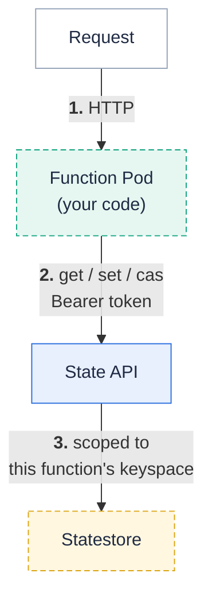

**Give a function durable key/value state without bringing your own Redis or database.**
A Fission function is normally stateless: nothing it writes to memory survives the request, and two requests may land on two different pods.
Anything that needs to remember something between requests — a per-user counter, a shopping cart, a login session, a rate limit, an AI agent's conversation history — usually means standing up Redis or a database, wiring its connection string into every environment image, and re-implementing tenancy and quotas per team.

Starting with Fission , a function can opt into a **keyed state API** instead.
It gets a private keyspace of versioned key/value entries, reached over a local HTTP endpoint that Fission injects into the pod along with a scoped token.
Your code shrinks to `get` / `set` / `delete` / `list` against `localhost`-speed HTTP — portable across environments, with no client library and no secret to manage.

State is **opt-in per function** and additive: functions that don't ask for it behave exactly as before.



## Prerequisites

Function state is **off by default** and stores its data on the [statestore]({}):

```bash
helm upgrade --install fission fission-charts/fission-all \
  --namespace fission \
  --set statestore.enabled=true \
  --set functionState.enabled=true
```

Embedded statestore mode is enough to try it; point `statestore.mode=external` at Postgres when you want the data on managed storage.

## Opt a function in

Add `--state` at create (or update) time:

```bash
fission function create --name cart --env nodejs --code cart.js --state
```

That is all a function needs. By default its keyspace is named after the function, values are capped at 256&nbsp;KiB, and it may hold up to 10,000 live keys. You can tune those:

```bash
fission function create --name sessions --env nodejs --code sessions.js \
  --state \
  --state-keyspace user-sessions \   # explicit name, so renaming the function keeps the data
  --state-max-keys 100000 \
  --state-max-value-bytes 8192 \
  --state-ttl 30m                     # writes without their own TTL expire after 30 minutes
```

Give the keyspace an explicit `--state-keyspace` if you might rename the function later — the keyspace, not the function name, is what owns the data.

## Read and write state from your code

Fission injects two things into the function pod:

- `FISSION_STATE_URL` — the base URL of the state API (an environment variable).
- `FISSION_STATE_TOKEN_PATH` — the path to a small JSON file holding this function's scoped credentials: `{ "namespace": "...", "keyspace": "...", "token": "..." }`.

You present the token as a bearer header along with the namespace and keyspace it was minted for. There is no client library to install — it is plain HTTP. A ~20-line helper is all any language needs.



```javascript
const fs = require('fs');

function stateClient() {
  const c = JSON.parse(fs.readFileSync(process.env.FISSION_STATE_TOKEN_PATH, 'utf8'));
  const base = process.env.FISSION_STATE_URL;
  const headers = {
    'Authorization': 'Bearer ' + c.token,
    'X-Fission-State-Namespace': c.namespace,
    'X-Fission-State-Keyspace': c.keyspace,
  };
  return {
    async get(key) {
      const r = await fetch(`${base}/v1/state/${key}`, { headers });
      if (r.status === 404) return null;
      return { value: await r.text(), version: Number(r.headers.get('x-fission-state-version')) };
    },
    async set(key, value, { ifVersion } = {}) {
      const h = { ...headers };
      if (ifVersion !== undefined) h['If-Match'] = String(ifVersion);   // compare-and-swap
      const r = await fetch(`${base}/v1/state/${key}`, { method: 'PUT', headers: h, body: value });
      return r.status;   // 204 ok, 412 version conflict
    },
    del: (key) => fetch(`${base}/v1/state/${key}`, { method: 'DELETE', headers }),
    async list(prefix = '') {
      const r = await fetch(`${base}/v1/state?prefix=${prefix}`, { headers });
      return (await r.json()).keys;
    },
  };
}
```


```python
import json, os, urllib.request

def state_client():
    with open(os.environ["FISSION_STATE_TOKEN_PATH"]) as f:
        c = json.load(f)
    base = os.environ["FISSION_STATE_URL"]
    headers = {
        "Authorization": "Bearer " + c["token"],
        "X-Fission-State-Namespace": c["namespace"],
        "X-Fission-State-Keyspace": c["keyspace"],
    }

    def req(method, path, body=None, extra=None):
        h = dict(headers, **(extra or {}))
        r = urllib.request.Request(base + path, data=body, method=method, headers=h)
        try:
            resp = urllib.request.urlopen(r)
            return resp.status, resp.read(), resp.headers
        except urllib.error.HTTPError as e:
            return e.code, e.read(), e.headers

    class Client:
        def get(self, key):
            s, b, hdr = req("GET", f"/v1/state/{key}")
            if s == 404:
                return None
            return b.decode(), int(hdr.get("X-Fission-State-Version", 0))

        def set(self, key, value, if_version=None):
            extra = {"If-Match": str(if_version)} if if_version is not None else None
            s, _, _ = req("PUT", f"/v1/state/{key}", value.encode(), extra)
            return s  # 204 ok, 412 version conflict

        def delete(self, key):
            req("DELETE", f"/v1/state/{key}")

    return Client()
```



## Practical patterns

### A per-user counter

The simplest useful pattern: increment a value keyed by user id. Because two requests for the same user can race, use the version returned by `get` as a **compare-and-swap** token on the `set` — the write only lands if nobody changed the value in between, and you retry on a conflict. No lost increments, no locks.

```javascript
module.exports = async function (context) {
  const state = stateClient();
  const user = context.request.query.user || 'anon';
  for (let attempt = 0; attempt < 10; attempt++) {
    const cur = await state.get(user);
    const next = (cur ? Number(cur.value) : 0) + 1;
    const code = await state.set(user, String(next), { ifVersion: cur ? cur.version : 0 });
    if (code === 204) return { status: 200, body: String(next) };
    // 412: someone else incremented first — read again and retry
  }
  return { status: 500, body: 'too much contention' };
};
```

The same shape covers **rate limiting** (increment a counter keyed by `client-ip`, reject past a threshold, let it expire with a TTL) and any other read-modify-write on a single key.

### A login session

Store a session document keyed by session id, with a TTL so it expires on its own:

```javascript
// on login
await state.set(sessionId, JSON.stringify({ user, roles }), { });   // ttl comes from --state-ttl
// on each request
const s = await state.get(sessionId);
if (!s) return { status: 401, body: 'session expired' };
```

Set `--state-ttl 30m` on the function and stale sessions clean themselves up — you never write a reaper.

### A shopping cart

A cart is a value keyed by cart id; add-item is a read-modify-write with the same compare-and-swap retry as the counter, so two tabs adding items at once never clobber each other:

```javascript
const cur = await state.get(cartId);
const cart = cur ? JSON.parse(cur.value) : { items: [] };
cart.items.push(item);
const code = await state.set(cartId, JSON.stringify(cart), { ifVersion: cur ? cur.version : 0 });
// retry on 412
```

### AI agent conversation memory

Give an agent function a durable memory keyed by conversation id — append each turn and read the history back on the next call, so the agent remembers across requests without a vector store or database for the transcript itself.

```javascript
const key = `conv:${conversationId}`;
const cur = await state.get(key);
const history = cur ? JSON.parse(cur.value) : [];
history.push({ role: 'user', content: userMessage });
// ... call the model with `history`, append the reply ...
await state.set(key, JSON.stringify(history), { ifVersion: cur ? cur.version : 0 });
```

## Keep an in-memory cache coherent with sticky routing

Everything above is durable and correct no matter which pod serves a request.
If your function also keeps an **in-memory cache** on top of that durable state — to avoid a round trip on hot keys — you want all requests for one key to keep landing on the same pod so that cache stays warm and coherent. Turn on **sticky routing** by telling Fission where the key lives in the request:

```bash
fission function create --name game-room --env nodejs --code room.js --state \
  --state-sticky-source header \
  --state-sticky-name X-Room-Id
```

Now requests carrying the same `X-Room-Id` are consistent-hashed onto the same ready pod while the pod set is stable. Sources can be a `header` or a `queryparam`.

Sticky routing is a **performance optimization, not a correctness guarantee**: on a scale event or pod replacement a key may move to another pod, and its in-memory cache warms up again from the state API. The durable truth always lives in the state API, so a request that lands on a different pod is never wrong — only, briefly, colder. Requests that don't carry the key fall back to normal routing.

## Inspect and manage state from the CLI

`fission function state` reaches the same keyspace as an operator, useful for debugging and cleanup (it needs the cluster's internal auth secret, so it fails closed if that is not configured):

```bash
fission function state set    --name cart --key demo-cart --value '{"items":[]}'
fission function state get     --name cart --key demo-cart
fission function state list    --name cart --prefix demo
fission function state delete  --name cart --key demo-cart
```

## Lifecycle, limits, and cleanup

- **Deleting a function purges its keyspace** by default, so state doesn't leak after the function is gone. Annotate the function with `fission.io/state-retain: "true"` to keep the data (for example to re-attach a replacement function to the same keyspace).
- **Quotas are enforced for you.** A value larger than `--state-max-value-bytes` is rejected; creating a key past `--state-max-keys` is rejected — atomically, so concurrent writers can't overshoot the budget.
- **This is key/value, not a database.** There are no cross-key transactions, no secondary indexes, and values are capped (256&nbsp;KiB by default) — large blobs belong in object storage, relational data in a real database. It is exactly the right tool for the "remember a small thing per key" workloads above.
- **Executor type.** State works with the `poolmgr` (default) and `newdeploy` executors. The container executor and the `infinite` functions-per-container environment mode aren't supported, because a scoped per-function token can't be delivered to them.

## Multi-namespace tenancy

Function state is supported under the default single-namespace / static tenancy model.
The dynamic and cluster multi-namespace tenancy modes are not yet supported for function state — enable it on a statically-scoped install for now.
