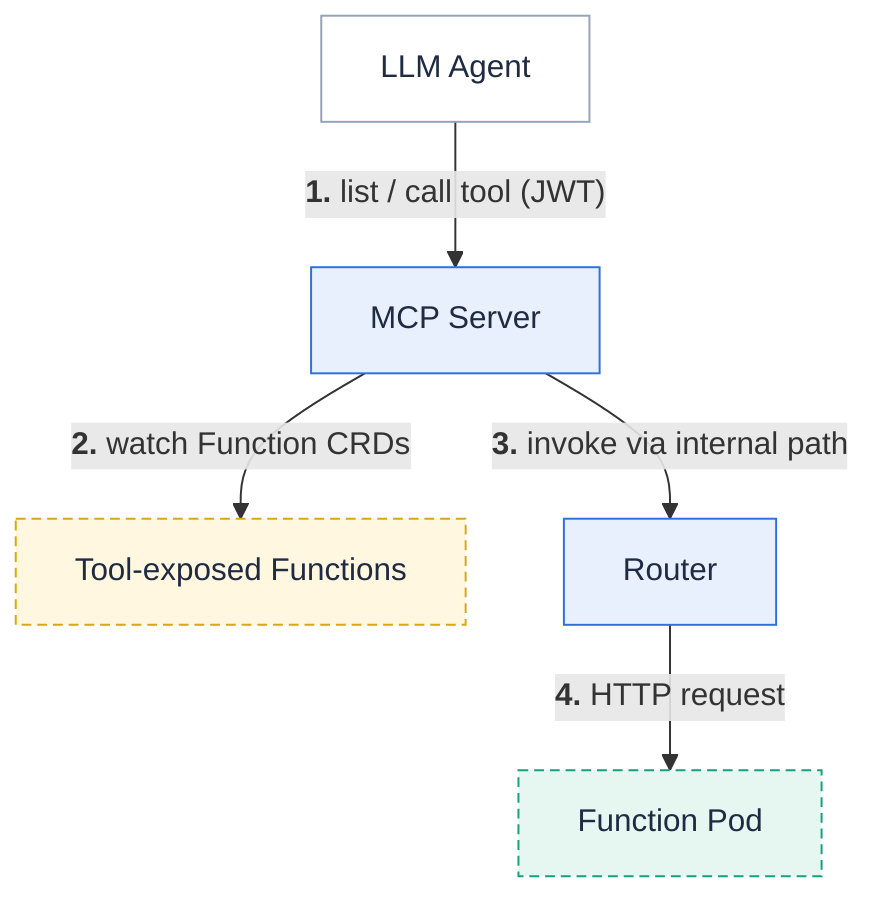

**Expose a Fission function as an MCP tool so any LLM agent that speaks MCP can discover and invoke it, with no hand-written adapter code.**
The [Model Context Protocol](https://modelcontextprotocol.io/) (MCP) is an open protocol that lets LLM agents discover and call external tools.
Starting with Fission , an agent that speaks MCP (for example Claude) can list an advertised function.
It can then invoke the function over Fission's existing internal invocation path.

Exposing a function as a tool is **opt-in per function** and additive — functions you don't mark stay private.

The request travels from agent to MCP server to router to function pod:



## Enable the MCP server

The MCP server is **off by default**.
Enable it with a Helm value:

```bash
helm upgrade --install fission fission-charts/fission-all \
  --namespace fission \
  --set mcp.enabled=true
```

This deploys a stateless MCP server that watches `Function` resources and hot-updates its advertised tool list.
It listens on a `ClusterIP` Service on port `8890` by default (`mcp.port`).

| Helm value | Default | Meaning |
| --- | --- | --- |
| `mcp.enabled` | `false` | Deploy the MCP server. |
| `mcp.port` | `8890` | Port the MCP server (and its `ClusterIP` Service) listens on. |
| `mcp.allowInsecure` | `false` | Permit **unauthenticated** access when `authentication.enabled` is `false`. Dev/test only — every caller can then list and invoke all tool-exposed functions. |
| `mcp.replicas` | `1` | Replica count. The server is stateless and runs without leader election; every replica serves the full tool list. |

{}
In production, leave `mcp.allowInsecure: false` and run with [authentication]({}) enabled.
Agents then authenticate with a signed JWT whose `allowed_namespaces` claim scopes which functions they may see and call.
Enabling MCP with authentication off and `mcp.allowInsecure: false` fails the chart render.
{}

## Expose a function as a tool

Create (or update) a function with `--expose-as-mcp` and a required agent-facing description:

```bash
fission fn create --name weather --env nodejs --code weather.js \
  --expose-as-mcp \
  --tool-description "Return the current weather for a city" \
  --tool-input-schema weather-schema.json
```

`--tool-input-schema` points at a JSON Schema (draft 2020-12) file describing the tool's arguments.
Fission advertises it verbatim as the MCP tool `inputSchema`.
When omitted, the tool advertises an open object schema (`{"type":"object"}`).

| Flag | Meaning |
| --- | --- |
| `--expose-as-mcp` | Advertise this function as an MCP tool. |
| `--tool-description` | Agent-facing tool description (required with `--expose-as-mcp`). |
| `--tool-input-schema` | Path to a JSON Schema file describing the tool's arguments. |
| `--tool-name` | Override the advertised tool name (defaults to `<namespace>-<function name>`; must match `^[a-zA-Z0-9_-]{1,64}$`). |

## List exposed tools

`fission function tools` lists every tool-exposed function in the current namespace:

```bash
$ fission function tools
TOOL              FUNCTION   NAMESPACE   DESCRIPTION                             EXPOSED
default-weather   weather    default     Return the current weather for a city   True
```

The `EXPOSED` column shows the function's `ToolExposed` status condition — `True` once the MCP server advertises the tool.
`-o wide` adds an `AGE` column; use `-o json` or `-o yaml` for full detail.

## Declarative spec

Exposing a function as a tool is controlled by the presence of `spec.tool` on the `Function` resource — there is no separate `enabled` flag:

```yaml
apiVersion: fission.io/v1
kind: Function
metadata:
  name: weather
spec:
  environment:
    name: nodejs
  package:
    packageref:
      name: weather
  tool:
    description: Return the current weather for a city   # required
    # Optional JSON Schema (draft 2020-12) for the tool's arguments.
    inputSchema:
      type: object
      properties:
        city:
          type: string
      required: [city]
    # Optional: override the advertised tool name (defaults to <namespace>-<name>).
    toolName: get-weather
```

## How agents reach the tools

Point an MCP-capable agent at the MCP server's Streamable HTTP endpoint: `http://mcp.<fission-namespace>:8890/mcp`.
The `mcp` Service is `ClusterIP`-only and never joins the router's public listener.
Expose it deliberately with an Ingress, a Gateway, or `kubectl port-forward`.
With authentication enabled, the agent presents a bearer JWT and only sees tools in its `allowed_namespaces`.
When the agent calls a tool, the MCP server invokes the underlying function through Fission's internal invocation path and returns the response.

## Related

* [Create and run functions]({}) — the everyday function workflow.
* [Internal Service Authentication]({}) — the signing used to scope agent access.
* [Functions]({}) — the `Function` resource and the `tool` field.
* [Custom Resource Definition Specification]({}) — the `ToolConfig` spec fields.
