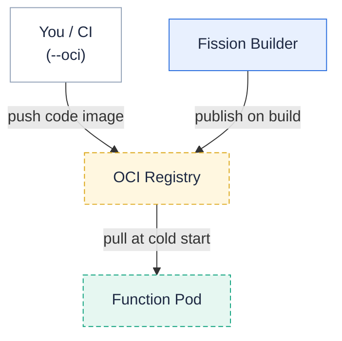

**Ship Fission function code as an OCI image instead of a zip archive.**
**Build a code-only image, push it to any OCI registry, and reference it when creating the package.**
Available starting with Fission v1.26.0.
Create the package with `--oci`:

```bash
$ fission package create --name hello --env python \
    --oci registry.example.com/myteam/hello-code:v1
```

Everything else — environments, functions, triggers, entry points — works exactly as with archive-based packages.

The code image moves from your build to the registry to the function pod, the same registry path a builder-published image takes:



#### Why deliver code as an image?

* **Faster, cache-friendly cold starts**: nodes and registries cache image layers, so repeated fetches of the same code are cheap.
  There is no zip download + extract step from Fission's internal storage.
* **Standard supply-chain tooling**: code images can be signed (`cosign`), scanned, replicated, and promoted with the same tooling you already use for runtime images.
* **Registry-native workflows**: CI pipelines that already push images need no extra upload step to Fission's storage service.

OCI delivery is **opt-in**: it applies per package via `--oci`, or cluster-wide for every build once you configure a [package registry](#automatic-oci-delivery-for-built-packages).
With neither configured, archive-based packages remain the default and are unaffected.

#### Building a compatible code image

The image's filesystem must contain exactly what an *extracted deployment archive* would contain.
That means your code files at the image root, or under a sub-path (see below).
The environment's runtime still comes from the environment image.
The code image carries **only your code**.

For a Python function with a `main` entry point in `hello.py`:

```python
# hello.py
def main():
    return "Hello, world!\n"
```

Package it with a minimal Dockerfile that copies only the code:

```dockerfile
# Dockerfile
FROM scratch
COPY hello.py /
```

Build and push it like any other image:

```bash
$ docker build -t registry.example.com/myteam/hello-code:v1 .
$ docker push registry.example.com/myteam/hello-code:v1
```

Multi-file packages work the same way — copy the whole directory:

```dockerfile
FROM scratch
COPY src/ /
```

You can also build code images without a Docker daemon using [`crane`](https://github.com/google/go-containerregistry/tree/main/cmd/crane):

```bash
$ tar -cf code.tar hello.py
$ crane append --new_layer code.tar \
    --new_tag registry.example.com/myteam/hello-code:v1
```

##### Base image recommendations

* **Use `FROM scratch`.**
  The code image is never executed as a container — Fission only reads its filesystem — so it needs no shell, libc, or OS layer.
  A scratch-based code image is a few kilobytes, pulls fast, and has no CVE surface.
* Do **not** base the code image on the environment/runtime image.
  The environment supplies the runtime.
  Duplicating it in the code image wastes pull time and storage and changes nothing at runtime.
* If your build pipeline cannot produce `FROM scratch` images, any minimal base works.
  Fission extracts the *merged* filesystem, so it also extracts anything in the image beyond your code.
  Keep it small, and put code under a dedicated directory.
  Combine this with `subPath` (below) to exclude OS files.

#### Creating packages and functions

Create the package and reference it from a function as usual:

```bash
$ fission package create --name hello --env python \
    --oci registry.example.com/myteam/hello-code:v1
$ fission fn create --name hello --pkg hello --entrypoint hello.main
$ fission route create --name hello --function hello --url /hello --method GET
$ curl http://$FISSION_ROUTER/hello
Hello, world!
```

`fission fn create --oci <ref>` is a shortcut that creates the package and the function in one step.
`fission package update --name hello --oci <ref:v2>` switches a package to a new image.
Follow it with `fn update` to roll running functions, exactly like archive updates.

The package spec exposes a few more fields than the CLI flag; use spec files for these:

```yaml
apiVersion: fission.io/v1
kind: Package
metadata:
  name: hello
spec:
  environment:
    name: python
  deployment:
    type: oci
    oci:
      image: registry.example.com/myteam/hello-code:v1
      # Optional: pin the exact content; the pull fails on any mismatch.
      digest: sha256:9f86d081884c7d659a2feaa0c55ad015a3bf4f1b2b0b822cd15d6c15b0f00a08
      # Optional: code lives under /app inside the image (must be a directory).
      subPath: app
      # Optional: registry credentials, resolved in the function namespace.
      imagePullSecrets:
        - name: regcred
```

{}
**Pin digests in production.**
A package references an image.
Re-pushing the same tag with different content is **not** detected automatically (functions roll only on package update).
Setting `digest` makes the reference immutable and the pull verifiable.
{}

#### Automatic OCI delivery for built packages

The `--oci` flow above is **per package** — you build and push the image yourself.
You can also have Fission do this for **every** build cluster-wide: configure a **package registry**.
Each successful build then publishes its deployment archive as a digest-pinned OCI image.
Functions cold-start by pulling it instead of downloading a tarball from the storage service.

Enable it with Helm:

```yaml
packageRegistry:
  enabled: true
  # Repository root. Packages are pushed to <repositoryPrefix>/<namespace>/<package>.
  repositoryPrefix: ghcr.io/myorg/fission-packages
  # Secret names (kubernetes.io/dockerconfigjson) in the builder namespace.
  # pushSecret needs write access (build time); pullSecret needs read access
  # (attached to packages for the pull). Keep them separate.
  pushSecret: registry-push
  pullSecret: registry-pull
  # On a failed push: true keeps the build and stores a tarball instead
  # (the package gets condition OCIPublished=False); false fails the build.
  fallbackToStorage: true
```

| Helm value | Default | Meaning |
| --- | --- | --- |
| `packageRegistry.enabled` | `false` | Publish built deployment archives as OCI images. When unset, builds use the storage-service tarball path unchanged. |
| `packageRegistry.repositoryPrefix` | `""` | Repository root; images are pushed to `<repositoryPrefix>/<namespace>/<package>`. |
| `packageRegistry.pushSecret` | `""` | `dockerconfigjson` secret (in the builder namespace) with **write** access, used at build time. |
| `packageRegistry.pullSecret` | `""` | `dockerconfigjson` secret with **read** access, stamped into each package's `imagePullSecrets`. |
| `packageRegistry.fallbackToStorage` | `true` | On push failure, keep the build and fall back to a tarball (package gets `OCIPublished=False`); `false` fails the build. |
| `packageRegistry.publishedPrefix` | `""` | Advanced: node-visible prefix recorded in packages when nodes reach the registry at a different address than pods do (e.g. an in-cluster registry via NodePort). |
| `packageRegistry.insecureHosts` | `""` | Comma-separated `host[:port]` list allowed to use plain HTTP instead of TLS. |

To keep a single package on the tarball path regardless of the cluster setting, annotate it:

```bash
$ kubectl annotate package <name> -n <ns> fission.io/package-delivery=tarball
```

#### Private registries

Code-image pulls resolve credentials in this order:

1. The **`fission-fetcher` service account's `imagePullSecrets`** — the cluster-wide default for all packages.
2. The **package's own `imagePullSecrets`** — per-package credentials, set in the package spec.
3. **Anonymous** access.

Both secret sources are resolved in the namespace the function pods run in.
By default that is the function's own namespace.
When your install sets the `functionNamespace` Helm value, functions in the `default` namespace run in that namespace instead.
Confirm with `kubectl get pods -l environmentName=<env> -A` if unsure.
The examples below use `default`; substitute your function-pod namespace.

##### Step 1 — create a registry secret

Create a standard `docker-registry` secret in the function-pod namespace (see the [Kubernetes guide](https://kubernetes.io/docs/tasks/configure-pod-container/pull-image-private-registry/) for registry-specific details):

```bash
$ kubectl create secret docker-registry regcred \
    --namespace default \
    --docker-server=registry.example.com \
    --docker-username=ci-bot \
    --docker-password="$REGISTRY_TOKEN"
```

##### Step 2a — cluster-wide: attach the secret to the fetcher service account

Patch the `fission-fetcher` service account in the same namespace.
Every OCI package pull then uses it without any per-package configuration:

```bash
$ kubectl patch serviceaccount fission-fetcher \
    --namespace default \
    -p '{"imagePullSecrets": [{"name": "regcred"}]}'
```

##### Step 2b — per-package: reference the secret in the package spec

For credentials scoped to one package (e.g. different teams pulling from different registries), set `imagePullSecrets` in the package spec instead:

```yaml
apiVersion: fission.io/v1
kind: Package
metadata:
  name: hello
spec:
  environment:
    name: python
  deployment:
    type: oci
    oci:
      image: registry.example.com/myteam/hello-code:v1
      imagePullSecrets:
        - name: regcred
```

##### Verifying

Create a function on the package and invoke it.
On a credential problem, the function returns a 5xx and the fetcher log names the registry error:

```bash
$ kubectl logs <function-pod> -c fetcher -n default | grep -i "error extracting OCI image"
```

{}
Fission does not validate that the referenced secrets exist or hold working credentials — a missing or wrong secret surfaces only at pull time.
With [image volumes](#kubernetes-image-volumes) active (the default on Kubernetes 1.33+), the **kubelet** performs the pull using the same two secret sources (the pod inherits both), so the same setup keeps working.
Pull errors then appear as pod events (`kubectl describe pod`, `ErrImagePull`) rather than fetcher logs.
{}

The kubelet pulls runtime/environment images independently of package images.
For those, see [Pull an Image From a Private Registry]({}).

#### Insecure (plain-HTTP) registries

Plain-HTTP registries are refused by default.
To allow specific hosts (e.g. an in-cluster registry for development), set the Helm value:

```yaml
fetcher:
  allowInsecureRegistries: "registry.dev.svc.cluster.local:5000"
```

This is a comma-separated host allowlist, not a global switch — every other registry still requires TLS.
The underlying client implicitly trusts localhost and private (RFC-1918) IP addresses, matching Docker's behavior.

#### Kubernetes image volumes

On Kubernetes **1.33+** the **kubelet** mounts the code image directly into function pods as an [image volume](https://kubernetes.io/docs/tasks/configure-pod-container/image-volumes/).
This removes the fetch-and-extract step from the cold-start path entirely.
This is **on by default** (`executor.enableOCIImageVolume: true` in the Helm chart).
On clusters below 1.33, Fission detects image volumes as unsupported.
Packages then automatically use the per-pod fetcher, which pulls and extracts the image itself.
To force the fetcher path on every cluster, disable the setting:

```yaml
executor:
  enableOCIImageVolume: false
```

Be aware of the behavioral differences when image volumes are active:

* **The kubelet pulls the image, not Fission.**
  Image references resolve with the node's DNS and containerd's registry configuration.
  A registry reachable only through cluster DNS (a ClusterIP `Service` name) will not resolve.
  Use a registry address that nodes can reach.
* Functions that reference **Secrets or ConfigMaps** still mount the code as an image volume.
  Their pods keep the fetcher, which materializes those Secrets and ConfigMaps.
* Poolmgr functions on **v1 environments**, and those whose environment sets `allowedFunctionsPerContainer: infinite` or `keepArchive: true`, stay on the fetcher path.
* The code mount is **read-only**.
  Runtimes that write next to the code (Python bytecode caches, JVM work files) should write elsewhere; the standard Fission environments handle this.
* `subPath` must point to a **directory** inside the image (kubelets reject file sub-paths).
* The kubelet enforces the `digest` pin through the volume's image reference.

#### Limitations

* OCI delivery applies to **deployment** archives only; source packages (built by a builder on the cluster) keep using archives.
* The container executor is unrelated to OCI packages — it already runs your full container image and ignores packages entirely.
* `--oci` cannot be combined with `--code`, `--src`, or `--deploy`; a package has exactly one code source.
