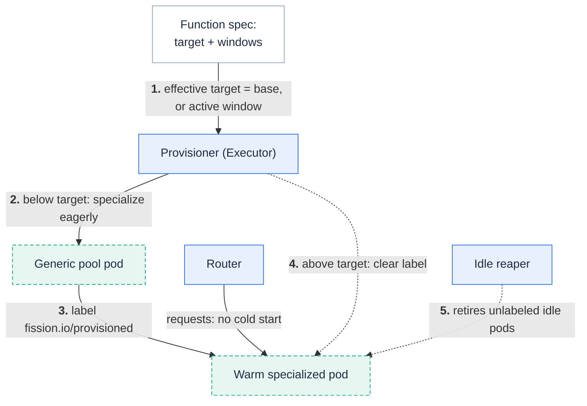

**Declare a floor of always-warm capacity: the executor keeps N specialized pods ready before any request arrives, and cron-scheduled windows raise or lower that floor for known traffic patterns.**

The poolmgr warm pool is generic: pods idle without your code loaded.
The first request per pod pays package fetch and load, and the idle reaper un-warms quiet functions, so off-hours traffic pays it again.
Starting with Fission , provisioned concurrency removes that cold start for opted-in functions.
The executor specializes pods eagerly, exempts them from the idle reaper, and publishes them to the router, so requests within the floor always hit a warm pod.
Requests beyond the floor behave exactly as before: they pay a normal on-demand cold start.



## Prerequisites

Provisioned concurrency is **off by default**.
Enable the provisioner in the executor at install or upgrade time:

```bash
helm upgrade --install fission fission-charts/fission-all \
  --namespace fission \
  --set executor.provisionedConcurrency.enabled=true
```

{}
With the Helm gate off, Fission still accepts a function spec that sets provisioned concurrency — but warms nothing, silently.
If your function never shows warm pods, check `executor.provisionedConcurrency.enabled` first.
{}

Provisioned concurrency works with the [poolmgr executor](/docs/usage/function/executor/) only; the API server rejects the field on other executor types.
For newdeploy or container functions, set `--minscale` instead — those executors already keep a minimum replica count.

## Keep pods warm

Set a base target on `fn create` or `fn update`:

```bash
$ fission fn create --name checkout --env node --code checkout.js \
    --provisioned-concurrency 2
function 'checkout' created
```

The executor's provisioner reconciles every 30 seconds (Helm: `executor.provisionedConcurrency.reconcileInterval`).
On each pass it counts ready warm pods for the function.
If the count is below the target, it specializes more pods from the generic pool — the same code path a cold start uses, so the pods are identical.
If the count is above the target, it removes the exemption label from the excess pods and lets the idle reaper retire them.

Warming is paced, not instant.
At most 4 eager specializations run per function at a time (Helm: `executor.provisionedConcurrency.maxInflightPerFunction`), so one function's warm-up burst cannot starve cold starts of other functions.
A target of 20 therefore takes several reconcile passes to fill.

## Scheduled warming

A schedule window overrides the base target during a time range.
Add one or more windows with the repeatable `--provisioned-schedule` flag:

```bash
fission fn update --name checkout \
  --provisioned-concurrency 2 \
  --provisioned-schedule "name=business-hours;start=CRON_TZ=America/New_York 0 9 * * 1-5;duration=10h;target=10" \
  --provisioned-schedule "name=nightly-batch;start=0 2 * * *;duration=90m;target=5"
```

Each window is one string with four required keys, separated by `;`:

| Key | Meaning |
| --- | --- |
| `name` | Unique name within the function's window list (max 32 windows). |
| `start` | Cron expression that opens each window instance. |
| `duration` | How long each instance stays open. Go duration, **single unit only** — `10h` and `90m` are valid, `1h30m` is rejected by the API server. |
| `target` | Warm-pod target while the window is open. `0` un-warms the function for the window. |

Quote the whole string in the shell — it contains `;` and spaces.
`--provisioned-schedule` requires `--provisioned-concurrency` of 1 or more.

### Window semantics

- `start` uses the same 5-field cron format as [time triggers](/docs/usage/triggers/timer/): minute, hour, day-of-month, month, day-of-week.
An optional leading seconds field and descriptors such as `@daily` also parse.
- Without a timezone prefix, the schedule fires in the executor's local timezone (UTC in most deployments).
Prefix with `CRON_TZ=<zone>` to pin a fixed timezone, as in the example above.
- **An active window replaces the base target completely — even when the window target is lower.**
When several windows are open at once, the highest window target wins.
The base target applies only while no window is open.
- A window with `target=0` drains the warm pods for its duration.
Use it to un-warm a function off-hours while keeping a base floor the rest of the time.

In the example above: 2 warm pods by default, 10 during New York business hours, and 5 during the nightly batch window — not 2+5.

## Update and disable

- `fission fn update --provisioned-concurrency 5` changes the base target and **keeps** the existing windows.
- Passing any `--provisioned-schedule` flag **replaces the whole window list** — repeat every window you want to keep.
`--provisioned-schedule` always needs `--provisioned-concurrency` in the same command; alone it is an error.
- `fission fn update --provisioned-concurrency 0` turns the feature off and clears the windows.
The provisioner removes the exemption labels and the idle reaper retires the pods gracefully.

## Observe it working

The function status reports the warm-pod count against the effective target:

```bash
$ kubectl get function checkout -o jsonpath='{.status.provisionedReady}/{.status.provisionedTarget}{"\n"}'
2/2
```

| Status field | Meaning |
| --- | --- |
| `provisionedReady` | Warm specialized pods currently ready. |
| `provisionedTarget` | Effective target right now (base, or the active window, after the namespace cap). |
| `provisionedSpecTarget` | Raw target from the spec. When it exceeds `provisionedTarget`, the namespace cap clamped it. |

The `Provisioned` condition summarizes the state with reason `ProvisionedSatisfied`, `ProvisionedWarming`, `ProvisionedDisabled`, or `ProvisionedClamped`:

```bash
kubectl get function checkout \
  -o jsonpath='{.status.conditions[?(@.type=="Provisioned")].reason}{"\n"}'
```

Warm pods carry the `fission.io/provisioned=true` label:

```bash
kubectl get pods -A -l fission.io/provisioned=true
```

`fission fn pods --name checkout` lists the same pods, but its columns do not show the provisioned label — use the kubectl label filter to tell warm floor pods apart.

The executor also exports metrics: `fission_provisioned_target`, `fission_provisioned_ready`, `fission_provisioned_eager_specializations_total` (by outcome), and `fission_provisioned_window_transitions_total`.

## Limits and caveats

- **Warm pods hold resources continuously.**
That is the point of the feature — the memory and CPU requests are the price of zero cold starts.
- **Namespace cap.**
The provisioner clamps the effective target to `executor.provisionedConcurrency.maxPerFunction` (Helm, default 20), so one function cannot reserve a cluster.
A clamped function shows `provisionedSpecTarget > provisionedTarget` and reason `ProvisionedClamped`.
- **Size the generic pool for the draws.**
Eager specialization consumes generic pool pods.
If the pool cannot supply them, warming stalls until the pool refills — raise the environment `--poolsize` to absorb the largest window target.
- **Warm-up bursts can slow other functions' worst-case cold starts.**
While one function eagerly warms a large burst, on-demand cold starts of other functions in the same environment pool can be several times slower at the tail; the median stays bounded.
The in-flight limit and a larger pool reduce the effect.
- **Latest generation only.**
After a function update, the provisioner warms the new generation and lets old-generation pods drain.
- Warming does not invoke your function; it loads the package and runs the environment's specialization, nothing more.

## Related

- [Executors](/docs/usage/function/executor/) — poolmgr and newdeploy, and where `--minscale` fits.
- [Environments](/docs/usage/function/environments/) — set the generic pool size with `--poolsize`.
- [Timers](/docs/usage/triggers/timer/) — the same cron format, used for scheduled invocations.
- [Custom Resource Definition Specification](/docs/reference/crd-reference/#provisionedconcurrencyconfig) — `provisionedConcurrency` spec and status fields.
- [fission function create](/docs/reference/fission-cli/fission_function_create/) — full flag reference.
