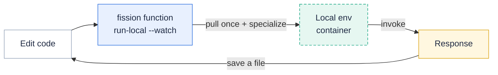

`fission function run-local` runs a single function on your laptop in Docker, against the **same environment runtime image** the cluster uses, so you can iterate without a build-and-deploy round-trip.
A normal edit → deploy → test cycle goes through a package build and a specialization on the cluster and takes tens of seconds to a couple of minutes; `run-local` collapses that to a local pull-once, then sub-second re-runs on each edit.

It reproduces the cluster's behavior faithfully — the runtime image, the specialize contract, and the invocation headers all match — so a function that works under `run-local` works the same way once deployed.

{}
`run-local` is an **alpha** command; its flags and output may change.
It needs a running Docker engine and is meant for the local inner loop, not for production traffic.
{}



#### Prerequisites

* A running **Docker engine** (Docker Desktop, Colima, or any `DOCKER_HOST` the Docker client can reach).
* Either an environment **image reference** (`--image`, for fully cluster-less use) or a reachable Fission cluster with an `Environment` to resolve from (`--env`).

#### Quick start (no cluster needed)

Point `run-local` at an environment runtime image and a source file:

```bash
$ cat hello.js
module.exports = async function (context) {
  return { status: 200, body: "Hello, world!\n" };
}

$ fission function run-local --image ghcr.io/fission/node-env --code hello.js
Pulling ghcr.io/fission/node-env ...
  pulled 10 layers
Starting ghcr.io/fission/node-env on 127.0.0.1:63048 ...
Specializing function ...
Hello, world!
```

`run-local` pulls the image (showing layer progress), starts the container, replays the specialize contract over your code, invokes the function once, prints the response, and tears the container down.
Status lines are color-coded on a terminal — cyan for progress, green for milestones, red for failures, dim for container logs — and plain when the output is piped or `NO_COLOR` is set.

The function is published on `127.0.0.1` at an auto-selected port (shown in the output).
`--port` sets the port the application **inside** the container listens on (default `8888`, the Fission environment contract port); change it only for a `container` function whose image listens elsewhere.

#### Running against a cluster environment

If you have a cluster, resolve the runtime (and builder) image from an existing `Environment` instead of naming it by hand:

```bash
$ fission function run-local --env nodejs --code hello.js
```

`--env` reads the `Environment` CRD for its runtime image; pass `--namespace` to resolve an environment outside `default`.
Use `--image` instead when you want to stay fully offline or pin a specific image tag.

#### Invoking the function

`run-local` reuses the same invocation flags as [`fission function test`]({}), so the request is built exactly as the cluster builds it:

```bash
$ fission function run-local --image ghcr.io/fission/python-env --code hello.py \
    --method POST --body '{"name":"ada"}' --header 'Content-Type: application/json'
```

* `--method` — HTTP method (default `GET`).
* `--header` / `-H` — request header, repeatable.
* `--body` / `-b` — request body.
* `--subpath` — path component for functions that route internally.

#### Hot reload with `--watch`

Add `--watch` (`-w`) to keep the function serving and reload it whenever the source changes — the local equivalent of a dev server:

```bash
$ fission function run-local --image ghcr.io/fission/node-env --code hello.js --watch
Starting ghcr.io/fission/node-env on 127.0.0.1:63048 ...
Specializing function ...
Serving local at http://127.0.0.1:63048 — watching hello.js for changes (Ctrl-C to stop)
```

Edit and save `hello.js`, and `run-local` reloads it; `curl http://127.0.0.1:63048` then returns the new response.

The watch scope follows the source:

* A single `--code` file watches that one file.
* A directory source — `--deploy <dir>`, or a builder project (Go, Java, …) — watches the **whole tree**, so editing any file inside it triggers a reload.
  Version-control and dependency/build directories (`.git`, `node_modules`, `vendor`, `target`, `.next`, `__pycache__`) and editor swap files are ignored.

A reload **restarts** the container rather than re-specializing in place, because published environment runtimes reject a second specialization on an already-specialized process.
The restart reuses the same local port, so your `curl` loop keeps working.

{}
`--watch` applies to environment executors (`poolmgr`, `newdeploy`) only.
A `container` function carries its own prebuilt image, so there is nothing to re-specialize.
{}

#### Compiled languages with `--build`

Compiled environments (Go, Java, Rust, …) need a build step before the runtime can load the code.
`--build` runs the environment's **builder image** first — exactly as the cluster's build pipeline does — and feeds the artifact to the runtime:

```bash
$ fission function run-local --build \
    --image ghcr.io/fission/go-env-1.26 \
    --builder-image ghcr.io/fission/go-builder-1.26 \
    --deploy ./my-go-fn --entrypoint Handler --watch
Building with ghcr.io/fission/go-builder-1.26 ...
Pulling ghcr.io/fission/go-env-1.26 ...
Starting ghcr.io/fission/go-env-1.26 on 127.0.0.1:63092 ...
Specializing function ...
Serving local at http://127.0.0.1:63092 — watching ./my-go-fn for changes (Ctrl-C to stop)
```

* `--build` — compile with the builder image before running.
* `--builder-image` — builder image to use when running cluster-less; with `--env` it defaults to the environment's builder image.
* `--buildcmd` — the build command the builder runs (defaults to the environment's build command).

Under `--watch`, editing any file in the source directory re-runs the builder, restarts the runtime, and re-specializes — so a compiled function reloads on save just like an interpreted one.

#### Multi-file applications with `--deploy`

For an app that is more than one file — a multi-module project, or a pre-built bundle such as a Next.js app with its `node_modules` — pass a **directory** with `--deploy`:

```bash
$ fission function run-local --image ghcr.io/fission/node-env --deploy ./app --entrypoint server
```

The directory is bind-mounted directly into the container (large dependency trees are not copied), and a `.zip` source is extracted automatically before mounting.

#### Executor types

`--executortype` selects how the function runs, matching the cluster's executor types:

| `--executortype` | What runs locally | Code source |
| --- | --- | --- |
| `poolmgr` (default) | The environment runtime image; your code is loaded via the specialize contract. | `--code` or `--deploy` |
| `newdeploy` | Same as `poolmgr` for local purposes — the environment image plus specialize. | `--code` or `--deploy` |
| `container` | Your **own** server image, run directly — no environment image, no specialize. | `--image` (the image itself) |

For a [container function]({}), point `--image` at your application image and `run-local` starts it and invokes it directly:

```bash
$ fission function run-local --executortype container --image myorg/my-api:latest --port 8080
```

#### Injecting configuration

Functions usually need configuration and secrets.
`run-local` bridges the common sources:

* `-e KEY=VALUE` — set an environment variable in the container (repeatable).
* `--env-from <file>` — read environment variables from a file (one `KEY=VALUE` per line); `-e` overrides individual keys.
* `--secret <name>` / `--configmap <name>` — materialize a cluster `Secret`/`ConfigMap` and mount it the way the cluster does, under `/secrets/<namespace>/<name>` and `/configs/<namespace>/<name>` (see [Accessing Secrets and ConfigMaps]({})).
  These require a reachable cluster to read the objects from.

#### Attaching a debugger

`--debug-port <N>` publishes an extra container port so a debugger (Delve for Go, debugpy for Python, …) can attach to the running function.
Combine it with `--keep` to leave the container and mounts running after the invocation instead of tearing them down, so you can attach, inspect, and re-invoke at will:

```bash
$ fission function run-local --image ghcr.io/fission/python-env --code hello.py \
    --debug-port 5678 --keep
```

#### Fidelity and limitations

`run-local` is high-fidelity but not a cluster.
What matches and what does not:

| Matches the cluster | Differs from the cluster |
| --- | --- |
| Environment runtime image | In-cluster DNS / service discovery |
| Specialize (load) contract, v1 and v2 | ServiceAccount, RBAC, and pod identity |
| Invocation path and `X-Fission-*` headers | NetworkPolicy and admission control |
| Builder image and build contract (`--build`) | Triggers (HTTP routes, timers, message queues) |

For anything that depends on the cluster — calling another in-cluster service, real RBAC, or trigger wiring — deploy to a development cluster and use [`fission function test`]({}) and [Debugging and diagnosing functions]({}).

#### Flag reference

The full, always-current flag list is in `fission function run-local --help` and the [CLI reference]({}).
The flags above cover the common workflows; `--env-version` selects the environment API version (default `2`) when running cluster-less with `--image`.
