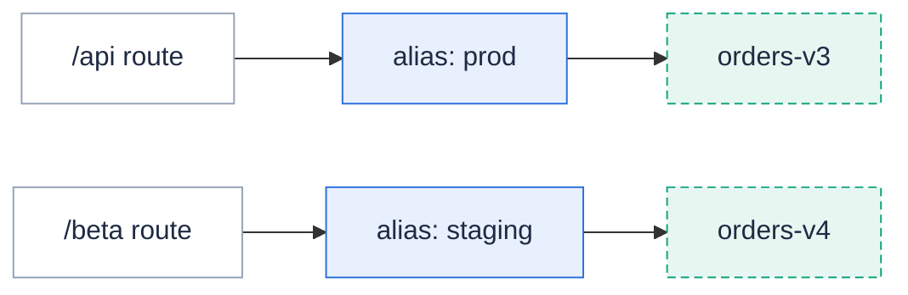

**Publish a function as immutable versions, point named aliases like `prod` and `staging` at them, and roll back a bad deploy in seconds — without editing a single trigger and without a cold start.**

A plain `fission fn update` changes the live function in place.
Every trigger that names the function immediately serves the new code, and the only way back is another update.
Starting with Fission , a function can also have **versions** and **aliases**:

- A **version** (`FunctionVersion`, `kubectl get fnver`) is an immutable snapshot of the function's spec and package content at publish time, named `<function>-v<sequence>` (for example `orders-v3`).
  It is never mutated after creation, only garbage collected once nothing references it.
- An **alias** (`FunctionAlias`, `kubectl get fnalias`) is a movable, named pointer at one version — or at two versions during a weighted traffic split.
  Triggers reference the alias; moving the alias is how a rollout or a rollback happens.



This is fully backward compatible.
A trigger that references a bare function name keeps meaning "the live function", exactly as before.
Nothing changes until you publish a version and point something at it.

## Publish a version

`fission fn publish` snapshots the function's current spec and package content as the next version:

```bash
$ fission fn update --name orders --code orders-v2.js
Function 'orders' updated

$ fission fn publish --name orders --description "checkout rounding fix"
created orders-v3
next: fission alias create --function orders --name <alias> --version orders-v3
```

The first line is machine-readable (`created <name>`); the `next:` breadcrumb suggests the usual follow-up — pointing an alias at the fresh version.
Publishing is idempotent: if nothing runtime-affecting changed since the last publish, the existing newest version is returned instead of minting a duplicate:

```bash
$ fission fn publish --name orders
unchanged orders-v3
next: fission alias create --function orders --name <alias> --version orders-v3
```

| Flag | Meaning |
| --- | --- |
| `--description` | Human-readable note recorded on the version. |
| `--wait` | Wait for the function's package build to finish before publishing (see `--timeout`); without it, publishing against a still-building package fails fast. |
| `-o name` | Print only the version name, for scripting. |
| `-o json` / `-o yaml` | Print the full version object. |

Versions can also be minted automatically on every runtime-affecting update — see [automatic publishing]({}).

## List versions

```bash
$ fission fn versions --name orders
NAME      SEQUENCE DIGEST              PUBLISHED            ALIASED-BY AGE
orders-v1 1        sha256:1f8ac10f23c5 2026-07-10T09:14:02Z -          14d
orders-v2 2        sha256:60303ae22b99 2026-07-17T16:41:55Z -          7d
orders-v3 3        sha256:fd61a03af4f7 2026-07-24T08:03:11Z prod       2m
```

The `DIGEST` column pins the exact package content of each version.
`ALIASED-BY` shows which aliases currently reference it — a `-` means the version is unreferenced and eligible for [retention GC]({}).
The table truncates digests.
`-o wide` prints digests in full.
It adds an `ENVDRIFT` column showing whether the version predates the environment's current generation (see [environment updates and drift]({})).
It also adds the `DESCRIPTION` recorded at publish time.
`-o name` prints one version name per line, for scripting; `-o json` / `-o yaml` print the full objects.

To read a version rather than list them, `fission fn get --version` prints the exact source snapshot the version froze:

```bash
$ fission fn get --name orders --version orders-v2
module.exports = async (context) => {
    // ...
}
```

## Point an alias at a version

```bash
$ fission alias create --name prod --function orders --version orders-v3 --wait
function alias 'prod' created
function alias 'prod' resolved

$ fission alias list
NAME    FUNCTION VERSION   PACKAGE-DIGEST WEIGHT SECONDARY-VERSION RESOLVED-VERSION
prod    orders   orders-v3                <none>                   orders-v3
staging orders   orders-v4                <none>                   orders-v4
```

`--wait` blocks until the alias's `Resolved` condition confirms the target — the same flag `alias update` takes, so a CI job can gate on either.
Without it, creation returns immediately and resolution completes asynchronously.

`fission alias get --name prod` shows the same row, plus the alias's status conditions.
Once the alias has been repointed at least once, it also shows a `HISTORY` block listing its previous targets, most recent last:

```bash
$ fission alias get --name prod
NAME FUNCTION VERSION   PACKAGE-DIGEST WEIGHT SECONDARY-VERSION RESOLVED-VERSION
prod orders   orders-v4                <none>                   orders-v4

CONDITIONS:
TYPE     STATUS REASON     MESSAGE                                                 LASTTRANSITION
Resolved True   Resolved   resolved to FunctionVersion "orders-v4"                 8s
EnvDrift False  EnvCurrent environment default/node generation 5 matches version "orders-v4"'s recorded generation 5 8s

HISTORY:
VERSION   SWITCHED-AT
orders-v2 2d
orders-v3 8s
```

The last history entry is what a bare `fission fn rollback` returns to.
`alias get` is therefore the fastest way to see where a rollback would land.
`fission alias delete --name prod` removes the alias.
An alias lives in the same namespace as its function, and one function can have any number of aliases.

## Testing an alias or version

`fission fn test` takes `--alias` and `--version`, so you can smoke-test one alias or one pinned version directly.
It needs no trigger, and no wait for the alias to see traffic:

```bash
$ fission fn test --name orders --alias prod
{"order":"ok"}

$ fission fn test --name orders --version orders-v3
{"order":"ok"}
```

`--alias` and `--version` are mutually exclusive.
Each is checked against the function before the request is sent.
A typo'd name fails immediately with a clear error, instead of an opaque router 404:

```bash
$ fission fn test --name orders --alias staging
Error: alias "staging" not found for function "orders": functionaliases.fission.io "staging" not found
```

`--async` works with either flag too.
Fission enqueues the invocation against the resolved alias/version route.
It stays pinned to that target even if the alias moves before the function actually runs.

## Inspecting versions, aliases, and their pods

`fission fn describe` on a versioned function ends with a `VERSIONING` section: the versioning mode, the version count, and one row per alias.
Its `PODS` table also gains a `VERSION` column, showing which version each specialized pod serves:

```bash
$ fission fn describe --name orders
...
PODS:
NAME                                        NAMESPACE READY STATUS  IP          EXECUTORTYPE MANAGED SERVED VERSION
poolmgr-node-default-8750-844bd45565-9tvrj  default   2/2   Running 10.244.0.77 poolmgr      false   true   orders-v4
poolmgr-node-default-8750-844bd45565-pg8rk  default   2/2   Running 10.244.0.78 poolmgr      false   true   orders-v3

VERSIONING:
Versioning: mode=auto retain=10
Versions:   4
NAME    TARGET    WEIGHT ENVDRIFT
prod    orders-v3 <none> False
staging orders-v4 <none> False
```

Add `--version` to describe one version instead of the function.
This inspects the immutable snapshot: its digest, publish-time description, the environment generation it was published under, and which aliases reference it:

```bash
$ fission fn describe --name orders --version orders-v3
Name:                    orders-v3
Function:                orders
Sequence:                3
Digest:                  sha256:fd61a03af4f77d870fc21e05e7e80678095c92d808cfb3b5c279ee04c74aca13
Description:             checkout rounding fix
Published:               2026-07-24T08:03:11Z
Age:                     2d
Entrypoint:              <none>
Environment:             node
Env Observed Generation: 5
Env Runtime Image:       ghcr.io/fission/node-env
Env Drift:               current

ALIASED-BY:
NAME TARGET    WEIGHT ENVDRIFT
prod orders-v3 <none> False
```

The same per-target filtering works on `fission fn pods` and `fission fn logs`.
`--version` narrows to pods serving one pinned version; `--alias` follows an alias to whatever it currently resolves to.
During a weighted split or an incident, that is the difference between reading interleaved logs from two versions and reading exactly the one you care about:

```bash
$ fission fn pods --name orders --version orders-v3
NAME                                        NAMESPACE READY STATUS  IP          EXECUTORTYPE MANAGED SERVED VERSION
poolmgr-node-default-8750-844bd45565-pg8rk  default   2/2   Running 10.244.0.78 poolmgr      false   true   orders-v3

$ fission fn logs --name orders --alias prod
...
```

`--version` and `--alias` are mutually exclusive on both commands.

## Route triggers through the alias

A trigger targets an alias through the optional `alias` field on its function reference.
The router resolves the alias **at request time**, so repointing the alias redirects traffic without touching the trigger.

Create the route with `--function-alias`:

```bash
$ fission route create --name orders-api --url /api/orders --method POST \
    --function orders --function-alias prod
trigger 'orders-api' created
```

`--function-alias` requires exactly one `--function` and is mutually exclusive with `--function-version` and with weighted multi-function routing.
The same flag works on `fission route update`, with one wrinkle.
Pass `--function` again alongside it — `route update` does not infer the target function from the existing route.

For GitOps pipelines, the same field is settable declaratively — write the trigger with `--spec` and edit the generated file, or apply YAML directly:

```yaml
apiVersion: fission.io/v1
kind: HTTPTrigger
metadata:
  name: orders-api
  namespace: default
spec:
  relativeurl: /api/orders
  methods:
    - POST
  functionref:
    type: name
    name: orders
    alias: prod
```

Different routes can target different aliases of the **same** function:

```yaml
# /api/orders -> alias prod (stable), /beta/orders -> alias staging (next)
functionref:
  type: name
  name: orders
  alias: prod
---
functionref:
  type: name
  name: orders
  alias: staging
```

To pin a route permanently to one immutable snapshot instead, pass `--function-version orders-v3` (or set `functionref.version: orders-v3` in YAML).
Unlike an alias, a version pin never moves.
`alias` and `version` are mutually exclusive, and both are valid on every trigger kind that embeds a function reference (HTTP, message queue, timer, Kubernetes watch).

## Deploy by moving the alias

A deploy becomes: publish, then repoint.

```bash
$ fission fn update --name orders --code orders-v3.js
function 'orders' updated

$ fission fn publish --name orders --wait
created orders-v4

$ fission alias update --name prod --version orders-v4 --wait
function alias 'prod' updated
function alias 'prod' resolved
```

`--wait` blocks until the alias's `Resolved` condition reports the new target, so a CI job can gate the next step on the switch actually happening.
You can also wait separately: `fission alias wait --name prod --for condition=Resolved`.

### Weighted traffic splits

An alias can spread traffic across two versions — the primary gets `--weight` percent, the secondary gets the rest:

```bash
$ fission alias update --name prod --version orders-v3 --weight 90 --secondary-version orders-v4
function alias 'prod' updated
```

Now 90% of requests through `prod` run `orders-v3` and 10% run `orders-v4`.
Step `--weight` down as confidence grows, then finish with a full repoint:

```bash
$ fission alias update --name prod --version orders-v4 --clear-weight
function alias 'prod' updated
```

`--weight` requires `--secondary-version`, and `--clear-weight` drops the split (it wins if combined with other flags in the same call).
To have Fission step the weight for you based on error rates, drive the split with a [canary config over the alias]({}).

## Instant rollback

`fission fn rollback` repoints one alias back at a previous version — atomically, and without recycling any pods:

```bash
$ fission fn rollback --name orders --alias prod --wait
function alias 'prod' rolled back: orders-v4 -> orders-v3
function alias 'prod' resolved
```

Confirm the alias is actually serving the rolled-back target with the same `--alias` flag `fn test` uses for smoke-testing:

```bash
$ fission fn test --name orders --alias prod
{"order":"ok"}
```

By default the alias returns to its **previous target**, which Fission records in the alias's history on every switch.
Pass `--to` to pick any version explicitly:

```bash
$ fission fn rollback --name orders --alias prod --to orders-v1
function alias 'prod' rolled back: orders-v3 -> orders-v1
```

Three properties make this safe to reach for during an incident:

- **No cold start.**
  A version that any alias references keeps at least one specialized pod warm, so the rollback target is already running when traffic arrives.
- **Full repoint.**
  A rollback clears any weighted split, so a rollback issued mid-canary stops the split entirely rather than rolling back only the primary side.
- **Atomic.**
  The alias flips in a single update; there is no window where triggers see a half-moved state.

### Rolling back a GitOps-managed alias

If the alias is owned by a `fission spec` directory (deployed with `fission spec apply`), a bare rollback is refused:

```bash
$ fission fn rollback --name orders --alias prod
Error: function alias 'prod' is managed by `fission spec` (Git); the next spec apply will revert this rollback. Re-run with --detach to strip spec ownership, and update your Git repo: set spec.version: orders-v3 in the FunctionAlias manifest
```

The guard exists because the next `fission spec apply` would reconcile the alias back to whatever `spec.version` says in Git — silently undoing the rollback.
You have two options:

- **Git-first (preferred):** change `spec.version` in the FunctionAlias manifest in your repository and let the pipeline apply it.
- **Emergency:** re-run with `--detach`, which strips the spec-ownership annotations in the same update as the repoint, so a later `spec apply` no longer reverts it.
  Update the manifest afterwards, then re-apply to re-adopt the alias.

## Declarative aliases and digest pinning

Aliases are ordinary objects in a [spec directory]({}), so a Git repository can own them:

```yaml
apiVersion: fission.io/v1
kind: FunctionAlias
metadata:
  name: prod
  namespace: default
spec:
  functionName: orders
  version: orders-v3
```

For pipelines that build content before versions exist, an alias can pin by **package digest** instead of by version name:

```yaml
spec:
  functionName: orders
  packageDigest: sha256:fd61a03af4f77d870fc21e05e7e80678095c92d808cfb3b5c279ee04c74aca13
```

The same pin works imperatively with `--package-digest`, on either `alias create` or `alias update`:

```bash
$ fission alias create --name prod --function orders \
    --package-digest sha256:fd61a03af4f77d870fc21e05e7e80678095c92d808cfb3b5c279ee04c74aca13
function alias 'prod' created
```

The pipeline commits the content hash it built; Fission resolves the digest to the version that recorded it, asynchronously, once that version exists.
Because resolution is eventually consistent, gate on it in CI:

```bash
$ fission alias wait --name prod --for condition=Resolved --timeout 120s
```

`version` and `packageDigest` are mutually exclusive — exactly one must be set.
Promotion between environments is then just two aliases converging.
Point `staging` at a new version and test through the staging route.
Promote by repointing `prod` at the **same** version — the identical immutable snapshot, not a rebuild.

Versions themselves are deliberately **not** spec-managed: the cluster mints them, and Git references them by name or digest.

## Related

- [Version lifecycle and interactions]({}) — automatic publishing, retention, environment drift, and how versions interact with async invocation, canaries, and state.
- [Canary deployments]({}) — automated, metrics-driven weight stepping.
- [Declarative specs]({}) — the `fission spec` workflow that can own aliases.
- [Create and run functions]({}) — the everyday function workflow.
