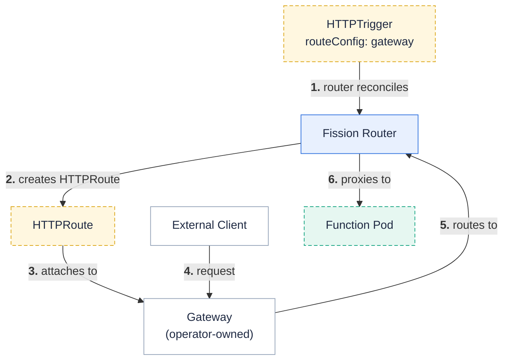

The [Gateway API](https://gateway-api.sigs.k8s.io/) is the successor to the (now frozen) Kubernetes Ingress API.
Fission's router can manage a Gateway API `HTTPRoute` for an HTTPTrigger, tied to the trigger's lifecycle, the same way it managed an `Ingress` for `--createingress`.

Fission runs in **attach mode**: it creates only the `HTTPRoute` and points it at a `Gateway` that the cluster operator owns.
Fission never creates or owns the `Gateway` or `GatewayClass`, so it works with any conformant Gateway API implementation and keeps its RBAC minimal.

{}
The Gateway API route provider is available starting with **Fission v1.26.0** (unreleased at the time of writing).
{}

{}
The `--createingress` / `IngressConfig` path still works but is deprecated, because the Kubernetes Ingress API is frozen.
Prefer the Gateway API for new triggers.
See [Migrating from Ingress](#migrating-from-ingress) below.
{}

## How it works



When an HTTPTrigger sets `routeConfig.provider: gateway`, the router:

- Creates an `HTTPRoute` named after the trigger, in the **router's own namespace** (`fission` by default).
- Sets the route's `parentRefs` to the Gateway(s) you specify (or a cluster-wide default Gateway).
- Sets the route's `hostnames` and a `PathPrefix` match from your config.
- Points the route's backend at the `router` Service on port 80 — the same backend the Ingress path used.
- Labels the route with `triggerName`, `functionName`, and `triggerNamespace` so you can find it with `kubectl get httproute -l triggerName=<name> -n fission`.

The route is reconciled level-based: it is created when missing, updated when the trigger changes, and deleted when the trigger is deleted or switched to a different provider.

## Prerequisites

1. A Kubernetes cluster with Fission installed (see the [installation page]({})).
2. The Gateway API CRDs and a Gateway controller installed in the cluster (see [Choosing a Gateway implementation](#choosing-a-gateway-implementation)).
3. A `Gateway` resource for the router to attach routes to, with a listener that **allows routes from Fission's namespace**.

## Enable the Gateway API provider in Fission

The gateway route provider is **off by default**.
Enable it (and grant the router the `gateway.networking.k8s.io` RBAC it needs) with a Helm value:

```bash
helm upgrade --install fission fission-charts/fission-all \
  --namespace fission \
  --set gatewayAPI.enabled=true
```

Optionally configure a **default Gateway** that triggers attach to when they don't name their own.
The value is `name` or `namespace/name`:

```bash
  --set gatewayAPI.defaultParentRef=fission-gateways/shared-gw
```

When `gatewayAPI.enabled=true`, the chart adds RBAC for the router to manage `httproutes` (and read `referencegrants`).
If you request the `gateway` provider on a trigger while this is disabled, the router logs a warning and creates no route.

## Create a Gateway for Fission to attach to

The operator owns the `Gateway`.
Its listener must allow `HTTPRoute`s from the namespace Fission creates routes in (`fission` by default).
A minimal HTTP Gateway that accepts routes from any namespace:

```yaml
apiVersion: gateway.networking.k8s.io/v1
kind: Gateway
metadata:
  name: fission-gw
  namespace: fission
spec:
  gatewayClassName: eg          # the GatewayClass of your implementation
  listeners:
    - name: http
      protocol: HTTP
      port: 80
      allowedRoutes:
        namespaces:
          from: Same            # routes in the Gateway's own namespace; use `All` for cross-namespace
```

{}
Whether an `HTTPRoute` in the `fission` namespace may attach to a `Gateway` in another namespace is controlled by the **Gateway listener's `allowedRoutes.namespaces`** (`Same`, `All`, or a label `Selector`) — not by a `ReferenceGrant`.
No `ReferenceGrant` is needed for the route's backend, because Fission's generated `HTTPRoute` and its backend (the `router` Service) always live in the same namespace.
{}

## Expose a function

Create the function and route, selecting the gateway provider and the Gateway to attach to:

```bash
fission env create --name nodejs --image ghcr.io/fission/node-env
fission function create --name hello --env nodejs --code hello.js

fission route create --name hello \
  --function hello \
  --method GET \
  --url /hello \
  --route-provider gateway \
  --route-host demo.example.com \
  --gateway fission-gw
```

Verify the route was created and accepted by the Gateway:

```bash
$ kubectl get httproute -n fission -l triggerName=hello
NAME    HOSTNAMES                 AGE
hello   ["demo.example.com"]      5s

$ kubectl get httproute hello -n fission -o jsonpath='{.status.parents[0].conditions}'
# look for type=Accepted, status=True and type=ResolvedRefs, status=True
```

Then call the function through the Gateway's address (the Gateway controller provisions a Service / load balancer; consult your implementation for how to obtain it):

```bash
$ curl -H "Host: demo.example.com" http://<gateway-address>/hello
```

### CLI flags

| Flag | Description |
|------|-------------|
| `--route-provider` | `gateway` or `ingress`. Selects the route provider. Takes precedence over `--createingress`. |
| `--route-host` | Hostname the route matches. Repeatable. Empty matches all hosts. |
| `--route-path` | Request path to match (absolute, starts with `/`). Defaults to the trigger URL/prefix. |
| `--gateway` | Parent Gateway to attach to: `name` or `namespace/name`. **Repeatable** — attach to several Gateways at once. |
| `--route-annotation` | `key=value` annotation added to the generated `HTTPRoute`. Repeatable. `-` clears all. |
| `--route-tls` | TLS Secret name. **Ingress provider only** — for the gateway provider, configure TLS on the Gateway listener instead. |

`fission route update` merges these flags into the trigger's existing `routeConfig`, so you can change one field (for example `--route-host`) without re-specifying the rest.

## RouteConfig reference (spec)

`--route-*` flags populate `spec.routeConfig` on the HTTPTrigger.
You can also write it directly in a spec file:

```yaml
apiVersion: fission.io/v1
kind: HTTPTrigger
metadata:
  name: hello
spec:
  functionref:
    type: name
    name: hello
  methods:
    - GET
  relativeurl: /hello
  routeConfig:
    provider: gateway              # "gateway" | "ingress"
    hostnames:
      - demo.example.com           # omit / "*" to match all hosts
    path: /hello                   # PathPrefix match; defaults to "/"
    annotations:                   # added to the generated HTTPRoute
      example.com/team: payments
    gateway:
      parentRefs:                  # the Gateway(s) to attach to
        - name: fission-gw
          namespace: fission       # optional; defaults to the router's namespace
          sectionName: http        # optional; attach to a specific listener
          port: 80                 # optional; narrow attachment to a listener port
```

Notes:

- `provider` is required.
  When it is `gateway`, you must supply at least one `parentRef` **unless** the router is configured with a default Gateway (`gatewayAPI.defaultParentRef`).
- `tls` applies only to the ingress provider and is rejected by validation when `provider: gateway` (gateway TLS lives on the Gateway listener).
- `routeConfig` takes precedence over the deprecated `createingress` + `ingressconfig` fields.

## Using more than one Gateway / implementation

Because Fission only attaches `HTTPRoute`s, **each trigger chooses its own Gateway(s)** via `parentRefs`.
Different triggers can attach to different Gateways — backed by different `GatewayClass`es and even different implementations — at the same time:

```bash
# Trigger A → an Envoy Gateway in the "edge" namespace
fission route create --name public-api --function api --url /api \
  --route-provider gateway --gateway edge/envoy-gw --route-host api.example.com

# Trigger B → an internal Istio gateway
fission route create --name internal --function worker --url /internal \
  --route-provider gateway --gateway mesh/istio-gw --route-host internal.svc.local
```

A single trigger can also attach to **multiple** Gateways by repeating `--gateway`.

## Choosing a Gateway implementation

Any [conformant Gateway API implementation](https://gateway-api.sigs.k8s.io/implementations/) works.
Below are quick-starts for three popular ones.
In each case: install the controller, create a `GatewayClass` (most installs ship one) and a `Gateway`, then point your Fission route at that Gateway with `--gateway`.

### Envoy Gateway

[Envoy Gateway](https://gateway.envoyproxy.io/) is a standalone Gateway API implementation built on Envoy.

```bash
helm install envoy-gateway oci://docker.io/envoyproxy/gateway-helm \
  --version v1.8.1 -n envoy-gateway-system --create-namespace --wait

kubectl apply -f - <<'EOF'
apiVersion: gateway.networking.k8s.io/v1
kind: GatewayClass
metadata:
  name: eg
spec:
  controllerName: gateway.envoyproxy.io/gatewayclass-controller
---
apiVersion: gateway.networking.k8s.io/v1
kind: Gateway
metadata:
  name: fission-gw
  namespace: fission
spec:
  gatewayClassName: eg
  listeners:
    - name: http
      protocol: HTTP
      port: 80
      allowedRoutes:
        namespaces:
          from: Same
EOF

fission route create --name hello --function hello --url /hello \
  --route-provider gateway --gateway fission-gw --route-host demo.example.com
```

### Istio

[Istio](https://istio.io/latest/docs/tasks/traffic-management/ingress/gateway-api/) supports the Gateway API natively for ingress.
With Istio installed, its `GatewayClass` (`istio`) is available; just create a `Gateway` and Fission route.

```bash
kubectl apply -f - <<'EOF'
apiVersion: gateway.networking.k8s.io/v1
kind: Gateway
metadata:
  name: fission-gw
  namespace: fission
spec:
  gatewayClassName: istio
  listeners:
    - name: http
      protocol: HTTP
      port: 80
      allowedRoutes:
        namespaces:
          from: Same
EOF

fission route create --name hello --function hello --url /hello \
  --route-provider gateway --gateway fission-gw --route-host demo.example.com
```

Istio provisions a gateway Deployment + Service for the `Gateway`; use that Service's address to reach the function.

### NGINX Gateway Fabric

[NGINX Gateway Fabric](https://docs.nginx.com/nginx-gateway-fabric/) is the Gateway API implementation backed by NGINX, and a natural migration target for users coming from `ingress-nginx`.

```bash
helm install ngf oci://ghcr.io/nginx/charts/nginx-gateway-fabric \
  --create-namespace -n nginx-gateway

kubectl apply -f - <<'EOF'
apiVersion: gateway.networking.k8s.io/v1
kind: Gateway
metadata:
  name: fission-gw
  namespace: fission
spec:
  gatewayClassName: nginx
  listeners:
    - name: http
      protocol: HTTP
      port: 80
      allowedRoutes:
        namespaces:
          from: Same
EOF

fission route create --name hello --function hello --url /hello \
  --route-provider gateway --gateway fission-gw --route-host demo.example.com
```

## Migrating from Ingress

Existing HTTPTriggers created with `--createingress` keep working unchanged after an upgrade.
Fission does **not** auto-convert them to the Gateway API, because doing so would break clusters that have no Gateway API installed.
Migration is opt-in and can be done per trigger, with no downtime for the others.

### Map the old flags to the new ones

| Ingress flag (deprecated) | Gateway equivalent |
|---------------------------|--------------------|
| `--createingress` | `--route-provider gateway` |
| `--ingressrule host=path` | `--route-host host` + `--route-path path` |
| `--ingressannotation k=v` | `--route-annotation k=v` |
| `--ingresstls secret` | configured on the Gateway listener (not on the route) |

### Migrate a trigger in place

Point an existing trigger at a Gateway; the router deletes the old `Ingress` and creates the `HTTPRoute` in the same reconcile:

```bash
fission route update --name hello \
  --function hello \
  --url /hello \
  --route-provider gateway \
  --route-host demo.example.com \
  --gateway fission-gw
```

Confirm the switch:

```bash
kubectl get ingress  -n fission -l triggerName=hello   # should be gone
kubectl get httproute -n fission -l triggerName=hello   # should exist and be Accepted
```

To roll back, run the same `update` with `--route-provider ingress` (or remove `routeConfig` and keep `--createingress`).

### Suggested rollout

1. Install a Gateway controller and create a `Gateway` whose listener allows routes from the `fission` namespace.
2. `helm upgrade --set gatewayAPI.enabled=true`.
3. Migrate one non-critical trigger, verify it serves through the Gateway, then migrate the rest.
4. Decommission the old Ingress controller once no triggers use `--createingress`.

## Troubleshooting

- **No `HTTPRoute` is created.**
  Confirm `gatewayAPI.enabled=true` (the router logs a warning when a trigger requests the gateway provider while it is disabled), and that the Gateway API CRDs are installed.
- **`HTTPRoute` exists but is not `Accepted`.**
  Check the Gateway listener's `allowedRoutes.namespaces` permits the `fission` namespace, that the `parentRef` name/namespace match the Gateway, and that the hostname/port are compatible with a listener.
  Inspect `kubectl get httproute <name> -n fission -o yaml` under `.status.parents[].conditions`.
- **Function not reachable through the Gateway.**
  Ensure the `Gateway` is `Programmed` and has an address, and that you send the request with the matching `Host` header.

## See also

- [HTTP Triggers]({})
- [Exposing Functions With Ingress]({}) (deprecated)
- [Gateway API documentation](https://gateway-api.sigs.k8s.io/)
