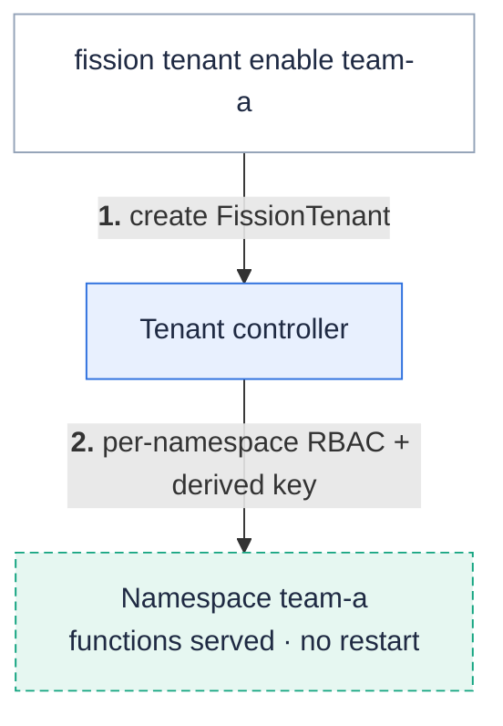

**Onboard or offboard a namespace at runtime with a single `fission tenant` command — the control plane keeps running, with no restart and no re-specialization of existing functions.**
Fission can serve functions in more than one namespace, and since v1.27.0 this *tenant mode* is the recommended way to control which namespaces it manages.

Each onboarded namespace (a *tenant*) gets its own narrow RBAC and its own derived signing key, so one namespace cannot read another's Secrets or invoke as another's identity.

{}
Tenant mode replaces the older pattern of listing every namespace in the `additionalFissionNamespaces` Helm value and re-running `helm upgrade`, which restarted the whole control plane on each change ([issue #3298](https://github.com/fission/fission/issues/3298)).
That static model still works and is the default; tenant mode is the dynamic, restart-free successor.
See [Coming from `additionalFissionNamespaces`](#coming-from-additionalfissionnamespaces) below.
{}

## Onboard a namespace

With tenant mode enabled (see [Enabling tenant mode](#enabling-tenant-mode)), onboard a namespace at any time:

```sh
kubectl create namespace team-a
fission tenant enable --namespace team-a
```

The tenant controller provisions the namespace and starts serving functions in it — **without restarting the control plane**.



`fission tenant enable` is idempotent, so re-running it to change settings is safe.
By default a tenant's function and builder pods run in the tenant namespace itself; point them elsewhere with `--function-namespace` / `--builder-namespace`:

```sh
fission tenant enable --namespace team-a --function-namespace team-a-fns
```

You can also onboard a namespace declaratively by labelling it — handy in GitOps where the namespace manifest is the source of truth:

```sh
kubectl label namespace team-a fission.io/enabled=true
```

The label and the `FissionTenant` resource are equivalent triggers; use whichever fits your workflow.

## Manage tenants

List every onboarded namespace and its status:

```sh
fission tenant list
fission tenant list -o wide      # also json | yaml
```

Inspect one tenant's onboarding state and conditions:

```sh
fission tenant status --namespace team-a
```

## Offboard a namespace

Stop serving a namespace by deleting its tenant:

```sh
fission tenant disable --namespace team-a
```

This tears down the namespace's Fission RBAC and derived key.
Your Functions, Packages, and Triggers are left in place, not deleted — they stop being served, so re-enabling the tenant later restores them.
If the namespace still has functions, `disable` refuses unless you pass `--force`:

```sh
fission tenant disable --namespace team-a --force
```

You can also offboard by removing the label (`kubectl label namespace team-a fission.io/enabled-`).

## Tenant modes

`fission tenant enable`/`disable` is how you manage namespaces in the **dynamic** mode.
The chart value `tenancy.mode` selects the overall posture:

| Mode | How namespaces are managed | Isolation | Use when |
| --- | --- | --- | --- |
| `static` (default) | Install-time only — the env-seeded set (`defaultNamespace` + `additionalFissionNamespaces`) | Per-namespace Roles; shared master key | A single namespace, or a fixed known set; behaves exactly like pre-tenancy Fission |
| `dynamic` | **Runtime — `fission tenant enable/disable` or the `fission.io/enabled` label, no restart** | Per-namespace RBAC **and** per-namespace derived keys; tenant Secrets/ConfigMaps never in a cluster-wide cache | Untrusted multi-tenant clusters — **the recommended isolating posture** |
| `cluster` | Automatic — the controller onboards every non-system namespace | Function pods stay per-namespace, but the control plane reads Secrets/ConfigMaps cluster-wide | Single-tenant / trusted clusters that value simplicity over isolation |

## Isolation guarantees

In `dynamic` and `cluster` modes, every tenant namespace is cryptographically isolated:

- **Per-namespace derived keys.** The master internal-auth key never leaves the control-plane namespace. Each tenant receives only a key derived from it (`HKDF(master, service:namespace)`), so a compromised tenant can act only as itself, never forge requests as another namespace.
- **Namespace-scoped archive content.** The storage service tags each archive with its owning namespace and authorizes every download/delete against the namespace whose key signed the request — a tenant that learns another tenant's archive id still gets a `404`. Existing un-scoped archives are grandfathered with no migration.
- **Least-privilege function pods in every mode.** Fetcher and builder pods always get a narrow per-namespace RoleBinding — even in `cluster` mode, where only the control plane goes cluster-wide.

Cross-namespace function invocation is governed by the admission webhooks and `NetworkPolicy`, not a runtime guard.

## Cluster mode and its trade-off

`cluster` mode auto-onboards every non-system namespace, so you never run `fission tenant enable` — convenient on a cluster you fully trust.

{}
In `cluster` mode the executor and buildermgr hold **cluster-wide read of Secrets and ConfigMaps**, so a compromise of either reaches every namespace's Secrets.
Use `cluster` mode only on single-tenant or otherwise trusted clusters.
For untrusted multi-tenant clusters, use `dynamic` mode, where tenant Secrets are never in a cluster-wide cache.
{}

Opt a single namespace out of auto-onboarding by labelling it `fission.io/enabled=false`; the controller skips it (and offboards it if it was already onboarded).
Removing the label re-onboards it.

## Enabling tenant mode

Tenant mode is off by default (`tenancy.mode: static`).
Switch it on at install or upgrade time:

```sh
helm upgrade --namespace $FISSION_NAMESPACE fission fission-charts/fission-all \
  --set tenancy.mode=dynamic
```

`dynamic` and `cluster` render the tenant controller automatically; `static` renders neither.
The controller can run active-passive with leader election (`tenantController.leaderElection.enabled=true`) when you scale `tenantController.replicas` above one.

## Coming from `additionalFissionNamespaces`

`static` mode renders byte-identical RBAC to the pre-tenancy chart, so an install that lists namespaces in `additionalFissionNamespaces` upgrades to v1.27.0 with no change.
To switch that install to restart-free, per-namespace-isolated onboarding:

1. Upgrade with `--set tenancy.mode=dynamic` (the controller seeds a `FissionTenant` for each namespace already in `defaultNamespace` + `additionalFissionNamespaces`).
2. From then on, add or remove namespaces with `fission tenant enable`/`disable` instead of editing `additionalFissionNamespaces` and re-running `helm upgrade`.

## Related

- [v1.27.0 release notes](/docs/releases/v1.27.0/) — the release that introduced tenant mode.
- [`fission tenant` CLI reference](/docs/reference/fission-cli/fission_tenant/) — `enable`, `disable`, `list`, `status`.
- [RBAC Permissions](/docs/usage/rbac-permissions/) — the permission model tenant RBAC builds on.
- [Upgrade Guide](/docs/installation/upgrade/) — upgrading to v1.27.0.
