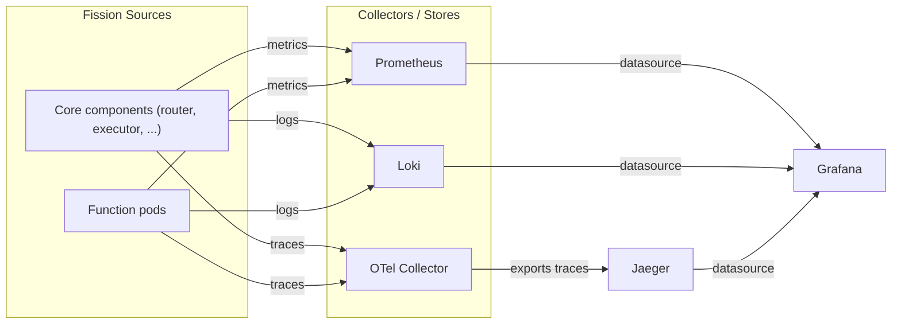

**Observability is how you understand what Fission and your functions are doing in production** — through metrics, traces, and logs.

Fission emits all three signals from its core components and from your function pods, in formats that standard cloud-native tooling already understands.
This section shows you how to wire each signal into a backend and visualize it in Grafana.

## The observability stack

Fission's components and your function pods are the sources.
Each source emits one or more signals, which a collector ingests and stores, and which Grafana then queries for dashboards and ad-hoc exploration.

## Signals and guides

- **Metrics** — Fission exposes Prometheus-format metrics from every component and function. See [Metrics with Prometheus]({}).
- **Traces** — Fission instruments request flows with OpenTelemetry and can export to any OTLP backend such as Jaeger. See [Tracing with OpenTelemetry]({}).
- **Logs** — function and component logs can be aggregated with Loki and queried in Grafana. See [Logs with Loki]({}).
- **Service mesh** — Linkerd can mesh function and Fission pods to add request-level metrics. See [Observability with Linkerd]({}).
