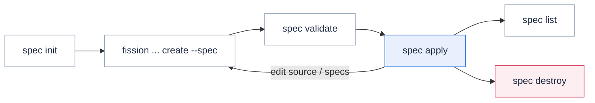

**Specify your whole Fission application — environments, functions, triggers, workflows — as version-controlled YAML, and deploy it with a single idempotent `fission spec apply`.**

Individual `fission ... create` commands work well for one function.
They do not scale to an application with many functions, shared environments, and triggers.
Specs solve this: the whole application lives in a `specs/` directory that you track in Git, review in pull requests, and apply as one unit.

Applying a spec means reconciling the cluster to match the files:

* Resources in the specs but not on the cluster are created.
  Local source files are packaged and uploaded.
* Resources in both are compared, and the cluster copy is updated when it differs.
* With `--delete`, resources this spec created earlier but no longer declares are removed.
  Deletion is opt-in; a plain `fission spec apply` never deletes anything.

Running apply again with unchanged specs changes nothing on the cluster: apply is ***idempotent***.
This makes it safe to run on every commit from a CI pipeline — see [Run spec apply from CI](#run-spec-apply-from-ci-gitops).

## The spec workflow

The `fission spec` subcommands form a loop: generate specs locally, validate them, then apply them to the cluster.
`fission spec destroy` tears down everything a previous apply created.



The full set of subcommands:

| Command | What it does |
| ------- | ------------ |
| `fission spec init` | Creates the `specs/` directory with a `fission-deployment-config.yaml` that carries the deployment ID. |
| `fission ... create --spec` | Writes a resource (function, environment, trigger, workflow, ...) as a YAML file under `specs/` instead of creating it on the cluster. |
| `fission spec validate` | Checks the specs for duplicate names, broken references between resources, and name conflicts with resources already on the cluster. |
| `fission spec apply` | Reconciles the cluster to match the specs. Add `--delete` to prune, `--wait` to block on builds, `--watch` for continuous deployment, or `--dry-run` to preview. |
| `fission spec list` | Lists the cluster resources that carry this spec's deployment ID. |
| `fission spec destroy` | Deletes the resources declared in the spec files. With `--force`, deletes every resource carrying the deployment ID, across all namespaces. |

All of these commands accept `--specdir` to point at a non-default directory.
They also accept `--specignore` to point at an ignore file (default `.specignore`) that excludes paths from being read as specs, much like `.gitignore`.
See the [`fission spec` CLI reference](/docs/reference/fission-cli/fission_spec/) for every flag.

## Ownership: the deployment ID

`fission spec init` writes a unique deployment ID into `fission-deployment-config.yaml`.
Every resource that apply creates is annotated with this ID.
Apply only updates or deletes resources that carry its own deployment ID.
Resources without the annotation — created by hand, by `kubectl`, or by another spec directory — are never modified or deleted.

If a spec resource's name collides with an unowned cluster resource, apply fails instead of overwriting it.
Pass `--allowconflicts` to adopt such resources into the spec deployment.

## Idempotency and drift reconciliation

Reapplying an unchanged spec directory is a no-op:

```bash
$ fission spec apply
Everything up to date.
```

A no-op reapply writes nothing to the cluster: no function generation bumps, no pod recycles, and no new [function versions](/docs/usage/function/versions-aliases/).
This is what makes a periodic or per-commit apply from automation safe.

Apply reconciles real drift, and only real drift:

* **Archives** are content-addressed by checksum.
  An archive whose bytes already exist on the cluster is not uploaded again (`archive ... exists, not uploading`).
* **A source change** updates the package and re-triggers its build automatically.
  A package whose last build failed is also re-triggered on the next apply.
* **A spec edit** to any resource updates only that resource and its dependents.
  For example, a package update re-stamps the functions that reference it, so running pods pick up the new code.
* **Untouched resources** stay byte-identical, even across many reapplies.

### Preview with --dry-run

`fission spec apply --dry-run` computes the same diff read-only and reports what a real apply would do:

```bash
$ fission spec apply --dry-run
would upload archive archive://eval-xk2p
1 package would be updated: calc-eval-0f36e9b8
1 function would be updated: calc-eval
(dry run - no changes made)
```

The preview also surfaces errors a real apply would hit, such as a name conflict with a resource this spec does not own.
`--wait` and `--watch` are inert under `--dry-run`.

## Tutorial

This tutorial assumes you have already set up Fission and tested a simple hello world function.
To learn how to do that, head over to the [installation guide](/docs/installation/).

We make a small calculator app with one Python environment and two functions, all specified as YAML files.
This is a contrived example, meant purely as an illustration.

### Make an empty directory

Create a working directory for the tutorial:

```bash
$ mkdir spec-tutorial
$ cd spec-tutorial
```

### Initialize the specs directory

```bash
$ fission spec init
```

This creates a `specs/` directory with a `fission-deployment-config.yaml` in it.
This file carries the deployment ID; everything created on the cluster from these specs is annotated with that ID.

The deployment ID is generated automatically.
To make a re-initialized directory manage the same set of resources, pass the same ID with `--deployid`:

```bash
$ fission spec init --deployid xxxx-yyyy-zzzz
```

### Set up a Python environment

```bash
$ fission env create --spec --name python --image ghcr.io/fission/python-env --builder ghcr.io/fission/python-builder
```

This command creates a YAML file under specs called `specs/env-python.yaml`.

### Code two functions

We create two Python functions, each in its own directory with an empty `requirements.txt` file so the builder can build the code.

```bash
.
├── eval
│   ├── eval.py
│   └── requirements.txt
├── form
│   ├── form.py
│   └── requirements.txt
└── specs

```

The first function returns a simple web form; here are the contents of the file `form.py`:

```python
def main():
    return """
       <html>
         <body>
           <form action="/eval" method="GET">
             Number 1 : <input name="num_1"/>
             <br>
             Number 2: <input name="num_2"/>
             <br>
             Operator: <input name="operator"/>
             <input type="submit" value="submit">
           </form>
         </body>
       </html>
    """
```

The form accepts a simple arithmetic expression.
When it is submitted, it makes a request to the second function, which calculates the expression entered.

The second function `eval.py` is pretty simple too:

```python
from flask import request

def main():
    num_1 = int(request.args.get('num_1'))
    num_2 = int(request.args.get('num_2'))
    operator = request.args.get('operator')

    if operator == '+':
        result = num_1 + num_2
    elif operator == '-':
        result = num_1 - num_2

    return "%s %s %s = %s" % (num_1, operator, num_2, result)
```

### Create specs for these functions

Create a specification for each function.
This specifies the function name, where the code lives, and associates the function with the Python environment:

```bash
$ fission function create --spec --name calc-form --env python --src "form/*" --entrypoint form.main
$ fission function create --spec --name calc-eval --env python --src "eval/*" --entrypoint eval.main
```

You can see the generated YAML files in `specs/function-calc-form.yaml` and `specs/function-calc-eval.yaml`.

### Create HTTP trigger specs

```bash
$ fission route create --spec --method GET --url /form --function calc-form
$ fission route create --spec --method GET --url /eval --function calc-eval
```

This creates YAML files specifying that GET requests on `/form` and `/eval` invoke the functions calc-form and calc-eval respectively.

### Validate your specs

Validation checks for duplicate resource names and broken references between resources.
It also checks that no spec name collides with a cluster resource owned by a different deployment ID, so it needs a cluster connection.

```bash
$ fission spec validate
```

You should see no errors.

### Apply: deploy your functions to Fission

Apply deploys the environment, functions, and HTTP triggers to the cluster.
With `--wait`, the command waits for the builds of both functions to complete before exiting:

```bash
$ fission spec apply --wait
uploading archive archive://form-o4e9
uploading archive archive://eval-xk2p
1 environment created: python
2 packages created: calc-form-a4c8e21d, calc-eval-0f36e9b8
2 functions created: calc-eval, calc-form
2 HTTPTriggers created: bac55924-03a8-42e1-81b9-8079a8885f3a, f16c8459-3c23-46ad-901f-9312f38cec2a
--- Build SUCCEEDED ---
--- Build SUCCEEDED ---
```

If a build fails, you can rebuild the package with the rebuild command:

```bash
--- Build FAILED: ---
Build timeout due to environment builder not ready
------
$ fission package rebuild --name calc-eval-0f36e9b8
```

### Test a function

You can check the function with `fission fn test`, but since this function returns HTML, it is best to open it in a browser.

```bash
$ fission function test --name calc-form
```

Open the URL of the Fission router service, suffixed by the route at which the form function is exposed.
For details on getting the router address, see [accessing the router](/docs/installation/env_vars/#fission-router-address).

```text
http://$FISSION_ROUTER/form
```

Enter two numbers and an operator to see the result.
Currently this function only supports addition and subtraction.

(If you do not know the address of the Fission router, you can find it with kubectl: `kubectl -n fission get service router`.)

### Modify the function and re-deploy it

Change the `calc-eval` function to support multiplication, too:

```python
    ...

    elif operator == '*':
        result = num_1 * num_2

    ...
```

Add the above lines to `eval.py`.
To deploy the change, apply the specs again:

```bash
$ fission spec apply --wait
uploading archive archive://eval-xk2p
1 package updated: calc-eval-0f36e9b8
1 function updated: calc-eval
--- Build SUCCEEDED ---
```

Apply detects the changed source, uploads only that archive, rebuilds the package, and updates the function so running pods pick up the new code.
The unchanged `calc-form` function is not touched.
Test the change by entering a `*` for the operator in the form.

### Remove a resource

To remove a resource, delete its YAML file and apply with `--delete`:

```bash
$ rm specs/route-f16c8459-3c23-46ad-901f-9312f38cec2a.yaml
$ fission spec apply --delete
1 HTTPTrigger deleted: f16c8459-3c23-46ad-901f-9312f38cec2a
```

`--delete` only removes resources that carry this spec's deployment ID.
To tear down the whole application, run `fission spec destroy`.

## Run spec apply from CI (GitOps)

Because apply is idempotent and scoped to its deployment ID, a pipeline can run it on every commit:

```bash
fission spec validate
fission spec apply --delete --wait
```

* **Safe to re-apply.**
  A sync with no spec change writes nothing: no rebuilds, no pod restarts, no new function versions.
* **`--delete` completes the loop.**
  Removing a spec file from Git removes the resource from the cluster on the next apply.
  Without it, deletions in Git never reach the cluster.
* **`--wait` fails the pipeline on a failed build**, instead of reporting success while the package is broken.
* **`--commitlabel` records provenance.**
  Each resource gets a `commit` label with the Git commit hash of its spec file, so you can trace any cluster object back to the commit that produced it.
* **Apply warns on a dirty work tree**, so uncommitted local changes do not silently ship from a workstation.
* **Preview in pull requests.**
  Run `fission spec apply --dry-run` in the PR pipeline to post what a merge would change.

### Specs with OCI image packages

Specs that use `ArchiveUploadSpec` need the `fission` CLI at apply time, because the CLI packages and uploads the source archives.
[OCI image packages](/docs/usage/function/oci-packages/) remove that step:

```bash
$ fission function create --spec --name hello --env go \
    --oci ghcr.io/example/pkgs/hello:1.2.0@sha256:4c2a... --entrypoint Handler
```

The generated package spec carries only the image reference.
Nothing is uploaded at apply time, and the digest pins exactly what runs.
Your CI builds and pushes the image, then bumps the digest in the spec file.
The same spec promotes unchanged across dev, QA, and production.
Such specs contain only plain Kubernetes resources.
A GitOps controller such as Argo CD or Flux can therefore apply them directly, without the `fission` CLI in the loop.
One exclusion applies: `fission-deployment-config.yaml` is CLI metadata, not a cluster resource, so point the sync at the resource YAMLs only.

## A bit about how this works

Kubernetes manages its state as a set of _resources_.
Deployments, Pods, and Services are examples of resources.
They represent a target state, and Kubernetes does the work to reach it.

Kubernetes resources can be extended, using _Custom Resources_.
Fission runs on top of Kubernetes and stores your functions, environments, and triggers as Custom Resources.
You can see these custom resources with `kubectl`: try `kubectl get customresourcedefinitions` or `kubectl get function.fission.io`.

Your specs directory is a set of these resources plus a bit of configuration.
Each YAML file contains one or more resources, separated by a `---` separator.
The supported kinds are functions, environments, packages, HTTP triggers, message queue triggers, time triggers, Kubernetes watch triggers, [workflows](/docs/usage/workflows/), and [function aliases](/docs/usage/function/versions-aliases/).

There is one special kind, _ArchiveUploadSpec_.
It is not a cluster resource; it names a set of local files to upload.
`fission spec apply` uses each `ArchiveUploadSpec` to create an archive locally and upload it.
Package specs reference these archives with `archive://` URLs.
These are not real URLs; apply replaces them with HTTP URLs after it uploads the archives.
On the cluster, archives are tracked with checksums, so apply only uploads an archive when its content has changed.

## Improve portability of specs

Sometimes you may want to release spec files without the function source code or the compiled binary.
You can point the spec at a URL that serves the target archive; see [using a URL as archive source](/docs/usage/function/url-as-archive-source/).
For full GitOps portability, prefer [OCI image packages](#specs-with-oci-image-packages).

## Custom Resource references

You can find the definitions for Fission Custom Resources in the [CRD reference](/docs/reference/crd-reference/) and at [doc.crds.dev/github.com/fission/fission](https://doc.crds.dev/github.com/fission/fission).

## More examples

For more spec examples, please visit [fission/examples](https://github.com/fission/examples/tree/main/miscellaneous/spec-example).
