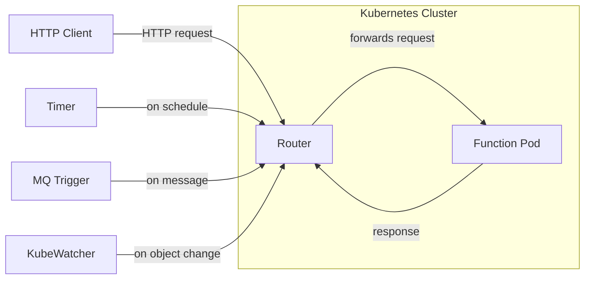

A **trigger binds an event source to a function**, so that the function runs whenever the event occurs.
Every function in Fission is ultimately invoked over HTTP: the router exposes functions internally, and each trigger type turns its event into an HTTP request to that function.

Fission ships several trigger types, one per kind of event source.
Pick the trigger that matches where your events come from.

## Trigger types

| Trigger | Event source | Created with | Page |
| --- | --- | --- | --- |
| HTTP trigger | An incoming HTTP request to a URL path | `fission httptrigger create` (alias `route`) | {} |
| Time trigger | A cron schedule | `fission timetrigger create` (alias `timer`) | {} |
| Message queue trigger | A message published to a queue or stream | `fission mqtrigger create` (alias `mqt`) | {} |
| Kubernetes watch trigger | A change to a Kubernetes object | `fission watch create` | {} |

{}
For message queues, the **KEDA-based** message queue trigger is the recommended path.
It autoscales the connector that consumes from your event source, scaling to zero when idle.
See [Message Queue Trigger: KEDA]({}).
{}

## How triggers reach a function

All trigger types converge on the same internal path: each one issues an HTTP request to the router, which routes it to a function pod.
HTTP triggers are served directly by the router; the other trigger types run a dedicated component that watches its event source and calls the router on your behalf.

The router resolves the request to a function and forwards it to a running pod (starting one if needed), then returns the function's response.
This is why understanding HTTP triggers and the router helps when debugging any trigger type.

## Related

- [HTTP Trigger]({})
- [Time Trigger]({})
- [Message Queue Trigger: KEDA]({})
- [Kubernetes Watch Trigger]({})
- [Router architecture]({})
