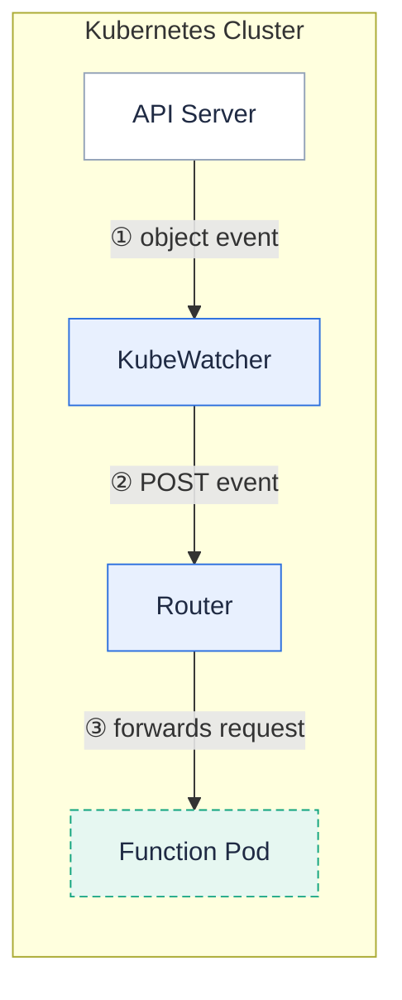

A **Kubernetes watch trigger invokes a function whenever a watched Kubernetes object changes** (added, modified, or deleted).
Use it to react to cluster events, for example to run a function each time a Pod is created or a Service is updated.

The `kubewatcher` component watches the resource you specify and POSTs each event to your function through the router.

## How it works



1. You create a watch trigger naming a resource type, a namespace, and (optionally) a label selector.
2. `kubewatcher` opens a watch on that resource against the Kubernetes API server.
3. For each event, `kubewatcher` POSTs the serialized object as the request body to your function.
4. The function processes the event and returns a response.

Each request carries the event and object type as HTTP headers so your function can branch on them:

- `X-Kubernetes-Event-Type` — `ADDED`, `MODIFIED`, or `DELETED`.
- `X-Kubernetes-Object-Type` — the object kind, for example `Pod`.

## Create a watch trigger

The following creates a watch on Pods in the `default` namespace and invokes the `pod-logger` function on every Pod event:

```bash
$ fission watch create --name podwatch --function pod-logger --type pod --ns default
```

You can watch any of the following resource types (case-insensitive) via the `--type` flag:

- `pod`
- `service`
- `replicationcontroller`
- `job`

{}
A watch trigger can only invoke a function in the **same namespace** as the trigger.
The function namespace equals the trigger namespace, and cross-namespace watches are rejected.
{}

List your watch triggers to confirm:

```bash
$ fission watch list
```

## Related

- [Triggers overview]({})
- [Functions]({})
