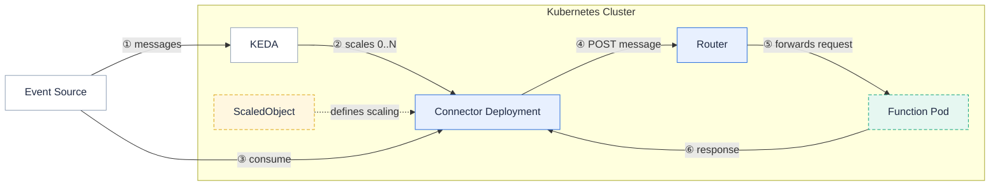

A **message queue trigger invokes a function for each message published to a queue or stream**.
The **KEDA-based message queue trigger is the recommended way to consume from message queues in Fission** — it autoscales the connector that reads from your event source, scaling all the way down to zero when there are no messages and back up as load grows.

{}
KEDA is the default and recommended kind for message queue triggers.
`--mqtkind` defaults to `keda`, so you only need to set it explicitly when you want the legacy Fission-managed connector (`--mqtkind=fission`).
The Fission kind is being phased out — prefer KEDA for all new triggers.
{}

## Supported event sources

Each connector is documented on its own page:

- [Apache Kafka]({})
- [AWS SQS]({})
- [AWS Kinesis]({})
- [GCP Pub/Sub]({})
- [NATS JetStream]({})
- [NATS Streaming]({})
- [RabbitMQ]({})
- [Redis Lists]({})

## Architecture



1. When you create a KEDA message queue trigger, Fission creates a `ScaledObject` and a connector deployment that the `ScaledObject` references.
   The `ScaledObject` is KEDA's way of encapsulating the connector deployment and the information needed to connect to an event source.
   If authentication is required, the trigger also creates a `TriggerAuthentication` referencing your secret.
2. KEDA creates an HPA for the deployment and scales it down to zero while there are no messages.
3. As messages arrive in the event source, KEDA scales the connector deployment from 0 to 1, and beyond as the backlog grows.
4. The connector consumes each message and POSTs it to the function through the router.
5. The function returns a response; the connector writes successful responses to the response topic and failures to the error topic, when those are configured.

## Prerequisites

- [KEDA must be installed](https://keda.sh/docs/latest/deploy/#helm) on your cluster.
  Fission  is built against KEDA v2.20.
- The KEDA integration must be enabled in Fission.
  Set `mqt_keda.enabled` to `true` when installing or upgrading the Fission Helm chart.

## Create a KEDA trigger

Create a message queue trigger with `fission mqtrigger create` (alias `fission mqt create`).
The connection details for each event source go in repeatable `--metadata key=value` flags, and credentials are referenced by `--secret`.

```bash
fission mqt create --name <name> --function <function> \
    --mqtype <source-type> --mqtkind keda \
    --topic <input-topic> --resptopic <response-topic> --errortopic <error-topic> \
    --maxretries 3 \
    --metadata key1=value1 --metadata key2=value2 \
    --secret <secret-name>
```

Key flags:

| Flag | Purpose |
| --- | --- |
| `--mqtype` | Event source type. For KEDA: `kafka`, `aws-sqs-queue`, `aws-kinesis-stream`, `gcp-pubsub`, `stan`, `nats-jetstream`, `rabbitmq`, `redis`. |
| `--mqtkind` | Trigger kind; defaults to `keda`. |
| `--topic` | Topic, queue, or subject the connector reads from. |
| `--resptopic` | Topic to publish successful function responses to (discarded if unset). |
| `--errortopic` | Topic to publish errors to (discarded if unset). |
| `--maxretries` | Maximum retries before a failed message is sent to the error topic. |
| `--metadata` | Connection metadata for the source, in `key=value` form (repeatable). |
| `--secret` | Name of the Kubernetes Secret holding source credentials. |
| `--pollinginterval` | Seconds between checks of the source for scaling decisions (default 30). |
| `--cooldownperiod` | Seconds to wait after the last active trigger before scaling back to 0 (default 300). |
| `--minreplicacount` | Minimum number of connector replicas to scale down to. |
| `--maxreplicacount` | Maximum number of connector replicas to scale up to (default 100). |

The exact `--metadata` keys depend on the event source — see the connector page for each source.

## Related

- [Triggers overview]({})
- [KEDA scalers](https://keda.sh/docs/latest/scalers/)
