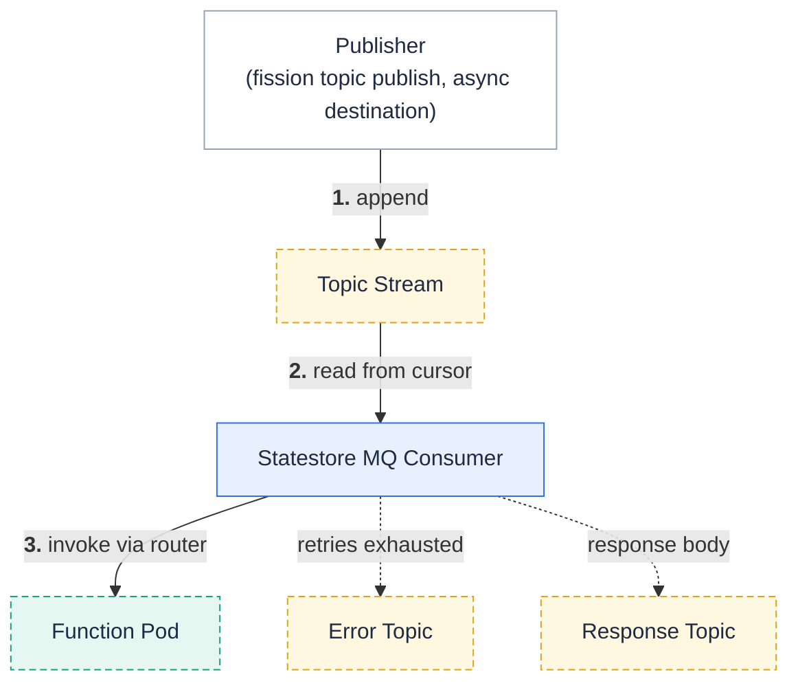

**Statestore eventing gives you durable publish/subscribe topics on the built-in [statestore](/docs/architecture/statestore/) — no Kafka, no external broker, no extra infrastructure.**

Statestore eventing is available starting with Fission .
A topic is a durable, replayable stream in the statestore event log.
Any producer appends events to it: the `fission topic publish` command, or an [async invocation](/docs/usage/function/async-invocation/) result destination.
A message queue trigger with `--mqtype statestore` subscribes a function to the topic.
Fission delivers each event to the function at least once, with retries and an error topic for events that keep failing.



## When to use it

| You need | Use |
| --- | --- |
| Function-to-function events inside the cluster, zero extra infrastructure | Statestore eventing (this page) |
| Events from an external broker you already run (Kafka, SQS, RabbitMQ, …) | [KEDA message queue triggers](/docs/usage/triggers/message-queue-trigger-kind-keda/) |
| High throughput, partitioned ordering, or consumer groups | An external broker |

The statestore provider targets small and medium event volumes.
When you outgrow it, change `--mqtype` to `kafka` and point at a broker — the trigger fields stay the same.

## Prerequisites

Eventing needs the [statestore](/docs/architecture/statestore/); the embedded mode is enough:

```bash
helm upgrade --install fission fission-charts/fission-all \
  --namespace fission \
  --set statestore.enabled=true
```

The chart value `eventing.enabled` defaults to `true`, so a statestore-enabled install already runs the eventing consumer.
Without the statestore, `fission topic` commands fail with `eventing is not enabled on this cluster (requires the statestore)`.

{}
When [internal service authentication](/docs/installation/internal-auth/) is enabled, set `FISSION_INTERNAL_AUTH_SECRET` so `fission topic publish` and `fission topic peek` can sign their requests.
{}

## Worked example

Wire a function to a topic named `orders`, publish an event, and watch it flow.

Create the consumer function:

```js
// process-order.js
module.exports = async function (context) {
    console.log("processing order:", JSON.stringify(context.request.body));
    return { status: 200, body: "ok" };
}
```

```bash
fission env create --name node --image ghcr.io/fission/node-env
fission fn create --name process-order --env node --code process-order.js
```

Create the trigger **before** you publish.
A new trigger starts at the head of the stream: it sees only events published after it starts.

```bash
fission mqtrigger create --name order-consumer \
  --mqtkind fission --mqtype statestore \
  --topic orders --function process-order \
  --pollinginterval 1 \
  --maxretries 3 --errortopic orders-errors
```

| Flag | Meaning |
| --- | --- |
| `--mqtkind fission` | The statestore provider runs in the classic head; the default `keda` kind rejects it. |
| `--topic` | Topic to consume; 1–249 characters of `[a-zA-Z0-9._-]`. |
| `--pollinginterval` | Seconds between reads on an idle topic; the CLI default of 30 adds up to 30 s of delivery latency. |
| `--maxretries` | Delivery retries per event before the event goes to the error topic. |
| `--errortopic` | Topic that receives events that exhaust their retries. |
| `--resptopic` | Topic that receives the function's response body (optional). |

Publish an event:

```bash
$ fission topic publish --topic orders --data '{"orderId":"A-1042"}'
published to topic "orders" in namespace "default" (statestore)
```

Peek at the topic to confirm the event is durably stored:

```bash
$ fission topic peek --topic orders
head: 1
SEQ TYPE             AGE PAYLOAD
1   application/json 10s {"orderId":"A-1042"}
```

Verify delivery in the function's log:

```bash
$ fission fn log --name process-order
... processing order: {"orderId":"A-1042"}
```

`fission topic publish` also accepts `--mqtype kafka` to publish to a broker topic through the egress queue; this page covers the default `statestore` type.

## Publish from a function

Async invocations can fan their results out to a topic instead of a single destination function:

```bash
fission fn update --name resize-image \
  --async-on-success-topic image-resized \
  --async-on-failure-topic image-failures
```

Every statestore trigger on `image-resized` then receives the result envelope of each successful delivery.
See [Asynchronous Invocation](/docs/usage/function/async-invocation/) for the async delivery pipeline itself.

## Delivery semantics

| Behavior | As implemented |
| --- | --- |
| Guarantee | At-least-once per trigger; make consumers idempotent. |
| Start position | Stream head at first subscribe; no backlog replay. |
| Ordering | Single stream, roughly FIFO; no partitions. |
| Fan-out | Each trigger on a topic keeps its own durable cursor and receives every event. |
| Success | Any 2xx response from the function. |
| Retry | Up to `--maxretries` retries per event, 500 ms apart. |
| Exhausted | Event is published to `--errortopic`; without one it is dropped with a log line. |
| Response topic | The 2xx response body is published to `--resptopic`, best effort. |

The consumer advances its cursor only after an event reaches terminal handling: delivered, or routed to the error topic.
One failing event therefore cannot wedge the topic, and a crash mid-batch redelivers the tail rather than skipping it.

## Retention

A reaper in the statestore MQ consumer trims each subscribed topic once per minute:

- Events that every trigger on the topic has consumed are trimmed — no live subscriber loses an unconsumed event.
- Two backstops trim past a stalled subscriber: events older than 7 days, and any backlog beyond 100,000 events per topic.
A subscriber that resumes after a backstop trim logs the gap and counts it in the `fission_eventing_gap_events_total` metric.

A topic with **no** statestore trigger is not trimmed at all — the orphan-stream age sweep is not implemented yet.
Instead, a per-topic backlog cap of 10,000 events bounds the growth: publishes to a capped topic fail with `topic backlog cap reached` instead of dropping silently.
To recover a capped orphan topic, create a statestore trigger on it.
The trigger's cursor starts at the head, so the reaper trims the old backlog within about a minute and publishes flow again; the trimmed backlog is not delivered.

## Limits

- One durable cursor per trigger; there are no consumer groups, so you cannot parallelize one trigger across replicas.
- Throughput is bounded by the statestore, not by Fission.
- Topics are namespace-scoped; a trigger can only consume topics in its own namespace.
- Exactly-once delivery is out of scope; design consumers to tolerate duplicates.

## Related

- [Statestore](/docs/architecture/statestore/) — the durable store behind topics.
- [Asynchronous Invocation](/docs/usage/function/async-invocation/) — async results as topic publishers.
- [KEDA message queue triggers](/docs/usage/triggers/message-queue-trigger-kind-keda/) — external brokers with autoscaled consumers.
- [`fission topic` CLI reference](/docs/reference/fission-cli/fission_topic/) — publish and peek flags.
- [`fission mqtrigger create` CLI reference](/docs/reference/fission-cli/fission_mqtrigger_create/) — the full trigger flag set.
