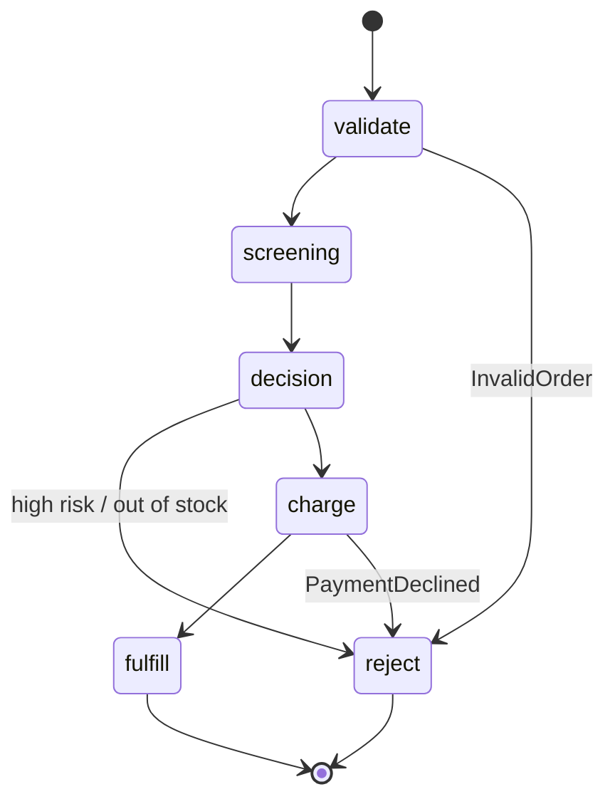

**A workflow orchestrates several functions as one durable state machine.
It survives controller restarts and resumes exactly where it stopped.
It retries transient failures and routes typed business errors.
Every step is recorded in the statestore.**

Starting with Fission , you define a `Workflow` as a state machine over your functions.
You start a `WorkflowRun` each time you want it to execute.
For the mental model behind the two resources and the durability guarantees, read the [Workflows concept]({}).
This guide covers how to enable, author, run, and inspect them.

## Prerequisites

Workflows are **off by default** and require the [statestore]({}), which holds each run's event log:

```bash
helm upgrade --install fission fission-charts/fission-all \
  --namespace fission \
  --set statestore.enabled=true \
  --set workflows.enabled=true
```

Embedded statestore mode is enough to run workflows.

## State types

A workflow is a map of named states; each has a `type`:

| State | Purpose |
| --- | --- |
| `Task` | Invoke a function, with per-step timeout, retry, and error catching. |
| `Choice` | Route to the next state based on the run's data — no function call. |
| `Parallel` | Run several branches concurrently and join their results in order. |
| `Map` | Run one branch per element of an array, bounded by `maxConcurrency`. |
| `Wait` | Pause the run durably for a `duration`. |
| `Succeed` / `Fail` | Terminate the run. |

A run walks from `startAt` along each state's `next` until a state with `end: true` or a `Succeed`/`Fail` state.
The order-pipeline example below has this shape:



`fission workflow graph --name <workflow>` renders this diagram from a workflow's definition.
`--open` serves it in a local day/night viewer.

## In this section

- [Authoring workflows]({}) — the full YAML reference for every state type, path shaping, retries, and the error model.
- [Run and inspect]({}) — create, run, and manage workflows, and see where a run stopped with the `runs` commands and the graph viewer.
- [Examples]({}) — three worked workflows covering the full palette.

## Related

- [Workflows concept]({}) — Workflow vs WorkflowRun and the durability model.
- [Statestore]({}) — the durable event log workflows are recorded in.
- [Asynchronous invocation]({}) — the simpler durable primitive for single-function work.
